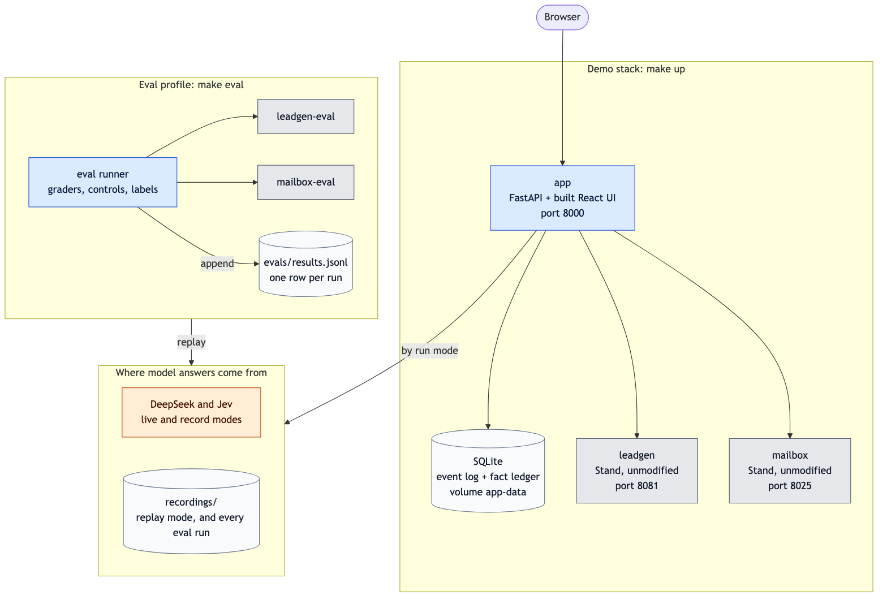
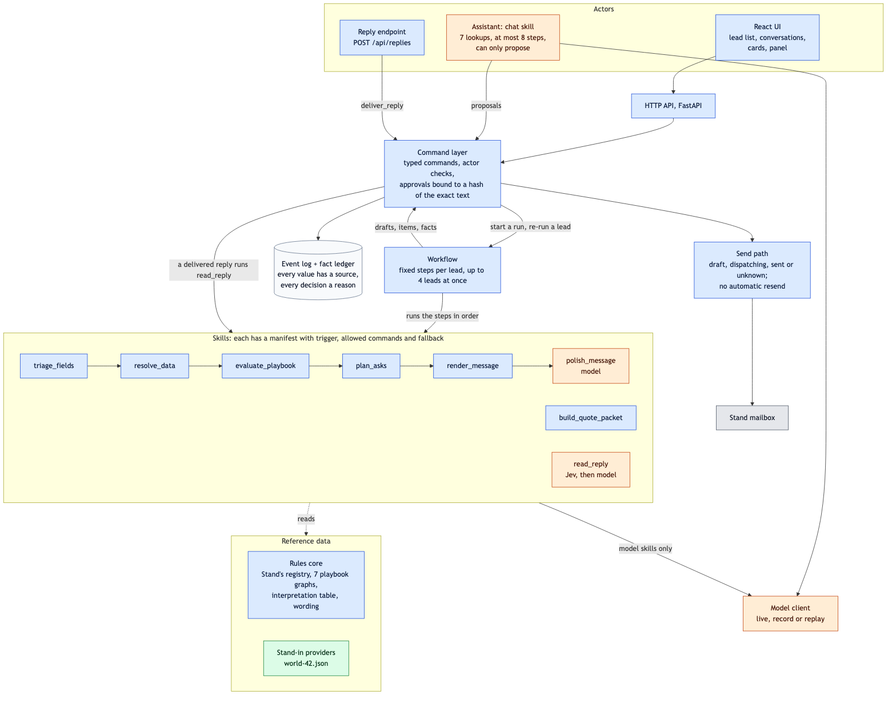
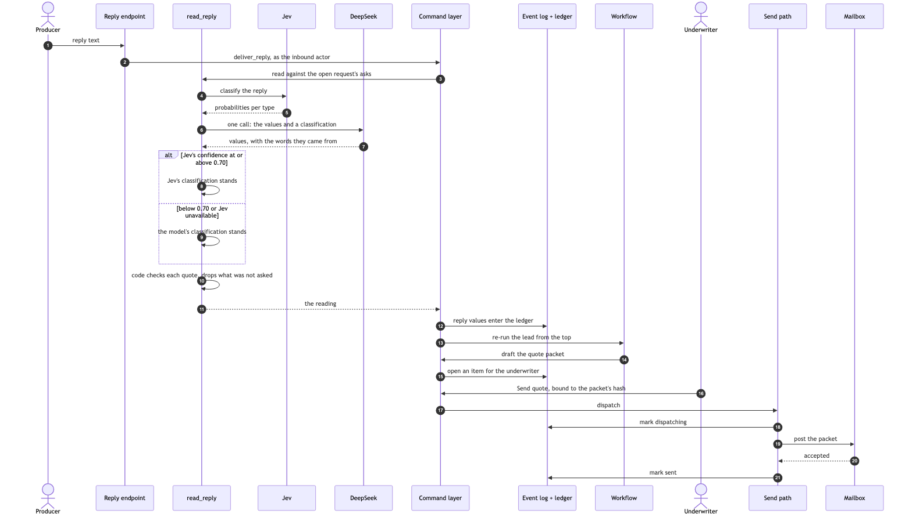
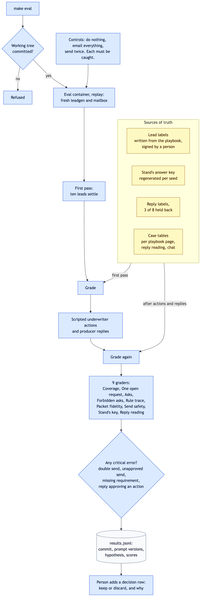
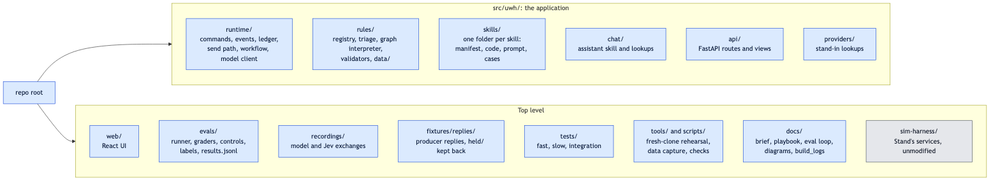

# Architecture diagrams

Seven views, from the outside in. `ARCHITECTURE.md` explains the reasoning; these show the shape.

**Legend:** blue is this submission, grey is Stand's services, orange is a model, green is a stand-in for a service not yet wired in, and yellow is where the underwriter decides or where the right answers come from. Solid arrows are calls or data flow; dotted arrows are reads of stored data.

## 1. System context

Who and what the system talks to.


## 2. Containers

What runs, as defined in `compose.yaml`. `make up` starts the demo stack; `make eval` starts the eval profile with its own copies of Stand's services, so an eval run never touches the demo.



## 3. Components inside the app

Every change goes through the command layer, and every actor reaches it the same way. The transport sets the actor, never a model. Orange marks the three places a model is used: reading replies, softening request emails, and the assistant.



## 4. The life of a lead

Each lead ends in one of three places: a quote sent, one request sent to the producer, or a clear question for the underwriter. After two request rounds without a resolution, the lead goes to the underwriter.


## 5. A reply, round trip

Lead 008: a request is out, the producer replies, and a quote goes out on approval.



## 6. The eval harness

`make eval` refuses uncommitted code, so every result row names the code it measured.



## 7. Repository map



## Editing the diagrams

Each image is drawn from the Mermaid source beside it in `docs/diagrams/`, on a white background so it reads in light and dark mode. After editing a `.mmd` file, render it again:

```
npx -y @mermaid-js/mermaid-cli@11.4.2 -i docs/diagrams/<name>.mmd -o docs/diagrams/<name>.png -s 2 -b white -t default
```
