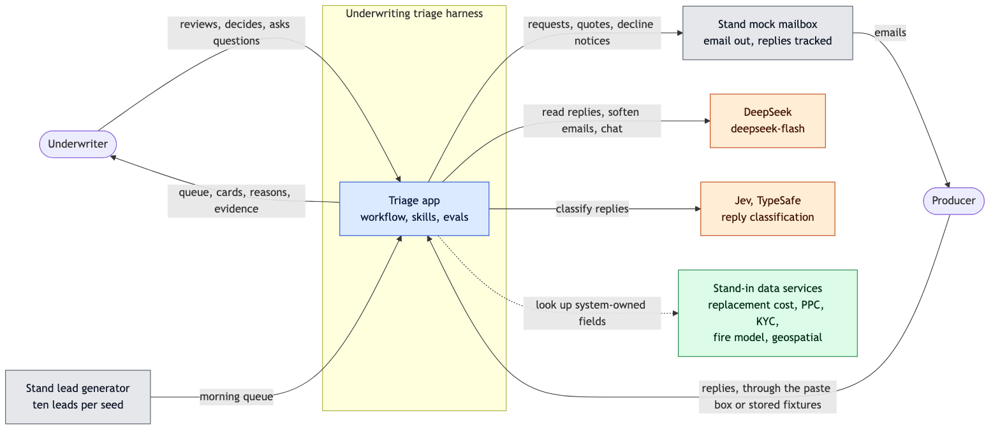
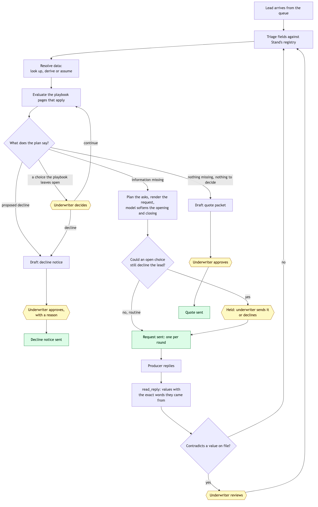
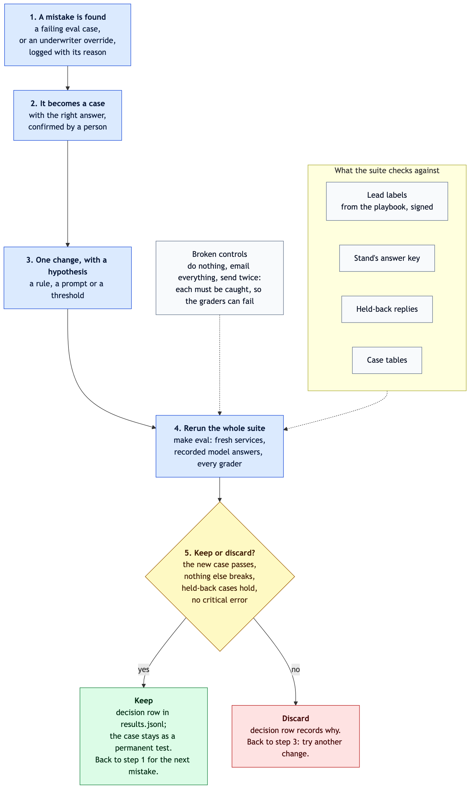

# Architecture diagrams

`ARCHITECTURE.md` explains the reasoning; these show the shape.

**Legend:** blue is this submission, grey is Stand's services, orange is a model, green is a stand-in for a service not yet wired in, and yellow is where the underwriter decides. Solid arrows are calls or data flow; dotted arrows are reads of stored data.

## 1. System context

Who and what the system talks to.



## 2. The life of a lead

Each lead ends in one of three places: a quote sent, one request sent to the producer, or a clear question for the underwriter. After two request rounds without a resolution, the lead goes to the underwriter.



## 3. The eval loop

Every mistake becomes a permanent test, and every change is checked against the whole suite. `docs/eval-loop.md` explains each step.



## 4. Repository map

```text
.
├── README.md                  how to run it, the five decisions, skills, cuts
├── ARCHITECTURE.md            the architecture in a few minutes
├── DEMO_GUIDE.md              the demo, step by step
├── AGENTS.md                  working rules for the coding agents
├── Makefile                   check, test-slow, up, eval
├── compose.yaml               the app, Stand's services, the eval profile
├── Dockerfile
├── .env.example               keys and run mode
├── src/uwh/                   the application
│   ├── api/                   FastAPI routes and the views the UI reads
│   ├── runtime/               commands, event log, fact ledger, send path, workflow, model client
│   ├── rules/                 registry, field triage, playbook graph interpreter, validators
│   │   └── data/              reviewed data: playbook graphs, interpretation table, wording
│   ├── skills/                one folder per skill: manifest, code, prompt, cases
│   │   ├── triage_fields/
│   │   ├── resolve_data/
│   │   ├── evaluate_playbook/
│   │   ├── plan_asks/
│   │   ├── render_message/
│   │   ├── polish_message/    model
│   │   ├── read_reply/        model, with Jev first
│   │   └── build_quote_packet/
│   ├── chat/                  the assistant: skill, lookups, prompt, cases
│   └── providers/             stand-in lookups and their captured data
├── web/src/                   React UI: lead list, conversations, cards, panel, demo controls
├── evals/
│   ├── run.py                 the eval runner
│   ├── graders/               the nine graders and the critical errors
│   ├── controls.py            the three deliberately broken runs
│   ├── labels/                expected results: seed42/ leads, replies/ (held/ kept back)
│   └── results.jsonl          one row per run, plus decision rows
├── recordings/                recorded model and Jev exchanges, for replay
├── fixtures/replies/          producer replies for the demo (held/ kept back for evals)
├── tests/                     fast, slow and integration tests
├── tools/                     fresh-clone rehearsal, data capture, type generation
├── scripts/                   discipline check and hooks
├── docs/
│   ├── eval-loop.md           the eval loop and the iteration plan
│   ├── architecture-diagram.md
│   ├── diagrams/              these diagrams: Mermaid sources and rendered images
│   ├── brief/                 Stand's brief, field registry, example lead
│   ├── playbook/              Stand's playbook, one folder per page
│   └── build_logs/            design spec, plan, progress log, critique, known limits
└── sim-harness/               Stand's lead generator and mailbox, unmodified
```

## Editing the diagrams

Each image is drawn from the Mermaid source beside it in `docs/diagrams/`, on a white background so it reads in light and dark mode. After editing a `.mmd` file, render it again:

```text
npx -y @mermaid-js/mermaid-cli@11.4.2 -i docs/diagrams/<name>.mmd -o docs/diagrams/<name>.png -s 2 -b white -t default
```
