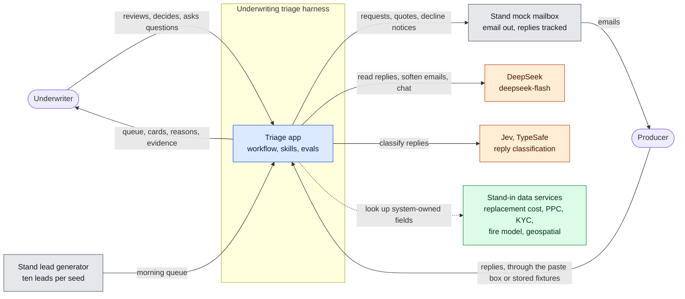
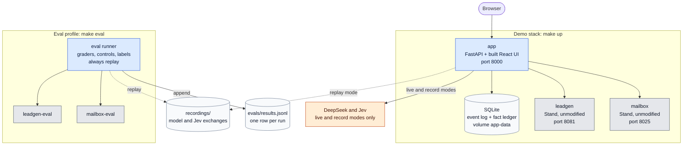
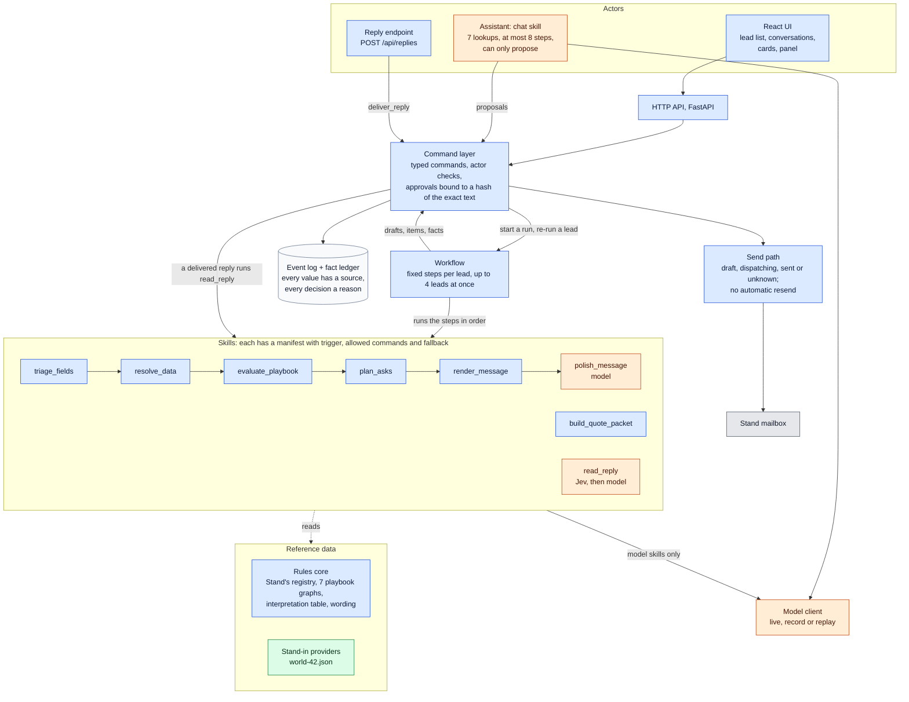
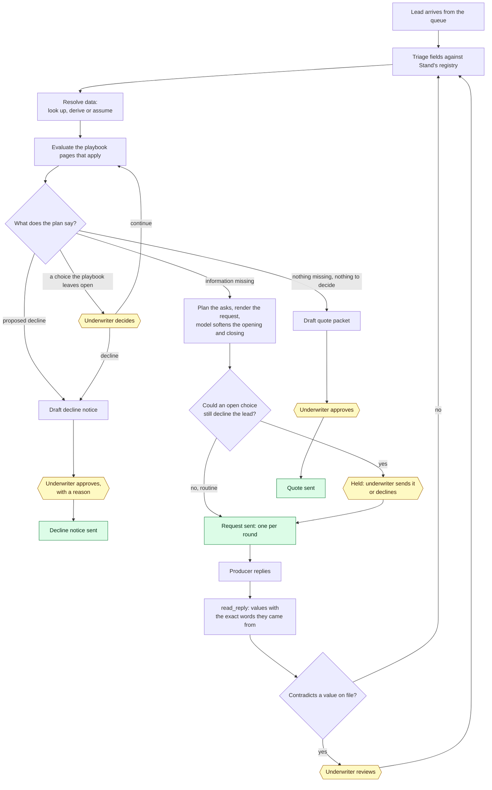
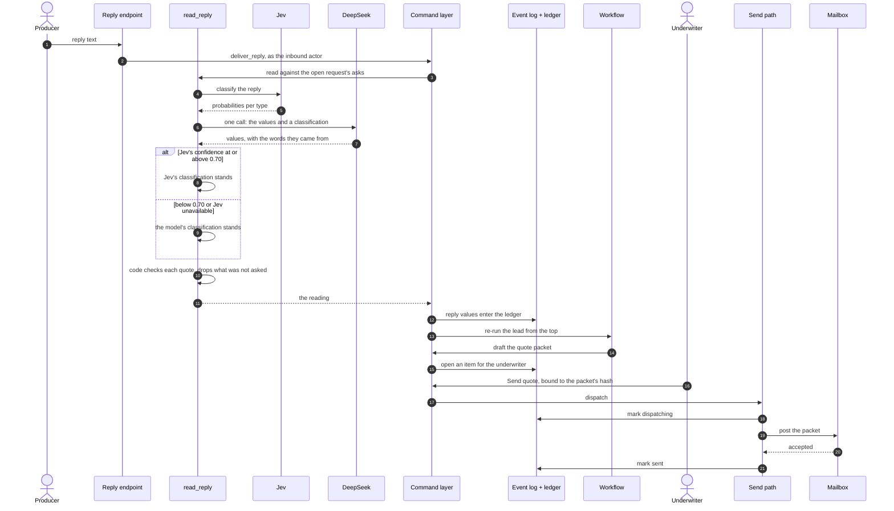
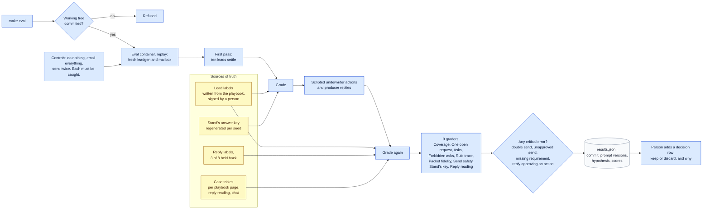
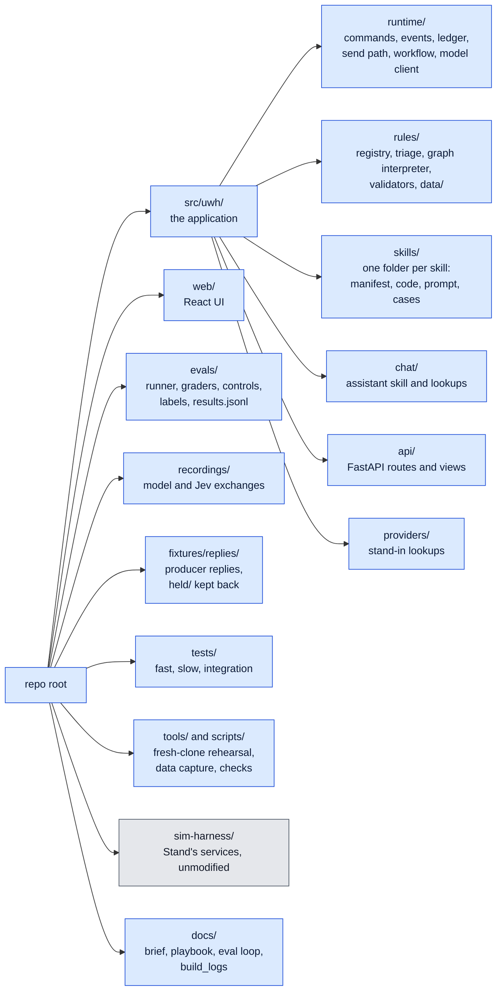

# Architecture diagrams

Seven views, from the outside in. `ARCHITECTURE.md` explains the reasoning; these show the shape. The diagrams are Mermaid, which GitHub renders in place.

**Legend:** blue boxes are this submission, grey boxes are Stand's services, orange boxes are external model services, and green boxes are stand-ins for services not yet wired in. Solid arrows are calls or data flow; dotted arrows are reads of stored data.

## 1. System context

Who and what the system talks to.

## 2. Containers

What runs, as defined in `compose.yaml`. `make up` starts the demo stack; `make eval` starts the eval profile with its own copies of Stand's services, so an eval run never touches the demo.

## 3. Components inside the app

Every change goes through the command layer, and every actor reaches it the same way. The transport sets the actor, never a model.

Orange marks the three places a model is used: reading replies, softening request emails, and the assistant.

## 4. The life of a lead

Where each lead can end: a quote sent, one request sent to the producer, or a clear question for the underwriter.

Yellow hexagons are where the underwriter decides; green boxes are messages that go out. After two request rounds without a resolution, the lead goes to the underwriter.

## 5. A reply, round trip

Lead 008: a request is out, the producer replies, and a quote goes out on approval.

## 6. The eval harness

`make eval` refuses uncommitted code, so every result row names the code it measured.

## 7. Repository map

