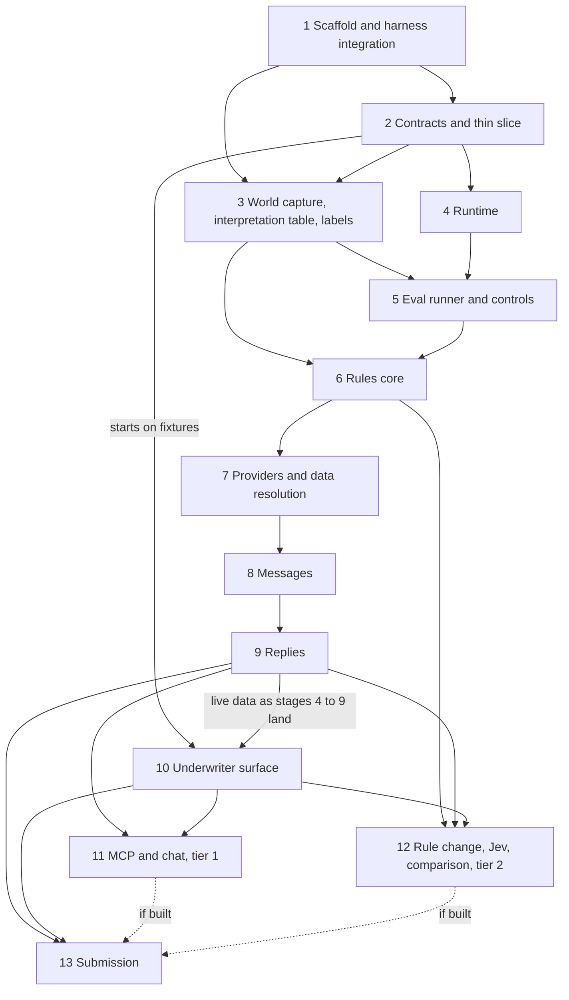

# Development plan: underwriting triage harness

This plan implements `docs/architecture.md`, cited as §n and A.n for its appendix. It adds no scope. Each stage is executable from this plan and the architecture. `AGENTS.md` holds the working rules; `.agents/skills/stage/SKILL.md` is the procedure for running one stage.

## Stage dependencies



Stages 3 and 4 do not depend on each other and may run at the same time. Stage 10 is a parallel track: it starts after stage 2 on fixtures and replaces each fixture-backed view with its live route as stages 4 to 9 land.

## Build tiers and cut order

§4.1 sets three tiers. A lower tier is finished and verified before a higher tier starts. The stage order stays fixed inside each tier, so the build runs in passes:

1. **Tier-0 pass.** Stages 1 to 13 in order, tier-0 tasks only. Stage 13 closes the pass, so a submittable build exists at its end.
2. **Tier-1 pass.** Stages 1 to 13 in order, tier-1 tasks only. Stage 13 updates the README for what the pass added.
3. **Tier-2 pass.** Stage 12's tier-2 tasks, built in the reverse of the cut order so the first item cut is the last item built: the model-driven triage comparison (§13.6), then the rule-change flow (§12), then the Jev adapter (§10.4). Stage 13 closes the pass.

**Cut order.** If time runs short, cut from the top of tier 2: the Jev adapter first, then the rule-change flow, then the triage comparison. Chat, MCP and replay mode are tier 1 and are cut only after all of tier 2. Whatever is cut, stage 13 writes it into the README's "Cut and hand-waved" section, and a graph that is not built returns an explicit `not_evaluated` note on the lead, never a silent pass (§4.1).

**Reading of §4.1 applied here.** An item the §4.1 table names is in that tier. An item it does not name is tier 0 when a named tier-0 item cannot work without it, and tier 1 otherwise. Examples: the event log, fact ledger, command layer and approval binding sit under "quote packet and decline notice with approval"; recordings and record mode sit under `read_reply`, whose tests replay recordings (`AGENTS.md`); the Reply reading grader and the held-back replies sit under the improvement cycle.

| Stage | Tier 0 | Tier 1 | Tier 2 |
|---|---|---|---|
| 1 | all | | |
| 2 | all | | |
| 3 | capture, rules data, review gate, tier-0 page cases, seed-42 labels, reply fixtures, held-back replies, sample gate | labelling function, tier-1 page cases, packet cases | |
| 4 | event log, clock, ledger, workflow, skill registry, commands and approval binding, send and reconcile, faults on the mailbox client, recordings and record mode, run start | emergency stop and settings, demotion, replay mode, second-vertical test | |
| 5 | eval services, runner, results log, tier-0 graders, Reply reading grader, Do nothing control | remaining graders, skill status and dispatch, release check, 50-seed sweep with Stand's key on seeds 1 to 50 | |
| 6 | parser, triage, validators, loader, interpreter, plan precedence, tier-0 graphs, not-encoded list, wiring | tier-1 graphs, escalation control, sweep triage column | |
| 7 | fixture reader, lookups, `resolve_data`, wiring | provider fault | |
| 8 | ask plan, rendering, recipients, packet, decline notice, dispatch, two controls | remaining controls, emergency stop on real requests, escalation headline | |
| 9 | reply endpoint, paste box, `read_reply`, code checks, lead 008 to a sent packet, fixture-reply control, reply suite, improvement cycle | fallback and skill gating, replay of the reply suite | |
| 10 | queue, detail pane with approval and the underwriter card, start and fixture-reply buttons | items with batch approval, settings, skills, live updates, mode label | |
| 11 | | all | |
| 12 | | candidate export | triage comparison, rule change, Jev |
| 13 | README, images, final eval, platform rehearsal | replay recording, release check | |

## Conventions

- Paths are relative to the repository root and follow §6.1.
- Seed-42 lead ids are `LEAD-00000042-000` to `LEAD-00000042-009`. Prose uses the last three digits.
- Host URLs (§14): app `http://localhost:8000`, leadgen `http://localhost:8081`, mailbox `http://localhost:8025`. Inside the compose network the app calls `http://leadgen:8080` and `http://mailbox:8080`. Host-side integration tests use the host URLs, set once in `tests/conftest.py`.
- The check command is `make check` (`AGENTS.md`): ruff check, ruff format check, mypy, `python3 scripts/check_discipline.py`, the fast pytest selection, and the web type check and unit tests once `web/package.json` exists.
- The eval command is `docker compose --profile eval run --rm eval <args>` (§13.1); `make eval` wraps it. After a code or label change, rebuild first with `docker compose --profile eval build eval`.
- Checks against the running app assume `docker compose up -d --build --wait` after the stage's last commit, in live mode unless the command sets `RUN_MODE`.
- Database reads in acceptance commands pipe SQL into the app container: `echo "<SQL>" | docker compose exec -T app sh -c 'sqlite3 "$UWH_DB"'`. Table and column names are A.1's; event types are A.2's.
- Acceptance commands start a run with `curl -s -X POST 'http://localhost:8000/api/run/start?wait=true'`, which returns once the first pass has settled (A.5), and read state straight after it.
- Command bodies, payloads, responses and settings keys are A.11's.
- JSON keys in API responses are the snake_case names of the items A.5 and §11 list. The OpenAPI file from stage 2 is the reference.
- Integration tests that write to the mailbox directly use lead ids starting `TEST-`. Integration tests that drive the system go through the app's REST API and start a run first.
- `docs/acceptance.json` mirrors every acceptance check, with its tier at the start of the description. `passes` becomes true only after the command ran and the stated result was seen (`.agents/skills/verify/SKILL.md`).
- One writer at a time across all parallel work: `pyproject.toml`, `uv.lock`, `Makefile`, `compose.yaml`, `Dockerfile`, `web/package.json`, `web/pnpm-lock.yaml`, `src/uwh/runtime/store.py`, `src/uwh/skills/__init__.py`, `src/uwh/skills/vertical.py`, `src/uwh/api/routes.py`. Only the eval runner and `evals/decide.py` write `evals/results.jsonl`.

## Test tiers

| Tier | Selection | Limit | When it runs |
|---|---|---|---|
| fast | `uv run pytest -m "not slow and not integration"` and the web unit tests | under 5 seconds per test | inside `make check`, on every stop |
| slow | `uv run pytest -m slow` | none | `make test-slow`, before a stage is marked done |
| integration | `uv run pytest -m integration`, containers up | none | `make test-slow`, before a stage is marked done |
| eval | `docker compose --profile eval run --rm eval <args>` | none | in acceptance checks; every run appends a `run` row to `evals/results.jsonl` |

`slow` and `integration` are registered markers, and pytest runs with `--strict-markers` and `--import-mode=importlib` (each skill has its own `test_skill.py`, so test basenames repeat). Every `src/uwh/**/<name>.py` has a `tests/**/test_<name>.py`; `scripts/check_discipline.py` fails otherwise.

Fast tests that need Stand's services load Stand's unmodified mailbox app in process (ASGI transport, `MAILBOX_DB` at a temporary file) and call Stand's generator in process. These are Stand's code paths, not mocks. Stand's package `mailbox` shares its name with a standard-library module, so `tests/conftest.py` puts `sim-harness/` first on `sys.path`, sets `MAILBOX_DB`, and imports Stand's package before anything imports the standard one. Model calls in tests are served from `recordings/`, never from a hand-written response.

| Stage | fast | slow | integration | eval |
|---|---|---|---|---|
| 1 | yes | | yes | |
| 2 | yes | | | |
| 3 | yes | | yes | |
| 4 | yes | yes | yes | |
| 5 | yes | yes | | yes |
| 6 | yes | | | yes |
| 7 | yes | | | yes |
| 8 | yes | | yes | yes |
| 9 | yes | | yes | yes |
| 10 | yes | | | |
| 11 | yes | | yes | yes |
| 12 | yes | | yes | yes |
| 13 | yes | | yes | yes |

## Definition of done for any stage

1. `make check` exits 0 and its output holds no warnings or errors.
2. `make test-slow` passes for the stage's tests.
3. Every acceptance check of the stage, for the tier being built, passes and is marked in `docs/acceptance.json`.
4. The `verify` skill, then the `cross-review` skill, ran and their findings are handled.
5. `docs/progress.md` has the stage entry in the format of `.agents/skills/stage/SKILL.md`, including its **Friction** line.
6. The stage's implemented and not-implemented lists match the code.

## Build discipline

`AGENTS.md` holds the full rules. In short:

- Test first. Each code task names its failing test, and the test fails for the stated reason before the implementation exists.
- No test asserts mocked behaviour. Integration and end-to-end tests run against Stand's real containers with no mocks.
- No temporal or historical language in any artifact; `scripts/check_discipline.py` enforces a word list and the rule is wider than the list.
- Every code file starts with a two-line `ABOUTME:` header.
- Make the smallest change that passes. Do not weaken a grader, threshold or test to get green.
- One task, one commit, on the stage branch `stage-NN-short-name`.

---

## Stage 1: Scaffold and harness integration

**Goal.** One command starts Stand's leadgen and mailbox, built from their unmodified code, and an app skeleton on Stand's documented ports. A bootstrap proves the app can post the seed queue, read the leads, and round-trip one mailbox message with metadata.

**Depends on.** None.

**Architecture sections.** §2.2, §6.1, §6.2, §7.7 (the mode variable), §9.4 (no debug access), §13.1 (bootstrap check), §14, §15 item 1.

**Tier.** All tasks tier 0.

**Tasks.**

1. **uv project and Makefile.** Build `pyproject.toml` (Python 3.12, package `uwh` under `src/`; runtime dependencies fastapi, uvicorn, pydantic, httpx, pyyaml, anthropic; dev dependencies pytest, hypothesis, ruff, mypy, and jinja2 for Stand's mailbox in process), `uv.lock`, mypy `strict = true` over `src`, `evals`, `tools`, the pytest options above, and a `Makefile` with the four targets in `AGENTS.md` -> `make check` exits 0 on the empty package. Not code; no test.
2. **SDK verification.** Check the `messages.parse()` structured-output call and the forced-`tool_choice` restriction against the Anthropic SDK documentation (Context7 or the vendor page), pin the SDK version in `uv.lock`, and record both findings with their source URLs in `docs/progress.md` (§14, §6.2) -> S01-A10.
3. **Environment file.** `.env.example` documents the six variables of §14, one comment line each, with `ANTHROPIC_MODEL=claude-sonnet-5-5` and `SEED=42`. `.gitattributes` and `.gitignore` exist; extend them only if a stage-1 file needs it -> S01-A9.
4. **Settings.** Test: `tests/test_settings.py` asserts `RUN_MODE` accepts `live`, `replay` and `record` and refuses anything else; `SEED` defaults to 42; `ANTHROPIC_MODEL` defaults to `claude-sonnet-5-5`; the leadgen and mailbox base URLs default to the in-network URLs and can be overridden for the eval -> red. Build: `src/uwh/settings.py` -> green.
5. **Registry copy.** Test: `tests/rules/test_registry_copies.py` asserts `docs/brief/field_registry.json` and `sim-harness/shared/field_registry.json` are byte-identical; it guards the copy the app image reads -> passes on first run.
6. **Harness clients.** Test: `tests/runtime/test_leadgen_client.py` asserts the client's public methods are exactly `post_queue`, `list_leads`, `get_lead`, `healthz`, and no attribute name contains `debug` (§9.4). `tests/runtime/test_mailbox_client.py` asserts `send`, `list_for_lead`, `get`, `reset`, `healthz`, and, against Stand's mailbox in process, that a message sent with metadata reads back by lead with equal metadata. `tests/integration/test_harness_clients.py` posts seed 42 to the leadgen container and asserts the ten ids in order with 73 fields each, and round-trips metadata on the mailbox container under a `TEST-` lead id -> red. Build: `src/uwh/runtime/leadgen_client.py`, `src/uwh/runtime/mailbox_client.py` -> green.
7. **App skeleton.** Test: `tests/api/test_app.py` asserts `GET /api/run` returns 200 with the mode and seed and no run id before a run starts -> red. Build: `src/uwh/api/app.py` -> green.
8. **Bootstrap.** Test: `tests/integration/test_bootstrap.py` asserts `uwh.runtime.bootstrap.run()` posts the queue for `SEED`, returns the ten ids in order, reads every lead envelope, sends one probe under lead id `BOOTSTRAP-<run id>` with metadata `{"probe": true, "run_id": <run id>}` and reads it back by lead; and that a mailbox URL at a closed port raises `EnvironmentInvalid`, the type the eval maps to `invalid` (§13.1) -> red. Build: `src/uwh/runtime/bootstrap.py` with a `python -m uwh.runtime.bootstrap` entry printing a JSON summary -> green.
9. **Compose and image.** Test: `tests/packaging/test_compose.py` parses `compose.yaml` and asserts the default-profile services of §14: `leadgen` and `mailbox` built from Stand's Dockerfiles with context `./sim-harness`, host ports 8081 and 8025, `DEBUG: "${DEBUG:-false}"`, `LEADGEN_DB` and `MAILBOX_DB` set, a named volume each; `app` built from the `app` target of `Dockerfile` on host port 8000 with a named volume, `.env` passed through `env_file`, `RUN_MODE`, `SEED` and `ANTHROPIC_MODEL` interpolated so a shell value overrides the file, `UWH_DB` set to `/data/app-${RUN_MODE:-live}.db` so replay gets its own database (§7.7), and `depends_on` both Stand services with `condition: service_healthy`; every service has a healthcheck (the app's calls `GET /api/run`) -> red. Build: `compose.yaml`; `Dockerfile` with an `app` stage (Python 3.12 slim, `uv sync --frozen`, `sqlite3` CLI, `WORKDIR /app`, copies `src/` and the registry, never `evals/`) -> green, and S01-A1 passes.

**Acceptance checks.**

**S01-A1.** Tier 0. All three services start and report healthy.
```sh
docker compose up -d --build --wait && docker compose ps --format '{{.Service}} {{.Health}}'
```
Expect: exactly three lines, `app healthy`, `leadgen healthy`, `mailbox healthy`.

**S01-A2.** Tier 0. The bootstrap posts seed 42, reads ten leads and round-trips the probe.
```sh
docker compose exec -T app python -m uwh.runtime.bootstrap | jq -e '(.lead_ids | length) == 10 and .lead_ids[0] == "LEAD-00000042-000" and .lead_ids[9] == "LEAD-00000042-009" and .probe.metadata_round_trip == true'
```
Expect: exit 0.

**S01-A3.** Tier 0. The probe is in the real mailbox with its metadata, read independently of the bootstrap.
```sh
id=$(curl -s "http://localhost:8025/emails?limit=1" | jq -r '.[0].id'); curl -s "http://localhost:8025/emails/$id" | jq -e '(.lead_id | startswith("BOOTSTRAP-")) and .metadata.probe == true and (.metadata.run_id | type) == "string"'
```
Expect: exit 0.

**S01-A4.** Tier 0. The answer key is off by default and no application source names the debug path.
```sh
docker compose config --format json | jq -r '.services.leadgen.environment.DEBUG' && test -d src/uwh && ! grep -rn '/debug' src/
```
Expect: `false`, then exit 0.

**S01-A5.** Tier 0. Stand's code is unchanged since the root commit and clean in the working tree.
```sh
git diff --quiet "$(git rev-list --max-parents=0 HEAD)" HEAD -- sim-harness && test -z "$(git status --porcelain -- sim-harness)"
```
Expect: exit 0.

**S01-A6.** Tier 0. Every tracked text file has LF line endings.
```sh
git ls-files --eol | awk '$1 != "i/lf" && $1 != "i/-text" && $1 != "i/none"' | wc -l
```
Expect: `0`.

**S01-A7.** Tier 0. The check command is clean.
```sh
make check
```
Expect: exit 0, no warnings or errors in the output.

**S01-A8.** Tier 0. The client and bootstrap integration tests pass against the containers.
```sh
uv run pytest -m integration tests/integration/test_harness_clients.py tests/integration/test_bootstrap.py
```
Expect: all pass.

**S01-A9.** Tier 0. `.env.example` documents the six variables and the default model.
```sh
grep -cE '^(ANTHROPIC_API_KEY|ANTHROPIC_MODEL|TYPESAFE_API_KEY|RUN_MODE|SEED|DEBUG)=' .env.example && grep -q '^ANTHROPIC_MODEL=claude-sonnet-5-5$' .env.example
```
Expect: `6`, then exit 0.

**S01-A10.** Tier 0. The Anthropic SDK version is pinned and the SDK check is recorded.
```sh
grep -A1 '^name = "anthropic"$' uv.lock | grep -c '^version = ' && grep -c 'messages.parse' docs/progress.md
```
Expect: `1`, then a number of at least 1.

**S01-A11.** Tier 0. The app reports its mode and seed.
```sh
curl -s http://localhost:8000/api/run | jq -e '.mode == "live" and .seed == 42'
```
Expect: exit 0.

**Implemented after this stage.** Compose with leadgen, mailbox and app on ports 8081, 8025 and 8000; settings; `GET /api/run`; leadgen and mailbox clients; bootstrap; Makefile; SDK pin and check record.

**Not implemented after this stage.** Contracts; web; eval services; any runtime or underwriting behaviour.

**Human gate.** None.

**Parallel work.** Tasks 4 to 8 and task 9 can run in parallel. Single writer for `pyproject.toml`, `uv.lock`, `Makefile`, `compose.yaml`, `Dockerfile`.

---

## Stage 2: Contracts and thin slice

**Goal.** Turn Appendix A into Pydantic models, SQL and an OpenAPI file, register the underwriting vertical, and render a queue page and detail pane from fixture data behind a stand-in API.

**Depends on.** 1.

**Architecture sections.** §7 (vertical registration), §7.1, §7.4, §8, §9.2, §9.4 (provider result), §9.6, §10.1, §10.2, §10.5, §11, A.1 to A.11, §6.2 (frontend), §14 (multi-stage image).

**Tier.** All tasks tier 0. Routes for tier-1 and tier-2 features are declared here and return 501 until their stage builds them.

**Tasks.**

1. **Vertical registration.** Test: `tests/skills/test_vertical.py` asserts `src/uwh/skills/vertical.py` registers the §7.1 statuses and blocker kinds in priority order, the A.3 transitions, the §7.4 command classes with default level, lock and permitted actors (including `inbound` and `start_run`), the four §10.1 message kinds, and the §2.2 reference morning -> red. Build: `src/uwh/skills/vertical.py` -> green.
2. **Tables.** Test: `tests/runtime/test_store.py` asserts the opened database has exactly the A.1 tables and columns, and that `UPDATE` and `DELETE` on `events` raise (§7.2 append-only) -> red. Build: `src/uwh/runtime/store.py` holding the A.1 DDL, including the `mode` column on `events`, and the triggers -> green.
3. **Event types.** Test: `tests/runtime/test_event_types.py` asserts the event-type enum equals the 24 names of A.2 and each has a payload model named after it -> red. Build: `src/uwh/runtime/event_types.py` -> green.
4. **Hashes and digests.** Test: `tests/runtime/test_hashing.py` asserts canonical JSON per A.4 and a Hypothesis property that the hash of a mapping does not depend on key order; plan, ruleset and payload hashes over their A.4 inputs. `tests/skills/test_digest.py` asserts the skill digest covers `manifest.yaml`, `skill.py`, `prompt.md`, the ruleset hash for rule-reading skills and the model id for model skills, and is unchanged by an edit under `cases/` -> red. Build: `src/uwh/runtime/hashing.py`, `src/uwh/skills/digest.py` -> green.
5. **Domain models.** Test: `tests/rules/test_models.py` asserts the §9.2 triage enums, the eight §9.6 effects as a discriminated union, the five `Deadline` values with no conversion, the three-valued node result (`decided`, `undecided`, `declines_on_every_branch`), the action plan with committed and possible effects, and the five §10.2 ask kinds. `tests/providers/test_models.py` asserts the §9.4 provider result. `tests/skills/test_contracts.py` asserts the A.9 `Candidate` and `ReplyReading` models and the §10.5 quote packet -> red. Build: `src/uwh/rules/models.py`, `src/uwh/providers/models.py`, `src/uwh/skills/contracts.py` -> green.
6. **Routes and OpenAPI file.** Test: `tests/api/test_routes.py` asserts the app's OpenAPI paths equal the A.5 table (14 paths; `/mcp` is mounted outside OpenAPI). `tests/api/test_views.py` asserts the queue row carries every §11 queue column, the lead detail carries every A.5 and §11 element, command bodies, payloads and responses match A.11, the HTTP command schema omits the workflow-only classes, and no field anywhere is named `confidence` or carries a probability (§11). `tests/tools/test_export_openapi.py` asserts `tools/export_openapi.py --check` fails when `web/src/api/openapi.json` differs from the app's document -> red. Build: `src/uwh/api/views.py`, `src/uwh/api/routes.py`, `tools/export_openapi.py`; `pnpm --dir web run gen:types` writes `web/src/api/types.ts` with openapi-typescript -> green.
7. **UI fixtures and stand-in API.** Test: `tests/tools/test_standin_api.py` asserts every GET route of A.5, served by `tools/standin_api.py` through FastAPI's test client, returns fixture data that validates against its response model for all ten seed-42 ids, and POST routes return 501 -> red. Build: `tests/fixtures/ui/` oriented on §5, with a README stating these are display data that no grader and no label author reads; `tools/standin_api.py --port <n>` -> green.
8. **Web scaffold, queue page and detail pane.** Test: `web/src/queue/QueuePage.test.tsx` asserts ten rows in the order received with the §11 group boundaries and the one-sentence summary with its six counts. `web/src/lead/DetailPane.test.tsx` asserts the next action, facts with source tags, the playbook-path checklist with its exceptions-only toggle, the draft, the notes, and no numeric confidence -> red. Build: `web/` with Vite, React, TypeScript, shadcn/ui and pnpm; the dev server proxies `/api` to `UWH_API_URL` -> green.
9. **Frontend in the image.** Test: `tests/api/test_app.py` gains the assertion that the app serves `index.html` at `/` from the built frontend -> red. Build: the frontend stage of the multi-stage `Dockerfile` (§14) and the static mount -> green.

**Acceptance checks.**

**S02-A1.** Tier 0. Contract tests pass.
```sh
uv run pytest tests/skills/test_vertical.py tests/runtime/test_store.py tests/runtime/test_event_types.py tests/runtime/test_hashing.py tests/skills/test_digest.py tests/rules/test_models.py tests/providers/test_models.py tests/skills/test_contracts.py tests/api/test_routes.py tests/api/test_views.py
```
Expect: all pass.

**S02-A2.** Tier 0. The committed OpenAPI file matches the app and holds the 14 A.5 paths.
```sh
uv run python tools/export_openapi.py --check && jq -e '(.paths | keys | length) == 14 and (.paths | has("/api/run/start")) and (.paths | has("/api/replies/fixtures"))' web/src/api/openapi.json
```
Expect: exit 0.

**S02-A3.** Tier 0. Generated TypeScript types match the committed copy.
```sh
pnpm --dir web run gen:types && git diff --exit-code -- web/src/api/
```
Expect: exit 0.

**S02-A4.** Tier 0. The stand-in API serves valid fixture data for every GET route and all ten leads.
```sh
uv run pytest tests/tools/test_standin_api.py
```
Expect: all pass.

**S02-A5.** Tier 0. Web unit tests pass.
```sh
pnpm --dir web exec vitest run
```
Expect: all pass.

**S02-A6.** Tier 0. The app container serves the built frontend.
```sh
docker compose up -d --build --wait app && curl -s http://localhost:8000/ | grep -c 'id="root"'
```
Expect: `1`.

**S02-A7.** Tier 0. The check command, with its web step, is clean.
```sh
make check
```
Expect: exit 0, no warnings or errors.

**Implemented after this stage.** Vertical registration; A.1 tables; A.2 event models; A.4 hashes and skill digest; domain, provider and skill contract models; A.5 routes declared and the OpenAPI file; generated types; fixtures and stand-in API; queue page and detail pane on fixtures; frontend in the image.

**Not implemented after this stage.** Every route except `GET /api/run` returns 501; no behaviour behind the models.

**Human gate.** Brett opens the queue page and detail pane against the stand-in (`uv run python tools/standin_api.py --port 8765` and `UWH_API_URL=http://localhost:8765 pnpm --dir web dev`) and reads `web/src/api/openapi.json`. Feedback goes into `docs/progress.md` for the stage 10 track.

**Parallel work.** Tasks 1 to 6 have one writer. Tasks 7 and 8 start once task 6 has generated types. Single writer for `src/uwh/api/routes.py`, `src/uwh/skills/vertical.py`, `web/package.json`, `web/pnpm-lock.yaml`.

---

## Stage 3: World capture, interpretation table, labels

**Goal.** Produce the synthetic provider data, the reviewed rules data, and the expected results the evals grade against, written without reading the rules Python.

**Depends on.** 1, 2.

**Architecture sections.** §9.1, §9.3, §9.4, §9.5 (validator list for confirmation templates), §9.7, §13.2, A.6 (board ids), A.7, §15 items 3 and 5.

**Authors.** Two agents. The **rules-data author** writes tasks 1 to 3. The **label author** writes tasks 5 to 7 and 9 to 12, after the gate in task 4. The label author reads the playbook transcriptions, the registry, the architecture, the provider fixture and the data files under `src/uwh/rules/data/`, and never the Python under `src/uwh/rules/` (§13.2) or `tests/fixtures/ui/`.

**Tasks.**

1. **capture_world** (tier 0). Test: `tests/tools/test_capture_world.py` asserts, for seed 42, that the wrapped generator's output equals the unwrapped output field for field; that the guarantee-pass assertion raises on an in-memory copy of Stand's config whose `guarantee_hard_archetypes` is raised above the natural count, and stays silent under the supplied config; that each fixture entry holds the clean base value of every §9.4 provider field, `not_found` where the rural or profile archetype nulled the value, the archetype-set values, and a fingerprint of the lead's submitted fields. `tests/integration/test_world_matches_leadgen.py` asserts the fixture's final leads equal the leadgen container's `GET /leads/{id}` fields -> red. Build: `tools/capture_world.py` (wraps `_base_lead` and each archetype call of Stand's unmodified generator, imported in process), writing `src/uwh/providers/data/world-<seed>.json`, with `--seed` and `--check` -> green.
2. **derivations.yaml** (tier 0). Test: `tests/rules/test_rules_data.py` asserts the roof and siding maps equal `ROOF_CLASS` and `SIDING_CLASS` imported from Stand's `generator.py` and cite that file and symbol (§9.1) -> red. Build: `src/uwh/rules/data/derivations.yaml` -> green.
3. **interpretation.yaml, catalogue.yaml, wording.yaml** (tier 0). Test: `tests/rules/test_rules_data.py` asserts rows I01 to I56, each with id, source page, ruling, kind and rationale, and each kind equal to §9.7; `catalogue.yaml` holds exactly the A.7 ids with wording, answer type and row; `wording.yaml` holds a question for every producer-editable registry field and a neutral confirmation template for every §9.5 validator, keyed by a validator id that stage 6 uses -> red. Build: the three files under `src/uwh/rules/data/` -> green.
4. **Human gate: interpretation rows** (tier 0). Brett reviews every row, the §9.7 lenient rows first, and adds `reviewed_by: Brett` to each row he accepts -> S03-A4.
5. **Cases for the tier-0 pages** (tier 0). Test: `tests/evals/test_case_coverage.py` parses the Mermaid in `docs/playbook/02-*`, `03-*`, `04-*`, `05-*`, `06-*`, `07-*` and `12-*` `flowchart.md`, lists every terminal box and each edge into it, and asserts one case per incoming edge in `src/uwh/skills/evaluate_playbook/cases/<page>/`, each naming its expected path as the ordered `board_node` list from the page root to the outcome (§13.2; for example ending `07:LIVING`, `07:D1`), plus one case per §9.7 boundary on those pages, listed in `evals/labels/boundaries.yaml` with its row. Cases validate against `evals/labels/schema.py` -> red. Build: the cases, including the I12 hand cases at `p_f` 0.21 and 0.54, the I07 two-month choice, the I52 case for a 2001 asphalt roof at `p_f` 0.6, and the §9.6 Post & Pier acceptance case. `src/uwh/skills/triage_fields/cases/` covers the §9.2 table and the null-versus-present rule -> green.
6. **Seed-42 labels** (tier 0). Test: `tests/evals/test_labels.py` asserts ten files `evals/labels/seed-42/LEAD-00000042-00N.yaml` that validate against the label schema: expected status, open blocker kinds, primary next action, message class, expected asks (kind and field or catalogue id), the expected `board_node` path for each decline and requirement, the reason the lead needs the underwriter where it does, `underwriter_actions` (the scripted underwriter the eval plays), and `signed_by`. Whether a lead needs the underwriter (the Escalation positive class) is derived from its expected blockers and message class, and a request whose only non-field asks are confirmations has `message_class: routine` (§10.1) -> red. Build: the ten labels -> green.
7. **Reply fixtures** (tier 0). Test: `tests/evals/test_reply_fixtures.py` asserts four fixtures (full for lead 008; partial, contradicting and instruction-bearing on leads the author names), each with expected facts and spans, classification and lead state, every span occurring verbatim in its body; bodies sit in `fixtures/replies/` and expected results in `evals/labels/replies/` (§13.2) -> red. Build: the fixtures, with producer answers written by hand -> green.
8. **Human gate: labels and case sample** (tier 0). Brett reads the ten labels and the boundary list, adds `signed_by: Brett` to each label he accepts, and checks a random sample of 20 per-outcome cases recorded by id in `evals/labels/case_sample.yaml`. The sample is drawn at the last stage-3 gate reached, over all cases present then -> S03-A6, S03-A7.
9. **Labelling function** (tier 1). Test: `tests/evals/test_labelling.py` asserts, on hand-built leads, every §9.2 rule, the six fields of the §9.2 table, and the §9.3 defaults, including the combined knob-and-tube question below 1950 and the ask at 1950 or later (I51) -> red. Build: `evals/labelling.py`, the §13.2 function with its own condition handling; it imports no Python from `uwh.rules` -> green.
10. **Cases for the tier-1 pages** (tier 1). Test: `tests/evals/test_case_coverage.py` gains the pages `08-*`, `09-*`, `10-*`, `11-*` and `13-*` -> red. Build: their cases and boundaries -> green.
11. **Packet cases** (tier 1). Test: `tests/evals/test_packet_cases.py` asserts three constructed leads in `evals/labels/packet_cases/` whose expected plans between them hold a surcharge, a requirement with a deadline, an exclusion and a coverage adjustment (§13.2) -> red. Build: the three leads -> green.
12. **Held-back replies** (tier 0, written in the tier-0 pass with tasks 5 to 7). Three hand-written replies, bodies and expected results together in `evals/labels/replies-held-back/` and never in `fixtures/replies/`, kept from the `read_reply` implementer until the stage 9 eval run (§13.2) -> S03-A9.

**Acceptance checks.**

**S03-A1.** Tier 0. The committed world fixture matches a fresh capture.
```sh
uv run python tools/capture_world.py --seed 42 --check
```
Expect: exit 0.

**S03-A2.** Tier 0. The captured leads equal the leadgen container's leads.
```sh
uv run pytest -m integration tests/integration/test_world_matches_leadgen.py
```
Expect: all pass.

**S03-A3.** Tier 0. Capture and rules-data tests pass.
```sh
uv run pytest tests/tools/test_capture_world.py tests/rules/test_rules_data.py
```
Expect: all pass.

**S03-A4.** Tier 0. Brett has reviewed all 56 interpretation rows.
```sh
grep -c 'reviewed_by: Brett' src/uwh/rules/data/interpretation.yaml
```
Expect: `56`.

**S03-A5.** Tier 0. Case coverage for the tier-0 pages, labels and reply fixtures pass.
```sh
uv run pytest tests/evals/test_case_coverage.py tests/evals/test_labels.py tests/evals/test_reply_fixtures.py
```
Expect: all pass.

**S03-A6.** Tier 0. Brett has signed all ten seed-42 labels.
```sh
grep -l 'signed_by: Brett' evals/labels/seed-42/*.yaml | wc -l
```
Expect: `10`.

**S03-A7.** Tier 0. Brett's sample of 20 per-outcome cases is recorded.
```sh
uv run python -c "import yaml; print(len(yaml.safe_load(open('evals/labels/case_sample.yaml'))['cases']))"
```
Expect: `20`.

**S03-A8.** Tier 0. Label code imports no rules Python.
```sh
test -d evals/labels && ! grep -rnE 'uwh\.rules\.(conditions|triage|validators|loader|interpreter|registry)' evals/ tests/evals/
```
Expect: exit 0.

**S03-A9.** Tier 0. Three held-back replies exist outside the shipped fixture folder.
```sh
test "$(ls evals/labels/replies-held-back/*.yaml | wc -l)" -eq 3
```
Expect: exit 0.

**S03-A10.** Tier 1. The labelling function, tier-1 page cases and packet cases pass.
```sh
uv run pytest tests/evals/test_labelling.py tests/evals/test_case_coverage.py tests/evals/test_packet_cases.py
```
Expect: all pass.

**Implemented after this stage.** Tier 0: `tools/capture_world.py` and `world-42.json` with fingerprints; `derivations.yaml`, `interpretation.yaml` (56 rows, reviewed), `catalogue.yaml`, `wording.yaml`; tier-0 page cases and boundaries; ten signed labels; four reply fixtures with bodies in `fixtures/replies/`; three held-back replies; the recorded case sample. Tier 1: labelling function; tier-1 page cases; packet cases.

**Not implemented after this stage.** Graph files; any rules Python; the runner that grades against these files.

**Human gate.** Two in the tier-0 pass: interpretation rows (task 4) before any label is written, and the labels with the case sample (task 8).

**Parallel work.** The rules-data author's tasks run alongside stage 4. The label author's tasks 5, 6 and 7 touch separate folders and can run in parallel. Single writer per folder under `evals/labels/` and per cases folder.

---

## Stage 4: Runtime

**Goal.** Build the runtime with no insurance vocabulary: event log, fact ledger, lead workflow with blockers, command layer with actors, autonomy, locks and approval binding, the send primitive with reconciliation, the clock, run modes, and run start. Every write goes through a command.

**Depends on.** 1, 2.

**Architecture sections.** §7 (all), §8 rules (skill list, declared command classes), §12 first bullet, §13.1 (`FaultPlan` on the mailbox client), §14 (run start and reset), A.1 to A.4, A.10.

**Tasks.**

1. **Event log** (tier 0). Test: `tests/runtime/test_events.py` asserts an appended event carries actor, run id, ruleset hash, model id and request id where a model was called, both timestamps and the run mode in the A.1 `mode` column; events read back in id order -> red. Build: `src/uwh/runtime/events.py` -> green.
2. **Clock** (tier 0). Test: `tests/runtime/test_clock.py` asserts simulated time per §7.6 with the real clock passed in, and a Hypothesis property that adding N business days from any timestamp never lands on a weekend in UTC and spans exactly N weekdays -> red. Build: `src/uwh/runtime/clock.py` -> green.
3. **Fact ledger** (tier 0). Test: `tests/runtime/test_facts.py` asserts the six §7.3 authority rules as named tests, including rule 6 (a restating reply closes the conflict and marks the fact confirmed; a changing reply follows rule 3); a Hypothesis property that an underwriter ruling, when present, is the effective value for any order of observations, and a reply never becomes effective for a system-owned field; a changed effective fact increments the lead revision and marks every dependant stale, and stale drafts and approvals return to review -> red. Build: `src/uwh/runtime/facts.py` -> green.
4. **Workflow and waits** (tier 0). Test: `tests/runtime/test_workflow.py` asserts the A.3 transitions, including a reply after a terminal status being recorded with an underwriter review and no status change; the primary next action as the highest open blocker in the registered order; one lead's steps in order; an accepted fact re-evaluates the lead; and, marked `slow`, never more than four leads in flight (A.10). `tests/runtime/test_waits.py` asserts a lead holds several blockers with kind, owner and resume trigger -> red. Build: `src/uwh/runtime/workflow.py`, `src/uwh/runtime/waits.py` -> green.
5. **Skill registry contract** (tier 0). Test: `tests/skills/test_manifest.py` asserts the skill list is a plain list in `src/uwh/skills/__init__.py`, a folder missing `manifest.yaml`, `skill.py` or `cases/` (or `prompt.md` for a model skill) fails, shown with a temporary folder, and a manifest carries every §8 field -> red. Build: `src/uwh/skills/__init__.py`, `src/uwh/skills/manifest.py` -> green.
6. **Command layer and approval binding** (tier 0). Test: `tests/runtime/test_commands.py` asserts the actor comes from the transport binding and a payload key named `actor` is refused; human-only classes refuse every other actor; `assistant` and `mcp_client` may submit only `propose_command`, and an `approve` from either writes `command_refused`; `inbound` may submit only `deliver_reply`; a class absent from the issuing skill's manifest is refused. `tests/runtime/test_policy.py` asserts default levels per §7.4, locked classes never run at `auto`, `off` refuses, and approval binding parametrised over the five bound items, each change returning the item to review; every approve, edit, reject and ruling records actor, reason and artifact hash in `approvals` (§12) -> red. Build: `src/uwh/runtime/commands.py`, `src/uwh/runtime/policy.py` -> green.
7. **Send primitive and faults** (tier 0). Test: `tests/runtime/test_send.py`, against Stand's mailbox in process, asserts §7.5 steps 1 to 4: the intent persists before the post, metadata carries intent id, run id, kind, round and payload hash, the mailbox id is recorded, an ambiguous result reconciles by intent id and no match opens `delivery_unknown`; step 5: at startup every intent without a mailbox id is reconciled before any dispatch; one sender per lead; tests key on lead id and intent id. `tests/runtime/test_faults.py` asserts the `FaultPlan` hook on the mailbox client injects fail-after-acceptance and empty-while-in-flight, records `fault_injected`, and leaves exactly one message per intent -> red. Build: `src/uwh/runtime/send.py`, `src/uwh/runtime/faults.py` -> green.
8. **Recordings and record mode** (tier 0). Test: `tests/runtime/test_recordings.py` asserts recordings keyed by skill, prompt version and input hash, written under `recordings/` at the repository root in record mode and read back by the same key. `tests/packaging/test_compose.py` gains the app's `./recordings` bind mount, read-only unless `RECORDINGS_ACCESS=rw`, which a `make record` target sets together with `RUN_MODE=record` (§7.7). `tests/runtime/test_modes.py` asserts the mode is read once at startup and stamped on events, and no code path falls back from live to replay -> red. Build: `src/uwh/runtime/recordings.py`, `src/uwh/runtime/modes.py`, the mount and the `record` target -> green.
9. **Run start** (tier 0). Test: `tests/runtime/test_runs.py` asserts `start_run {seed}` resets the app database and the interactive mailbox, posts the queue for the seed (default `SEED`) with count 10, sets the run start for the clock and ingests ten leads with `lead_received`. `tests/api/test_run.py` asserts `POST /api/run/start` submits `start_run` as `underwriter` and returns at once with the run id, `?wait=true` returns once every lead is terminal or blocked, and `GET /api/run` reports run id, mode, seed, simulated time, summary counts and `first_pass_complete` (A.5). `tests/api/test_commands.py` asserts `POST /api/commands` binds `underwriter` from the REST transport, returns the A.11 response, and refuses the workflow-only classes -> red. Build: `src/uwh/runtime/runs.py`, `src/uwh/api/run.py`, `src/uwh/api/commands.py` -> green.
10. **Runtime vocabulary** (tier 0). Test: `tests/runtime/test_vocabulary.py` asserts no file under `src/uwh/runtime/` contains a status, blocker kind, command class, message kind or actor name registered in `src/uwh/skills/vertical.py` -> red only if a task leaked vocabulary; fix by moving it into the registration module.
11. **Integration faults** (tier 0). Test: `tests/integration/test_send_faults.py` repeats fail-after-acceptance, empty-while-in-flight and startup reconcile against the mailbox container under `TEST-` lead ids, counting messages per intent id with `GET /leads/{id}/emails` -> green once task 7 is done.
12. **Emergency stop, settings, demotion** (tier 1). Test: `tests/runtime/test_policy.py` gains the stop refusing every dispatching class for every actor, checked immediately before the side effect; `change_setting` refusing `auto` on a locked class with `command_refused`; demotion on two mailbox messages for one intent or a failed pre-send check, with `class_demoted`. `tests/api/test_settings.py` asserts `GET /api/settings` over the A.11 keys (`autonomy.<command_class>`, `emergency_stop`) -> red. Build: the policy additions, `src/uwh/api/settings.py` -> green.
13. **Replay mode** (tier 1). Test: `tests/runtime/test_modes.py` gains replay: its own app database and the `replay` run id (§14), recordings served by key, a miss failing closed with a visible error event and no model client constructed -> red. Build: the replay branch of `modes.py` -> green.
14. **Second vertical** (tier 1). Test: `tests/runtime/test_second_vertical.py` registers a two-status toy vertical in the test and drives a lead through the workflow, commands and send primitive with no edit under `src/uwh/runtime/` (§7) -> red until the runtime reads every name from the registration, then green.

**Acceptance checks.**

**S04-A1.** Tier 0. Runtime, skill-registry and API tests pass.
```sh
uv run pytest tests/runtime tests/skills tests/api
```
Expect: all pass.

**S04-A2.** Tier 0. Faults and startup reconcile against the mailbox container leave exactly one message per intent.
```sh
uv run pytest -m integration tests/integration/test_send_faults.py
```
Expect: all pass.

**S04-A3.** Tier 0. A waited run start ingests ten leads and reports the first pass complete.
```sh
curl -s -X POST 'http://localhost:8000/api/run/start?wait=true' >/dev/null && curl -s http://localhost:8000/api/run | jq -e '.first_pass_complete == true' && echo "SELECT count(*) FROM leads; SELECT count(*) FROM events WHERE type = 'lead_received';" | docker compose exec -T app sh -c 'sqlite3 "$UWH_DB"'
```
Expect: `true`, then `10`, then `10`.

**S04-A4.** Tier 0. A run start resets the interactive mailbox, so no bootstrap probe remains.
```sh
curl -s "http://localhost:8025/emails?limit=1000" | jq -e 'map(select(.lead_id | startswith("BOOTSTRAP-"))) | length == 0'
```
Expect: exit 0.

**S04-A5.** Tier 0. Every event carries actor, run id, mode, ruleset hash and both timestamps.
```sh
echo "SELECT count(*) > 0, sum(actor IS NULL OR run_id IS NULL OR mode IS NULL OR ruleset_hash IS NULL OR real_ts IS NULL OR sim_ts IS NULL) FROM events;" | docker compose exec -T app sh -c 'sqlite3 "$UWH_DB"'
```
Expect: `1|0`.

**S04-A6.** Tier 0. The live event table is append-only.
```sh
echo "DELETE FROM events;" | docker compose exec -T app sh -c 'sqlite3 "$UWH_DB"'; echo "SELECT count(*) > 0 FROM events;" | docker compose exec -T app sh -c 'sqlite3 "$UWH_DB"'
```
Expect: the first command prints the append-only trigger's error; the second prints `1`.

**S04-A7.** Tier 0. The runtime holds no vertical vocabulary.
```sh
uv run pytest tests/runtime/test_vocabulary.py
```
Expect: passes.

**S04-A8.** Tier 1. A locked class cannot be set to `auto` on the running app.
```sh
curl -s -X POST http://localhost:8000/api/commands -H 'content-type: application/json' -d '{"type":"change_setting","payload":{"key":"autonomy.send_quote_packet","value":"auto"}}' >/dev/null; echo "SELECT coalesce((SELECT value_json FROM settings WHERE key = 'autonomy.send_quote_packet'), '\"review\"'); SELECT count(*) > 0 FROM events WHERE type = 'command_refused';" | docker compose exec -T app sh -c 'sqlite3 "$UWH_DB"'
```
Expect: `"review"` (an absent key reads as the §7.4 default), then `1`.

**S04-A9.** Tier 1. The emergency stop engages and releases through commands on the running app.
```sh
curl -s -X POST http://localhost:8000/api/commands -H 'content-type: application/json' -d '{"type":"emergency_stop","payload":{"engaged":true}}' >/dev/null; echo "SELECT value_json FROM settings WHERE key = 'emergency_stop';" | docker compose exec -T app sh -c 'sqlite3 "$UWH_DB"'; curl -s -X POST http://localhost:8000/api/commands -H 'content-type: application/json' -d '{"type":"emergency_stop","payload":{"engaged":false}}' >/dev/null; echo "SELECT value_json FROM settings WHERE key = 'emergency_stop';" | docker compose exec -T app sh -c 'sqlite3 "$UWH_DB"'
```
Expect: `true`, then `false`.

**S04-A10.** Tier 1. Replay fails closed on a missing recording, and a second vertical runs with no runtime change.
```sh
uv run pytest tests/runtime/test_modes.py tests/runtime/test_second_vertical.py
```
Expect: all pass.

**Implemented after this stage.** Tier 0: event log, clock, ledger with rule 6, workflow and waits, skill registry contract, commands, policy and approval binding, send with startup reconcile, `FaultPlan` on the mailbox client, recordings and record mode, run start and `GET /api/run`. Tier 1: emergency stop, settings, demotion, replay mode, second-vertical test.

**Not implemented after this stage.** Skills; providers; messages; replies; lead, item, skill and stream routes.

**Human gate.** None.

**Parallel work.** Track A: tasks 1 to 4. Track B: tasks 5, 6, 9 and 12, after task 1. Track C: tasks 7, 8, 11 and 13, after task 1. `src/uwh/runtime/store.py` has one writer (track A); other tracks request schema changes from it. Stage 3 runs alongside.

---

## Stage 5: Eval runner and controls

**Goal.** A containerised eval runner that imports the app in process against dedicated leadgen and mailbox instances, refuses to score an invalid environment, proves each grader can fail, and logs every run.

**Depends on.** 3, 4.

**Architecture sections.** §8 (status, dispatch, release check, results mount), §13.1, §13.2 (Stand's key), §13.3, §13.4, §13.5, §14 (eval profile).

**Tasks.**

1. **Eval services** (tier 0). Test: `tests/packaging/test_compose.py` gains the `eval` profile: `eval`, `leadgen-eval` and `mailbox-eval`, separate named volumes, no host ports, `DEBUG` pass-through; `eval` built from the `eval` stage of `Dockerfile` (the app image plus `evals/`), receiving `.env`, and writing `evals/results.jsonl` through a bind mount; the `app` service mounts `evals/results.jsonl` read-only (§8) -> red. Build: the compose additions, the `eval` image stage, and an empty committed `evals/results.jsonl` so the mounts have a source -> green.
2. **Runner** (tier 0). Test: `tests/evals/test_runner.py` asserts the runner imports the app with its own database path and points it at `leadgen-eval` and `mailbox-eval`; a failed health or bootstrap check writes a `run` row with status `invalid` and no scores and exits 2; `--fault` passes a `FaultPlan` and the row lists the injected faults; the scripted underwriter plays `underwriter_actions` from the labels through an underwriter-bound transport; a transport recorder logs every outbound request; `--suite` exits 0 only when every registered grader passes with no critical error; `--control` exits 0 only when the variant's named graders fail it, and 3 when it is not ready -> red. Build: `evals/runner.py` -> green.
3. **Results log** (tier 0). Test: `tests/evals/test_results.py` asserts one `run` row per run with `type`, `run_id`, `commit`, `evaluator_hash`, `case_set_id`, `skill_digests`, `status`, `scores` (per grader, each with `passed`), `critical_errors`, `injected_faults`, `tokens`, `cost_usd`, `hypothesis`, `suite`, `control` and `controls`; `tests/evals/test_decide.py` asserts `python -m evals.decide <run_id> keep|discard --reason <text>` appends a `decision` row and that no row is ever rewritten (§13.5) -> red. Build: `evals/results.py`, `evals/decide.py` -> green.
4. **Tier-0 graders** (tier 0). Test: `tests/evals/test_graders.py` asserts, for Coverage, Asks both directions, Forbidden asks, Send safety, Key isolation (the static test and the transport recorder), Stand's key on seed 42 (§4.1), and Reply reading (three repeats, A.10; tier 0 because the improvement cycle needs it), one constructed passing state and one constructed failing state (event rows, ledger rows, and mailbox records in Stand's mailbox in process), the failure message naming the lead; each §13.3 critical error fails the run -> red. Build: `evals/graders/` for those seven -> green.
5. **Controls scaffold** (tier 0). Test: `tests/evals/test_controls.py` asserts all eight §13.4 variants are registered with their named graders; each reports `state` and `caught` under `controls.<name>`; a variant whose prerequisite is unbuilt, or whose reference run holds no instance of what the variant breaks, reports `not_ready` and never counts as caught; "Do nothing" is filled -> red. Build: `evals/controls/` -> green. Stage 8 fills the other two tier-0 controls, Email every lead with every missing field and Send twice (§4.1).
6. **Remaining graders** (tier 1). Test: `tests/evals/test_graders.py` gains passing and failing states for One open message, Rule trace (on `board_node`), Packet fidelity (on the stage 3 packet cases), Field resolution, Escalation (with the rate and a reason per lead as a headline, target at most 4 of 10 on seed 42), Approval binding, Policy, Skill gating and Cost and time -> red. Build: those graders -> green.
7. **Skill status and dispatch** (tier 1). Test: `tests/skills/test_status.py` asserts status from the latest `run` row whose digest matches (A.4); a changed skill is `untested`; dispatch per §8 for all four statuses (a deterministic skill at `failing` stops the lead with a `data` blocker; a model skill uses its fallback with `skill_fallback_used`; `untested` runs and the lead shows "unevaluated skill"); the app appends no row at startup; the release check fails while any skill is `untested`; and a temporary skill folder with manifest, cases and threshold is dispatched, permission-checked and gated with no edit under `src/uwh/runtime/` (§8) -> red. Build: `src/uwh/skills/status.py` with `python -m uwh.skills.status --release-check` -> green.
8. **50-seed sweep** (tier 1). Test: `tests/evals/test_sweep.py` (slow) asserts the sweep runs seeds 1 to 50 in process through capture, triage, resolution, evaluation and the ask plan with no dispatch and no model call; applies Stand's key per §13.2 with the three allowed disagreement classes counted by class; and reports the residual -> red. Build: `evals/sweep.py` (`python -m evals.sweep`) -> green.

**Acceptance checks.**

**S05-A1.** Tier 0. One eval run appends one complete `run` row.
```sh
before=$(wc -l < evals/results.jsonl); docker compose --profile eval run --rm eval --suite seed42; test $(( $(wc -l < evals/results.jsonl) - before )) -eq 1 && tail -1 evals/results.jsonl | jq -e '.type == "run" and ((["run_id","commit","evaluator_hash","case_set_id","skill_digests","status","scores","critical_errors","injected_faults","tokens","cost_usd","hypothesis"] - keys) == [])'
```
Expect: exit 0.

**S05-A2.** Tier 0. A broken environment yields `invalid`, exit code 2 and no scores.
```sh
docker compose --profile eval run --rm eval --suite seed42 --mailbox-url http://mailbox-eval:9; test $? -eq 2 && tail -1 evals/results.jsonl | jq -e '.status == "invalid" and .scores == null'
```
Expect: exit 0.

**S05-A3.** Tier 0. The do-nothing variant is caught by Coverage.
```sh
docker compose --profile eval run --rm eval --control do_nothing && tail -1 evals/results.jsonl | jq -e '.control == "do_nothing" and .scores.coverage.passed == false'
```
Expect: exit 0.

**S05-A4.** Tier 0. All eight controls are registered and unfilled ones report `not_ready`.
```sh
docker compose --profile eval run --rm eval --controls all; tail -1 evals/results.jsonl | jq -e '(.controls | length) == 8 and .controls.do_nothing.caught == true and ([.controls[] | select(.state == "not_ready")] | length) == 7'
```
Expect: exit 0.

**S05-A5.** Tier 0. Runner, results, decision, grader and control tests pass.
```sh
uv run pytest tests/evals tests/packaging/test_compose.py
```
Expect: all pass.

**S05-A6.** Tier 0. The app container holds no labels and reads the results log through a read-only mount.
```sh
docker compose up -d --wait app && docker compose exec -T app sh -c 'test ! -e /app/evals/labels && test -r /app/evals/results.jsonl && ! touch /app/evals/results.jsonl 2>/dev/null'
```
Expect: exit 0.

**S05-A7.** Tier 0. On seed 42 Key isolation passes: no debug path in `src/` and no debug request seen by the transport recorder.
```sh
docker compose --profile eval run --rm eval --suite seed42; tail -1 evals/results.jsonl | jq -e '.scores.key_isolation.passed == true'
```
Expect: exit 0.

**S05-A8.** Tier 1. Stand's key leaves a zero residual across seeds 1 to 50.
```sh
uv run python -m evals.sweep --seeds 1-50 --grader stands_key
```
Expect: exit 0; counts per allowed disagreement class; residual `0`.

**S05-A9.** Tier 1. Skill status, dispatch, release check and the harness claim pass.
```sh
uv run pytest tests/skills/test_status.py
```
Expect: all pass.

**Implemented after this stage.** Tier 0: eval profile and image, runner, results log with `run` and `decision` rows, seven graders (Coverage, Asks, Forbidden asks, Send safety, Key isolation, Stand's key on seed 42, Reply reading), eight controls registered with one filled. Tier 1: remaining graders except Chat, skill status and dispatch, release check, 50-seed sweep with Stand's key.

**Not implemented after this stage.** A passing reference run; the Chat grader (stage 11); six controls.

**Human gate.** None.

**Parallel work.** Tasks 2 and 3 form one track; tasks 4 and 6 a second; tasks 7 and 8 a third. Single writer for `compose.yaml`, `Dockerfile`, `evals/runner.py`.

---

## Stage 6: Rules core

**Goal.** The deterministic rules core wired into the workflow as `triage_fields` and `evaluate_playbook`, with the seven tier-0 graphs encoded first and the five tier-1 graphs after, graded against the stage 3 cases.

**Depends on.** 3, 5.

**Architecture sections.** §9.1, §9.2, §9.5, §9.6, §8 (`triage_fields`, `evaluate_playbook`), §4.1 (`not_evaluated` for unbuilt graphs), §13.2 (`board_node`), A.6.

**Graph author's read scope.** The playbook transcriptions, the registry, and the data files under `src/uwh/rules/data/`. Failing case output from the runner may be read; every fix cites a playbook box or an interpretation row, never a case.

**Tasks.**

1. **Registry and condition parser** (tier 0). Test: `tests/rules/test_registry.py` asserts the loader reads the 73 fields with owner, requirement and section. `tests/rules/test_conditions.py` enumerates the distinct `requiredWhen` strings in the registry and asserts each parses (a seventh form fails the test), the three results, `pool_type != None` against the option string, and protection-class strings against numeric condition text; a Hypothesis property that a missing referenced field gives unknown and a present one never does -> red. Build: `src/uwh/rules/registry.py`, `src/uwh/rules/conditions.py` -> green.
2. **Field triage** (tier 0). Test: `tests/rules/test_triage.py` asserts every §9.2 rule as a named test and the six fields of the §9.2 table; Hypothesis properties that a missing system-owned field never resolves to `ask` and `bind_only` always resolves to `defer`. `tests/skills/triage_fields/test_skill.py` runs the stage 3 triage cases -> red. Build: `src/uwh/rules/triage.py`, skill `src/uwh/skills/triage_fields/` -> green.
3. **Conflict validators** (tier 0). Test: `tests/rules/test_validators.py` asserts each of the eleven §9.5 validators fires on its condition and stays silent past its boundary, uses the validator id of `wording.yaml`, and returns the fields involved and the neutral template; hand cases for the two conflicts the generator never injects (effective date before the reference date, a tankless heater with an age); roof replaced before the home was built fires; the same function runs on reply-extracted values -> red. Build: `src/uwh/rules/validators.py` -> green.
4. **Loader** (tier 0). Test: `tests/rules/test_loader.py` asserts the A.6 format; every node carries `board_node` (§13.2; the A.6 example omits it); each §9.6 load-time check rejects a constructed bad graph with its named error, including a §9.7 row that is neither referenced by a node, marked `not_evaluated`, nor on a page listed in `graphs/_not_encoded.yaml` -> red. Build: `src/uwh/rules/loader.py` -> green.
5. **Interpreter** (tier 0). Test: `tests/rules/test_interpreter.py` asserts `one_of`, `all_of` and `ladder` semantics; three-valued evaluation per §9.6; catalogue questions collected only under decided ancestors; a decline proposed only from a root committed decline; `underwriter_choice` effects possible, not committed; dedupe by rule id keeping traces; the rule trace as the ordered `board_node` list from root to outcome (§13.2); a lead that a page listed in `graphs/_not_encoded.yaml` applies to carries a `not_evaluated` note naming the page (§9.6); and the named case `post_and_pier_deck_over_12_declines_on_every_branch` (§9.6) -> red. Build: `src/uwh/rules/interpreter.py` -> green.
6. **Tier-0 graphs** (tier 0). Test: the runner's case suite over the tier-0 pages -> red. Build: `src/uwh/rules/data/graphs/` `profile.yaml`, `occupancy.yaml`, `fire_simulation.yaml`, `roof_class.yaml`, `siding.yaml`, `post_and_pier.yaml` (A.6 plus `board_node`), `replacement_cost.yaml`; and `_not_encoded.yaml`, a `pages` list naming the five tier-1 pages, each with its `applies_when`, so the note lands only on leads the page applies to. Where a board box has no graph node of its own, or one graph node spans several boxes, the graph author stops and asks (`AGENTS.md`); case paths are not edited to fit -> every tier-0 case passes.
7. **Plan precedence** (tier 0). Test: `tests/skills/evaluate_playbook/test_skill.py` asserts the six §9.6 precedence rules, including registry asks going out under an open choice unless a decline is committed, catalogue questions and document requests held under an unanswered choice, and all open choices on a lead as one card -> red. Build: skill `src/uwh/skills/evaluate_playbook/` -> green.
8. **Workflow wiring** (tier 0). Test: `tests/skills/test_vertical.py` gains the step order: on `lead_received` or a fact change, `triage_fields` then `evaluate_playbook`, writing `triage_completed` and `plan_built` -> red. Build: the registration in `src/uwh/skills/vertical.py` -> green.
9. **Tier-1 graphs** (tier 1). Test: the case suite over the tier-1 pages -> red. Build: `plumbing.yaml`, `electrical.yaml`, `pools.yaml`, `trusts.yaml`, `pc_9_10.yaml`, removing each page from `_not_encoded.yaml` as its graph lands -> every case passes.
10. **Escalation control and sweep column** (tier 1). Fill "Send everything to the underwriter"; add the triage-versus-labelling column to the sweep with `--fail-on-disagreement` -> S06-A7, S06-A8.

**Acceptance checks.**

**S06-A1.** Tier 0. Rules and skill tests pass.
```sh
uv run pytest tests/rules tests/skills
```
Expect: all pass.

**S06-A2.** Tier 0. The §9.6 Post & Pier acceptance case passes.
```sh
uv run pytest tests/rules/test_interpreter.py -k post_and_pier_deck_over_12_declines_on_every_branch
```
Expect: one test selected and passing.

**S06-A3.** Tier 0. Every per-outcome and boundary case present passes.
```sh
docker compose --profile eval run --rm eval --suite cases
```
Expect: exit 0.

**S06-A4.** Tier 0. After a run, every seed-42 lead has a built plan.
```sh
curl -s -X POST 'http://localhost:8000/api/run/start?wait=true' >/dev/null && echo "SELECT count(DISTINCT lead_id) FROM events WHERE type = 'plan_built';" | docker compose exec -T app sh -c 'sqlite3 "$UWH_DB"'
```
Expect: `10`.

**S06-A5.** Tier 0. No lead holds more than one open underwriter card.
```sh
echo "SELECT coalesce(max(c), 0) <= 1 FROM (SELECT count(*) AS c FROM blockers WHERE kind = 'underwriter_question' AND closed_event_id IS NULL GROUP BY lead_id);" | docker compose exec -T app sh -c 'sqlite3 "$UWH_DB"'
```
Expect: `1`.

**S06-A6.** Tier 1. All twelve graphs load, no page is listed as not encoded, and every case passes.
```sh
test "$(ls src/uwh/rules/data/graphs/*.yaml | grep -vc _not_encoded)" -eq 12 && uv run python -c "import yaml; d = yaml.safe_load(open('src/uwh/rules/data/graphs/_not_encoded.yaml')) or {}; raise SystemExit(len(d.get('pages') or []))" && docker compose --profile eval run --rm eval --suite cases
```
Expect: exit 0.

**S06-A7.** Tier 1. The send-everything-to-the-underwriter variant is caught by Escalation precision.
```sh
docker compose --profile eval run --rm eval --control send_everything_to_underwriter && tail -1 evals/results.jsonl | jq -e '.scores.escalation.passed == false'
```
Expect: exit 0.

**S06-A8.** Tier 1. Triage agrees with the labelling function on seeds 1 to 50.
```sh
uv run python -m evals.sweep --seeds 1-50 --fail-on-disagreement
```
Expect: exit 0; zero triage-versus-labelling disagreements.

**Implemented after this stage.** Tier 0: registry loader, condition parser, triage, eleven validators, loader, three-valued interpreter, seven graphs, `_not_encoded.yaml` with the five tier-1 pages, plan precedence, both skills in the workflow. Tier 1: five graphs with the not-encoded list emptied, escalation control, sweep triage column.

**Not implemented after this stage.** Data resolution; asks and messages; replies.

**Human gate.** None.

**Parallel work.** Tasks 1 to 3 and tasks 4 and 5 are separate tracks. Graph encoding splits by page, one writer per graph file. Single writer for `src/uwh/skills/__init__.py` and `src/uwh/skills/vertical.py`.

---

## Stage 7: Providers and data resolution

**Goal.** Stand-in providers read the world fixture under the §9.4 policy, with a fingerprinted synthetic fallback, and `resolve_data` resolves missing values by derivation, lookup or stated default, or reports them blocked.

**Depends on.** 6.

**Architecture sections.** §9.3, §9.4, §8 (`resolve_data`), §13.1 (`FaultPlan` on the provider client), §9.7 I51.

**Tasks.**

1. **Fixture reader** (tier 0). Test: `tests/providers/test_world.py` asserts the fixture for `SEED` is read; a lead whose submitted fields match its fingerprint gets the captured value; a missing entry or a fingerprint mismatch gets a deterministic synthetic value seeded by lead id with `is_stub` true; the reader opens no network connection -> red. Build: `src/uwh/providers/world.py` -> green.
2. **Lookups** (tier 0). Test: `tests/providers/test_lookups.py` asserts each row of the §9.4 table: inputs, `blocked` naming the missing inputs (full address is `street_address`, `city`, `state`, `zip`), `not_found` for protection class under the rural archetype and KYC under the profile archetype, archetype-set values never replaced, no provider for roof and siding class; each call writes `provider_called` -> red. Build: `src/uwh/providers/lookups.py` -> green.
3. **resolve_data** (tier 0). Test: `tests/skills/resolve_data/test_skill.py` asserts the §9.3 order; the combined knob-and-tube question when `year_built` is below 1950, the ask at 1950 or later (I51), and both asks when it is missing; `blocked` adds the input to the ask plan and reruns after the reply without a `data` blocker; KYC `not_found` raises an underwriter question with name-search links; each observation carries its evidence -> red. Build: skill `src/uwh/skills/resolve_data/` -> green.
4. **Wiring** (tier 0). Test: `tests/skills/test_vertical.py` gains `resolve_data` between triage and evaluation, and re-evaluation on a fact it produced -> red. Build: the registration -> green.
5. **Provider fault** (tier 1). Test: `tests/providers/test_lookups.py` gains the `FaultPlan` hook on the provider client: `unavailable` raises a `data` blocker and records `fault_injected` -> red. Build: the hook and the eval fault `provider_unavailable` -> green.

**Acceptance checks.**

**S07-A1.** Tier 0. Provider and resolution tests pass.
```sh
uv run pytest tests/providers tests/skills/resolve_data tests/skills/test_vertical.py
```
Expect: all pass.

**S07-A2.** Tier 0. A fingerprint mismatch falls back to a marked synthetic value.
```sh
uv run pytest tests/providers/test_world.py -k fingerprint
```
Expect: at least one test selected; all pass.

**S07-A3.** Tier 0. On the live app, lead 001's address-dependent lookups are called and none returns a fetched value.
```sh
curl -s -X POST 'http://localhost:8000/api/run/start?wait=true' >/dev/null && echo "SELECT (SELECT count(*) FROM events WHERE lead_id = 'LEAD-00000042-001' AND type = 'provider_called') > 0, (SELECT count(*) FROM observations WHERE lead_id = 'LEAD-00000042-001' AND source = 'fetched' AND key IN ('replacement_cost', 'p_f', 'slope_angle_deg', 'vegetation_clearance', 'min_distance_to_neighbor_ft'));" | docker compose exec -T app sh -c 'sqlite3 "$UWH_DB"'
```
Expect: `1|0`.

**S07-A4.** Tier 1. Injected provider unavailability is scored with the fault recorded, not marked invalid.
```sh
docker compose --profile eval run --rm eval --suite seed42 --fault provider_unavailable; tail -1 evals/results.jsonl | jq -e '.status == "scored" and (.injected_faults | index("provider_unavailable")) != null'
```
Expect: exit 0.

**S07-A5.** Tier 1. Field resolution on seed 42 agrees fully with the labelling function.
```sh
docker compose --profile eval run --rm eval --suite seed42; tail -1 evals/results.jsonl | jq -e '.scores.field_resolution.precision == 1 and .scores.field_resolution.recall == 1'
```
Expect: exit 0.

**Implemented after this stage.** Tier 0: fixture reader with fingerprint and fallback, lookups, `resolve_data` in the workflow. Tier 1: provider fault.

**Not implemented after this stage.** Asks, messages, dispatch, replies.

**Human gate.** None.

**Parallel work.** Tasks 1 and 2 are one track; task 3 follows. Single writer for `src/uwh/skills/__init__.py` and `src/uwh/skills/vertical.py`.

---

## Stage 8: Messages

**Goal.** Build the ask plan, render messages in code, route recipients, build quote packets and decline notices, and send lead 008's request end to end to the real mailbox.

**Depends on.** 7.

**Architecture sections.** §10.1, §10.2, §10.3, §10.5, §7.4, §7.5, §8 (`plan_asks`, `render_message`, `build_quote_packet`), §13.3, §13.4, A.7, A.8, A.10.

**Confirmation class.** The message class of a request whose only non-field asks are confirmations is one value in the vertical registration, `confirmation_only_class` in `src/uwh/skills/vertical.py`, set to `routine` per §10.1. It is not a settings key, because A.11 fixes those. The labels hold the matching `message_class` field (stage 3).

**Tasks.**

1. **plan_asks** (tier 0). Test: `tests/skills/plan_asks/test_skill.py` asserts the mapping from triage, resolution and plan to the five ask kinds; follow-on questions worded conditionally; a Hypothesis property that no ask targets a system-owned, bind-only or inactive conditional field; the §10.1 class, with confirmation-only requests taking the class from `confirmation_only_class`; a proposed decline yields no asks; one open message per lead; a second request only after a reply; after two rounds an underwriter blocker (A.10) -> red. Build: skill `src/uwh/skills/plan_asks/` -> green.
2. **render_message** (tier 0). Test: `tests/skills/render_message/test_skill.py` asserts the A.8 sender, subjects and fixed opening; asks grouped by the registry's section and ordered by registry order; each ask's wording from `wording.yaml` or `catalogue.yaml` appears exactly once; applicant wording for `direct_web`; ask ids recorded in the intent; the pre-send check rejects an edited draft holding a decline reason, a price or an internal note -> red. Build: skill `src/uwh/skills/render_message/` -> green.
3. **Recipients** (tier 0). Test: `tests/providers/test_contacts.py` asserts `agent_portal` and `broker_email` route to the directory address for that source, `direct_web` to `owner_email` with applicant wording, no address to the "no contact route" underwriter blocker, and no bind-only field requested to repair routing -> red. Build: `src/uwh/providers/contacts.py`, `src/uwh/providers/data/contacts.yaml` keyed by source and headed as a labelled mock directory -> green.
4. **build_quote_packet and decline notice** (tier 0). Test: `tests/skills/build_quote_packet/test_skill.py` asserts every §10.5 element, no price, the internal copy (assumptions, rule trace, approver), firing only with no open blocker and no remaining ask, and packets and decline notices always waiting for approval; the decline notice uses its fixed template with no reason -> red. Build: skill `src/uwh/skills/build_quote_packet/` -> green.
5. **Dispatch** (tier 0). Test: `tests/integration/test_lead_008_request.py` (through the app's REST API) starts a run and asserts lead 008's request in the mailbox with the A.8 sender and subject, kind `routine_request`, round 1, intent id and payload hash in metadata, and the intent's ask ids equal to the label's expected asks in both directions -> red. Build: the registration from `plan_asks` through `render_message` to the send primitive under the §7.4 classes -> green.
6. **Tier-0 controls** (tier 0). Fill "Email every lead with every missing field" and "Send twice" (§4.1); run the seed-42 suite -> S08-A6 to S08-A8.
7. **Remaining controls** (tier 1). Fill "Ignore conflicts", "Drop a requirement from the packet" (on the stage 3 packet cases), "Dispatch after a stale approval" and "Ask for a bind-only field" -> S08-A9 to S08-A12.
8. **Emergency stop on real requests** (tier 1). Test: `tests/integration/test_stop.py` (through the REST API) asserts that with the stop engaged a run start leaves every seed-42 lead without a mailbox message and approving a sensitive draft sends nothing; released, the same approval sends one message -> green once stage 4 task 12 and this stage are done.

**Acceptance checks.**

**S08-A1.** Tier 0. Message, recipient and packet tests pass.
```sh
uv run pytest tests/skills tests/providers
```
Expect: all pass.

**S08-A2.** Tier 0. Lead 008's request reaches the real mailbox with the expected asks.
```sh
uv run pytest -m integration tests/integration/test_lead_008_request.py
```
Expect: all pass.

**S08-A3.** Tier 0. After a run, the mailbox holds exactly one routine request for lead 008 with the A.8 sender, subject and §7.5 metadata.
```sh
curl -s -X POST 'http://localhost:8000/api/run/start?wait=true' >/dev/null && curl -s http://localhost:8025/leads/LEAD-00000042-008/emails | jq -e 'length == 1 and .[0].from == "uw@stand.com" and (.[0].subject | startswith("Information needed for your quote: ")) and .[0].metadata.kind == "routine_request" and .[0].metadata.round == 1 and (.[0].metadata.intent_id | type) == "string" and (.[0].metadata.payload_hash | type) == "string"'
```
Expect: exit 0.

**S08-A4.** Tier 0. Run directly after S08-A3: lead 000, a proposed decline, has no message and an open underwriter blocker.
```sh
curl -s http://localhost:8025/leads/LEAD-00000042-000/emails | jq -e 'length == 0' && echo "SELECT count(*) > 0 FROM blockers WHERE lead_id = 'LEAD-00000042-000' AND kind = 'underwriter_review' AND closed_event_id IS NULL;" | docker compose exec -T app sh -c 'sqlite3 "$UWH_DB"'
```
Expect: exit 0 from `jq`, then `1`.

**S08-A5.** Tier 0. Run directly after S08-A3: the mailbox count across the ten leads equals the sent intents.
```sh
n=0; for i in 0 1 2 3 4 5 6 7 8 9; do c=$(curl -s "http://localhost:8025/leads/LEAD-00000042-00$i/emails" | jq length); n=$((n + c)); done; echo "$n"; echo "SELECT count(*) FROM intents WHERE state = 'sent';" | docker compose exec -T app sh -c 'sqlite3 "$UWH_DB"'
```
Expect: two equal numbers.

**S08-A6.** Tier 0. The seed-42 suite passes every registered grader with no critical error.
```sh
docker compose --profile eval run --rm eval --suite seed42
```
Expect: exit 0.

**S08-A7.** Tier 0. The email-every-missing-field variant is caught by Forbidden asks and Asks.
```sh
docker compose --profile eval run --rm eval --control email_every_missing_field && tail -1 evals/results.jsonl | jq -e '.scores.forbidden_asks.passed == false and .scores.asks.passed == false'
```
Expect: exit 0.

**S08-A8.** Tier 0. The send-twice variant is caught by Send safety with a duplicate-send critical error.
```sh
docker compose --profile eval run --rm eval --control send_twice && tail -1 evals/results.jsonl | jq -e '.scores.send_safety.passed == false and (.critical_errors | index("duplicate_send")) != null'
```
Expect: exit 0.

**S08-A9.** Tier 1. The ignore-conflicts variant is caught by Asks.
```sh
docker compose --profile eval run --rm eval --control ignore_conflicts && tail -1 evals/results.jsonl | jq -e '.scores.asks.passed == false'
```
Expect: exit 0.

**S08-A10.** Tier 1. The drop-a-requirement variant is caught by Packet fidelity on the packet cases.
```sh
docker compose --profile eval run --rm eval --control drop_requirement && tail -1 evals/results.jsonl | jq -e '.scores.packet_fidelity.passed == false'
```
Expect: exit 0.

**S08-A11.** Tier 1. The stale-approval variant is caught by Approval binding.
```sh
docker compose --profile eval run --rm eval --control stale_approval && tail -1 evals/results.jsonl | jq -e '.scores.approval_binding.passed == false'
```
Expect: exit 0.

**S08-A12.** Tier 1. The bind-only-ask variant is caught by Stand's key and Forbidden asks.
```sh
docker compose --profile eval run --rm eval --control bind_only_ask && tail -1 evals/results.jsonl | jq -e '.scores.stands_key.passed == false and .scores.forbidden_asks.passed == false'
```
Expect: exit 0.

**S08-A13.** Tier 1. The emergency stop blocks dispatch on the workflow and REST paths, read from the mailbox.
```sh
uv run pytest -m integration tests/integration/test_stop.py
```
Expect: all pass.

**S08-A14.** Tier 1. The seed-42 run row reports the escalation rate with a reason per lead.
```sh
docker compose --profile eval run --rm eval --suite seed42; tail -1 evals/results.jsonl | jq -e '.scores.escalation | has("rate") and has("reasons")'
```
Expect: exit 0. The rate is 3 of 10 (leads 000, 003, 006), within the target of at most 4.

**Implemented after this stage.** Tier 0: `plan_asks`, `render_message`, recipients by source, `build_quote_packet`, decline notice, dispatch, `confirmation_only_class`, two controls. Tier 1: four controls, stop on real requests, escalation headline.

**Not implemented after this stage.** Replies; packets reaching the mailbox on seed 42.

**Human gate.** Brett reads the seed-42 messages in the mailbox viewer (`http://localhost:8025/`) and the decline template. Wording changes go into `wording.yaml`, `catalogue.yaml` or the templates before stage 9.

**Parallel work.** Tasks 1, 3 and 4 are separate tracks; task 2 follows task 1. Single writer for `src/uwh/skills/__init__.py`, `src/uwh/skills/vertical.py` and `evals/controls/`.

---

## Stage 9: Replies

**Goal.** Close the loop: deliver replies through the endpoint or the paste box, read them with a model under code checks, close rounds, carry lead 008 to a sent quote packet, and record one improvement cycle.

**Depends on.** 8.

**Architecture sections.** §10.4 (without the cascade, which is stage 12), §7.3, §7.4 (`inbound`), §7.7, §8 (`read_reply`, fallback), §11 (fixture-reply control), §13.2 (held-back cases), §13.3, §13.5, A.9, A.10.

**Tasks.**

1. **Reply endpoint and paste box** (tier 0). Test: `tests/api/test_replies.py` asserts `POST /api/replies` submits `deliver_reply` as `inbound`; a second identical body for one intent delivers nothing; bodies over 8,000 characters are refused (A.9); an unknown intent is refused. `web/src/lead/PasteReplyBox.test.tsx` asserts the box posts lead id, intent id and body -> red. Build: `src/uwh/api/replies.py`, `web/src/lead/PasteReplyBox.tsx` -> green.
2. **read_reply** (tier 0). Test: `tests/skills/read_reply/test_skill.py`, served from recordings, asserts the A.9 output model, the model id from `ANTHROPIC_MODEL`, the prompt version as the content hash of `prompt.md`, the reply passed as data, and `model_called` with model id and request id -> red. Build: skill `src/uwh/skills/read_reply/` calling `messages.parse()` with the A.9 model and no forced `tool_choice`. Recordings come from a record-mode run (`make record`) into `recordings/` and are committed -> green.
3. **Code checks after the model** (tier 0). Test: `tests/skills/read_reply/test_apply.py` asserts the five §10.4 steps as named tests; a restating reply closes its conflict (§7.3 rule 6); facts, round closure and re-evaluation commit in one transaction (a fault injected mid-transaction commits nothing); reply text cannot approve or change a setting -> red. Build: `src/uwh/skills/read_reply/apply.py` -> green.
4. **Lead 008 end to end** (tier 0). Test: `tests/integration/test_lead_008_quote.py` (stack in record mode, so the model call is real and recorded; through the REST API) starts a run, delivers the full-reply fixture for lead 008, asserts accepted facts with source `reply` and spans, no remaining ask, a packet awaiting approval, approves it as underwriter, and asserts status `quote_sent` with the request and the packet in the mailbox -> red. Build: the remaining wiring -> green.
5. **Reply safety** (tier 0). Test: `tests/integration/test_reply_safety.py` delivers the instruction-bearing fixture and asserts no `approvals` row, no settings change and no command other than `deliver_reply` from `inbound` -> red until tasks 1 to 3 are done, then green.
6. **Fixture-reply control** (tier 0). Test: `tests/api/test_replies.py` gains `POST /api/replies/fixtures`, delivering every reply body in `fixtures/replies/` for the run's leads (§13.2); held-back replies are never among them -> red. Build: `src/uwh/providers/fixture_replies.py`, the route, and the copy of `fixtures/replies/` into the app image -> green.
7. **Fallback** (tier 1). Test: `tests/skills/read_reply/test_skill.py` gains: with status `failing` the reply goes to the underwriter unread and the lead shows the fallback (`skill_fallback_used`) -> red. Build: the fallback through stage 5's dispatch -> green.
8. **Reply suite and improvement cycle** (tier 0). Run the reply suite (three repeats, A.10). Then run the three held-back replies once. If one fails: write the diagnosis in `docs/progress.md`, make one change to `prompt.md`, record it, rerun with a hypothesis naming the change, and have Brett write the `decision` row. If none fails, the results log says so and no cycle is staged (§13.2) -> S09-A9.

**Acceptance checks.**

**S09-A1.** Tier 0. Reply endpoint, reading and apply tests pass.
```sh
uv run pytest tests/api/test_replies.py tests/skills/read_reply && pnpm --dir web exec vitest run src/lead/PasteReplyBox.test.tsx
```
Expect: all pass.

**S09-A2.** Tier 0. Lead 008 reaches a sent quote packet through the running app in record mode. Needs `ANTHROPIC_API_KEY` in `.env`.
```sh
RUN_MODE=record RECORDINGS_ACCESS=rw docker compose up -d --wait --force-recreate app && uv run pytest -m integration tests/integration/test_lead_008_quote.py
```
Expect: all pass.

**S09-A3.** Tier 0. Run directly after S09-A2: the mailbox holds lead 008's request and packet, and the lead's status is `quote_sent`.
```sh
curl -s http://localhost:8025/leads/LEAD-00000042-008/emails | jq -e 'length == 2 and ([.[].metadata.kind] | sort) == ["quote_packet","routine_request"]' && echo "SELECT status FROM leads WHERE lead_id = 'LEAD-00000042-008';" | docker compose exec -T app sh -c 'sqlite3 "$UWH_DB"'
```
Expect: exit 0 from `jq`, then `quote_sent`.

**S09-A4.** Tier 0. `read_reply` recordings are committed.
```sh
git ls-files recordings/read_reply | wc -l
```
Expect: a number of at least 1.

**S09-A5.** Tier 0. An instruction-bearing reply changes nothing.
```sh
uv run pytest -m integration tests/integration/test_reply_safety.py
```
Expect: all pass.

**S09-A6.** Tier 0. The fixture-reply control exercises `read_reply` on several leads.
```sh
curl -s -X POST 'http://localhost:8000/api/run/start?wait=true' >/dev/null && curl -s -X POST http://localhost:8000/api/replies/fixtures >/dev/null && echo "SELECT count(DISTINCT lead_id) >= 2 FROM events WHERE type = 'reply_read';" | docker compose exec -T app sh -c 'sqlite3 "$UWH_DB"'
```
Expect: `1`.

**S09-A7.** Tier 0. The reply suite passes Reply reading (three agreeing repeats) with no critical error.
```sh
docker compose --profile eval run --rm eval --suite replies && tail -1 evals/results.jsonl | jq -e '.scores.reply_reading.passed and .critical_errors == []'
```
Expect: exit 0.

**S09-A8.** Tier 0. The held-back run is logged, and either a failing case led to a rerun with a `keep` decision row, or the log records that none failed.
```sh
jq -s -e '([.[] | select(.type == "run" and .case_set_id == "replies-held-back")] | length >= 1) and (([.[] | select(.type == "decision" and .decision == "keep")] | length >= 1) or ([.[] | select(.type == "run" and .case_set_id == "replies-held-back")][0].scores.reply_reading.passed == true))' evals/results.jsonl
```
Expect: exit 0.

**S09-A9.** Tier 1. A `read_reply` forced to `failing` hands the reply to the underwriter and the Skill gating grader passes.
```sh
docker compose --profile eval run --rm eval --suite replies && tail -1 evals/results.jsonl | jq -e '.scores.skill_gating.passed'
```
Expect: exit 0.

**S09-A10.** Tier 1. The reply suite replays from recordings with zero tokens.
```sh
docker compose --profile eval run --build --rm -e RUN_MODE=replay eval --suite replies && tail -1 evals/results.jsonl | jq -e '.tokens == 0'
```
Expect: exit 0.

**Implemented after this stage.** Tier 0: reply endpoint and paste box, `read_reply` with committed recordings, code checks with rule 6 and one transaction, lead 008 to a sent packet, reply safety, fixture-reply control, reply suite, held-back run and improvement cycle. Tier 1: fallback and skill gating, replay of the reply suite.

**Not implemented after this stage.** MCP and chat; Jev; rule change. Which UI views read live data depends on the stage 10 track.

**Human gate.** Brett writes the `decision` row of the improvement cycle (§13.5).

**Parallel work.** Task 1 and tasks 2 and 3 are separate tracks. `web/src/lead/PasteReplyBox.tsx` has this stage as its single writer; the stage 10 track mounts it. Single writer for `src/uwh/skills/read_reply/prompt.md`.

---

## Stage 10: Underwriter surface on live data

**Goal.** The underwriter's working surface on the real API: queue, detail pane with approval and the underwriter card, then items with batch approval, settings, skills, live updates and the mode label.

**Depends on.** 2 to start. Each view switches to its live route when the stage it reads from lands: queue and detail after 6 to 8, approval after 8, paste box after 9, settings after stage 4's tier-1 tasks, skills after stage 5's tier-1 tasks.

**Architecture sections.** §11 except Chat and MCP, §7.1, §7.4, §14 ("Start morning run"), A.5.

**Tasks.**

1. **Queue** (tier 0). Test: `tests/api/test_leads.py` asserts `GET /api/leads` in the §11 order as a Hypothesis property over any set of rows; age in business days on the simulated clock against the two-business-day service level, labelled as assumed with its source; and `GET /api/run` summary counts from stored state -> red. Build: `src/uwh/api/leads.py`; the queue page switches to it; views refetch after every command they submit -> green.
2. **Detail pane** (tier 0). Test: `tests/api/test_leads.py` gains `GET /api/leads/{id}` and `GET /api/leads/{id}/events`: next action templated from the plan, facts with source tags, the playbook path as a checklist with its exceptions-only flag, the draft with approve, edit and reject, the non-blocking notes for N rows and for `not_evaluated` pages, search and map links where I47 applies, no key named `confidence`. `web/src/lead/UnderwriterCard.test.tsx` asserts one card per lead with all open choices, equal buttons, no default and a required reason -> red. Build: the routes, the pane and the card; the pane mounts `PasteReplyBox` -> green.
3. **Start and fixture-reply buttons** (tier 0). Test: `web/src/layout/Layout.test.tsx` asserts the start button calls `POST /api/run/start` and the fixture-reply button calls `POST /api/replies/fixtures` (§11) -> red. Build: layout -> green.
4. **Items and batch approval** (tier 1). Test: `tests/api/test_items.py` asserts `GET /api/items`, batch approval as one approve per item, each rechecked by the dispatcher, and a batch holding question items from more than one lead refused (§11) -> red. Build: `src/uwh/api/items.py` and the panel -> green.
5. **Settings view** (tier 1). Test: `web/src/settings/SettingsPage.test.tsx` asserts levels per class with locked classes marked and disabled, the emergency stop, and the pending rule proposals from `GET /api/proposals` -> red. Build: the page -> green.
6. **Skills view** (tier 1). Test: `tests/api/test_skills.py` asserts `GET /api/skills` returns status, last result, threshold and fallback per skill from stage 5's status function -> red. Build: `src/uwh/api/skills.py` and the page -> green.
7. **Live updates** (tier 1). Test: `tests/api/test_stream.py` asserts `GET /api/events/stream` emits `id:` lines equal to event ids in order and resumes after `Last-Event-ID`; `web/src/api/stream.test.ts` asserts the client marks its state stale on reconnect and refetches the snapshot -> red. Build: `src/uwh/api/stream.py` and the client -> green.
8. **Mode label** (tier 1). Test: `web/src/layout/Layout.test.tsx` gains the mode label with run id on every page -> red. Build: layout -> green.

**Acceptance checks.**

**S10-A1.** Tier 0. API tests pass.
```sh
uv run pytest tests/api
```
Expect: all pass.

**S10-A2.** Tier 0. Web unit tests pass.
```sh
pnpm --dir web exec vitest run
```
Expect: all pass.

**S10-A3.** Tier 0. After a run, the live queue holds ten rows.
```sh
curl -s -X POST 'http://localhost:8000/api/run/start?wait=true' >/dev/null && curl -s http://localhost:8000/api/leads | jq -e 'length == 10'
```
Expect: exit 0.

**S10-A4.** Tier 0. No lead detail carries a confidence field.
```sh
for i in 0 1 2 3 4 5 6 7 8 9; do curl -s "http://localhost:8000/api/leads/LEAD-00000042-00$i"; done | jq -s -e 'length == 10 and ([.[] | .. | objects | keys[] | select(test("confidence"; "i"))] | length) == 0'
```
Expect: exit 0.

**S10-A5.** Tier 1. The event stream emits event ids.
```sh
curl -sN --max-time 3 http://localhost:8000/api/events/stream | grep -c '^id: '
```
Expect: a number of at least 1.

**S10-A6.** Tier 1. The skills route reports a status for every skill.
```sh
curl -s http://localhost:8000/api/skills | jq -e 'length >= 7 and all(.[]; has("status") and has("threshold") and has("fallback"))'
```
Expect: exit 0.

**Implemented after this stage.** Tier 0: queue with ordering, summary and age; detail pane with approval, the one-card underwriter choice and the paste box; start and fixture-reply buttons. Tier 1: items with batch approval, settings and stop, skills, live updates, mode label.

**Not implemented after this stage.** Chat panel; MCP; rule-proposal form.

**Human gate.** Brett runs the seed-42 morning in the UI: starts the run, reads the queue, answers lead 003's card, approves the sensitive drafts, pastes lead 008's full reply, approves the packet. Friction goes into `docs/progress.md`.

**Parallel work.** This track runs alongside stages 3 to 9 in each pass. It is the single writer of `web/` except `web/src/lead/PasteReplyBox.tsx` (stage 9) and `web/src/chat/` (stage 11), and of `src/uwh/api/leads.py`, `items.py`, `skills.py` and `stream.py`. It reads stage 4 to 9 modules and requests changes from their owners.

---

## Stage 11: MCP transport and chat panel

**Goal.** Add the MCP transport and the chat panel as further clients of the command layer: they read, and they propose commands that only the underwriter applies.

**Depends on.** 9, 10.

**Architecture sections.** §11 (Chat, MCP), §7.4, §8 (chat manifest), §13.3 (Chat, Policy), §4, A.5.

**Tier.** All tasks tier 1.

**Tasks.**

1. **Tool functions.** Test: `tests/api/test_tools.py` asserts `list_leads`, `get_lead`, `explain_decision` (answers from the event log and cites event ids), `list_skills` and `propose_command` (creates a card, issues no command) -> red. Build: `src/uwh/api/tools.py` -> green.
2. **MCP transport.** Test: `tests/integration/test_mcp.py` (an MCP client over streamable HTTP at `http://localhost:8000/mcp`) asserts exactly the five tools, actor `mcp_client` bound by the transport, a proposal applied only by the underwriter, an `approve` submitted directly refused with `command_refused`, and an applied MCP proposal blocked by the emergency stop -> red. Build: `src/uwh/api/mcp.py` mounting the MCP Python SDK's streamable HTTP app -> green.
3. **Chat loop.** Test: `tests/chat/test_loop.py`, served from recordings, asserts read questions answered with cited event ids, directives turned into `propose_command` cards, actor `assistant`, model id from `ANTHROPIC_MODEL`. `tests/api/test_chat.py` asserts `POST /api/chat` runs one turn -> red. Build: `src/uwh/chat/` (`manifest.yaml`, `prompt.md`, `cases/`, `loop.py`), `src/uwh/api/chat.py` -> green.
4. **Chat grader.** Test: `tests/evals/test_graders.py` gains Chat: a question causes zero commands; a refused directive stays refused when reworded -> red. Build: `evals/graders/chat.py` -> green.
5. **Chat panel.** Test: `web/src/chat/ChatPanel.test.tsx` asserts a card shows a preview and an apply action for the underwriter only -> red. Build: the panel -> green.

**Acceptance checks.**

**S11-A1.** Tier 1. Tool, chat and grader tests pass.
```sh
uv run pytest tests/api/test_tools.py tests/api/test_chat.py tests/chat tests/evals/test_graders.py
```
Expect: all pass.

**S11-A2.** Tier 1. The MCP transport exposes five tools, binds its actor, refuses approval and respects the stop.
```sh
uv run pytest -m integration tests/integration/test_mcp.py
```
Expect: all pass.

**S11-A3.** Tier 1. Run directly after S11-A2: the event log holds the refused MCP approval.
```sh
echo "SELECT count(*) > 0 FROM events WHERE type = 'command_refused' AND actor = 'mcp_client';" | docker compose exec -T app sh -c 'sqlite3 "$UWH_DB"'
```
Expect: `1`.

**S11-A4.** Tier 1. The chat suite passes.
```sh
docker compose --profile eval run --rm eval --suite chat
```
Expect: exit 0.

**S11-A5.** Tier 1. The chat panel tests pass.
```sh
pnpm --dir web exec vitest run src/chat
```
Expect: all pass.

**Implemented after this stage.** Five tool functions, MCP at `/mcp`, chat loop and route, Chat grader, chat panel.

**Not implemented after this stage.** Rule change; Jev; triage comparison.

**Human gate.** None.

**Parallel work.** Tasks 1 and 3 are separate tracks; task 2 follows task 1. The stage 10 track hands `web/src/chat/` to this stage.

---

## Stage 12: Rule change and Jev adapter

**Goal.** Export underwriter inputs as candidate eval cases (tier 1), then the three tier-2 items in reverse cut order: the model-driven triage comparison, the I35 rule change end to end, and the optional Jev classification adapter.

**Depends on.** 6, 9, 10.

**Architecture sections.** §12, §13.6, §10.4 (cascade), §4.1, §15 items 2 and 3, A.5, A.10.

**Tasks.**

1. **Candidate eval cases** (tier 1). Test: `tests/runtime/test_export_candidates.py` asserts every event submitted by a human actor exports as one candidate document with actor, reason, artifact hash and lead revision, and no other event exports -> red. Build: `src/uwh/runtime/export_candidates.py` (`python -m uwh.runtime.export_candidates` writes YAML documents to stdout) and `evals/candidates/README.md`, which says a candidate joins a suite only after Brett places it in a cases folder -> green.
2. **Triage comparison** (tier 2, built first). Test: `tests/evals/test_comparison.py` asserts the comparison runs the ten seed-42 leads through a tool-calling Claude loop given the registry, scores its ask lists with Asks and Forbidden asks over five repeats, and writes one `run` row with case-set id `triage-comparison` beside the rules core's row (§13.6); model calls in the test come from recordings -> red. Build: `evals/comparison.py` and the suite name -> green.
3. **Rule proposals** (tier 2). Test: `tests/rules/test_proposals.py` asserts a proposal on I35 runs, in order, the §9.6 load-time checks on the candidate ruleset, a dry run against stored lead snapshots as they were at decision time, a diff of changed plans, approval bound to the diff hash, and the next ruleset version with `rule_change_applied`; in-flight leads re-evaluate and their open drafts return to review; a dry run sends no mail; `apply_rule_change` is human-only. `tests/api/test_proposals.py` asserts `GET /api/proposals` -> red. Build: `src/uwh/rules/proposals.py`, `src/uwh/api/proposals.py` -> green.
4. **Proposal form** (tier 2). Test: `web/src/settings/RuleProposalForm.test.tsx` asserts the form targets one interpretation row, shows the diff, and applies only the exact diff shown -> red. Build: the form -> green.
5. **Rule change end to end** (tier 2). Test: `tests/integration/test_rule_change.py` (through the REST API) starts a run, proposes an I35 tolerance Brett chooses at the gate, asserts each lead in the diff has a changed Replacement Cost outcome and no other lead changed, asserts the mailbox count is equal before and after the dry run, approves, and asserts the ruleset hash on later events differs -> red. Build: the wiring -> green.
6. **Jev adapter** (tier 2, built last). Only with `TYPESAFE_API_KEY`. First read the `jev-1.13.0` TypeSafe SDK documentation and record the live response shape in `docs/progress.md` (§15 item 2). Test: `tests/skills/read_reply/test_jev.py` asserts, on recorded Jev responses, confidence from the returned probabilities, Claude answering below the manifest threshold of 0.7 (A.10), and Claude answering every time without a key -> red. Build: `src/uwh/skills/read_reply/jev.py`; run the reply suite with Jev and a hypothesis naming it -> green, with Jev rows in the results log.

**Acceptance checks.**

**S12-A1.** Tier 1. A human approval exports as a candidate eval case. Run after any stage 10 human gate run.
```sh
docker compose exec -T app python -m uwh.runtime.export_candidates > evals/candidates/demo-run.yaml && grep -c '^actor: underwriter' evals/candidates/demo-run.yaml
```
Expect: a number of at least 1.

**S12-A2.** Tier 2. The triage comparison writes its row to the results log.
```sh
docker compose --profile eval run --rm eval --suite triage-comparison; jq -s -e '[.[] | select(.type == "run" and .case_set_id == "triage-comparison")] | length >= 1' evals/results.jsonl
```
Expect: exit 0.

**S12-A3.** Tier 2. Proposal, form and comparison tests pass.
```sh
uv run pytest tests/rules/test_proposals.py tests/api/test_proposals.py tests/evals/test_comparison.py && pnpm --dir web exec vitest run src/settings
```
Expect: all pass.

**S12-A4.** Tier 2. The I35 change runs end to end through the running app with no mail sent by the dry run.
```sh
uv run pytest -m integration tests/integration/test_rule_change.py
```
Expect: all pass.

**S12-A5.** Tier 2. Run directly after S12-A4: the event log shows two ruleset versions and the applied change.
```sh
echo "SELECT count(DISTINCT ruleset_hash) >= 2, sum(type = 'rule_change_applied') >= 1 FROM events;" | docker compose exec -T app sh -c 'sqlite3 "$UWH_DB"'
```
Expect: `1|1`.

**S12-A6.** Tier 2. Jev classification rows are in the results log. Run only with a `TYPESAFE_API_KEY`; without one, report the check as not run and state it in the README's cut section.
```sh
uv run pytest tests/skills/read_reply/test_jev.py && jq -s -e '[.[] | select(.type == "run" and ((.hypothesis // "") | test("jev"; "i")))] | length >= 1' evals/results.jsonl
```
Expect: exit 0.

**Implemented after this stage.** Tier 1: candidate export. Tier 2, as far as built: triage comparison, I35 rule change with dry run, diff and bound approval, proposal form, Jev adapter.

**Not implemented after this stage.** A general rule editor and autonomy promotion (§4).

**Human gate.** Brett chooses the I35 tolerance and, as underwriter, approves the exact diff in task 5.

**Parallel work.** Task 1, task 2 and tasks 3 to 5 touch separate files, but tier-2 tasks start only in reverse cut order (task 2, then 3 to 5, then 6). Single writer for `src/uwh/rules/data/interpretation.yaml`, changed only through the proposal flow.

---

## Stage 13: Submission

**Goal.** Package the brief's four deliverables at the end of each tier pass, so a submittable build always exists, and prove the one command on the three platforms of §14.

**Depends on.** 9, 10, and 11 and 12 as built.

**Architecture sections.** §1, §2.3, §4.1, §6, §9.4 (real-source column, fixture statement), §13.3 (escalation headline), §13.5, §14, §17; the brief's four deliverables and five product decisions.

**Tasks.**

1. **README** (tier 0, refreshed each pass). Test: `tests/docs/test_readme.py` asserts the headings checked in S13-A4 and that the README's skills table names exactly the skills in `uwh.skills`, plus chat if built -> red. Build: `README.md` with the one command (`cp .env.example .env`, set the key, `docker compose up --build`) and Docker Compose 2.20 or later; the architecture overview with the five product decisions one by one, each pointing at its section; data and control flow (§6); trade-offs (§17); the integrations table from the §9.4 real-source column plus the contacts directory, the mailbox and reply classification; the plain statement that the provider fixture replays the generator's pre-perturbation state (§9.4); skills with what each does, when it fires and its status; the prioritised hit list with rationale; evals and the iteration plan (§13.5 loop, the autonomy-promotion mechanism named in §4, U rows turning into A rows per §15 item 3, the escalation rate headline); "Cut and hand-waved" naming every tier or item not built; the platform table -> green.
2. **Images** (tier 0). `docker buildx build --platform linux/amd64,linux/arm64` for the `app` and `eval` stages (§14) -> S13-A5.
3. **Final eval** (tier 0, each pass). Run the full suite and all controls for the tiers built; Brett writes the `decision` row -> S13-A1, S13-A2.
4. **Platform rehearsal** (tier 0). From a clean clone, run the one command and the demo on macOS (arm64), an amd64 Linux host and Windows with WSL2, and record each result, or "not run", in the README's platform table (§14) -> S13-A6, S13-A7.
5. **Replay recording for seed 42** (tier 1). Run the demo script in record mode (start run, scripted underwriter actions, the full reply for lead 008, packet approval) and write the mailbox bodies per lead and message kind to `tests/fixtures/replay/seed-42-mailbox.json`. Test: `tests/integration/test_replay_seed42.py` (through the REST API, stack in replay mode) runs the same script and asserts `GET /api/run` reports `replay`, the mailbox bodies equal the transcript, and no replay-miss event exists -> red until recordings exist, then green.
6. **Release check** (tier 1). `python -m uwh.skills.status --release-check` passes at the tagged commit (§8) -> S13-A9.

**Acceptance checks.**

**S13-A1.** Tier 0. The reference run passes every registered grader with no critical error.
```sh
docker compose --profile eval run --rm eval --suite all
```
Expect: exit 0.

**S13-A2.** Tier 0. Every ready control is caught by its named grader; `not_ready` appears only for controls of tiers not built.
```sh
docker compose --profile eval run --rm eval --controls all; tail -1 evals/results.jsonl | jq -e 'all(.controls[]; .state == "not_ready" or .caught == true)'
```
Expect: exit 0.

**S13-A3.** Tier 0. After a full demo on containers created with `--force-recreate`, the leadgen log shows the run and no debug request.
```sh
docker compose logs leadgen | grep -q 'POST /queue' && ! docker compose logs leadgen | grep -q '/debug'
```
Expect: exit 0.

**S13-A4.** Tier 0. The README carries every required section and its skills table matches the code.
```sh
uv run pytest tests/docs/test_readme.py && grep -cE '^## (Run it|Architecture overview|Human-in-the-loop|Queue orchestration|Outbound comms|Visualization|Integrations|Evals and iteration plan|Skills|Hit list|Cut and hand-waved|Platforms)$' README.md
```
Expect: tests pass; `12`.

**S13-A5.** Tier 0. App and eval images build for both architectures.
```sh
docker buildx build --platform linux/amd64,linux/arm64 --target app . && docker buildx build --platform linux/amd64,linux/arm64 --target eval .
```
Expect: exit 0.

**S13-A6.** Tier 0. A clean clone starts with the one command. Stop the main project first; it holds the same host ports.
```sh
d=$(mktemp -d) && git clone -q . "$d" && cd "$d" && cp .env.example .env && docker compose -p uwh-rehearsal up -d --build --wait && docker compose -p uwh-rehearsal ps --format '{{.Service}} {{.Health}}'
```
Expect: three lines, `app healthy`, `leadgen healthy`, `mailbox healthy`.

**S13-A7.** Tier 0. The README records a result for each of the three platforms.
```sh
grep -cE '^\| (macOS \(arm64\)|Linux \(amd64\)|Windows \(WSL2\)) \|' README.md
```
Expect: `3`.

**S13-A8.** Tier 1. Replay of seed 42 reproduces the recorded mailbox content with no replay miss.
```sh
RUN_MODE=replay docker compose up -d --wait --force-recreate app && uv run pytest -m integration tests/integration/test_replay_seed42.py
```
Expect: all pass.

**S13-A9.** Tier 1. No skill is `untested` at the release commit.
```sh
uv run python -m uwh.skills.status --release-check
```
Expect: exit 0.

**Implemented after this stage.** Tier 0: README with every deliverable and the cut section, multi-architecture images, final eval rows, platform results. Tier 1: seed-42 replay recording, release check.

**Not implemented after this stage.** Everything §4 lists as a non-goal, and every tier or item the cut section names.

**Human gate.** Brett runs the platform rehearsal, writes the final `decision` row, and signs off the README.

**Parallel work.** Tasks 1, 2 and 4 are separate tracks; tasks 3, 5 and 6 run in that order. Only the runner and `evals/decide.py` write `evals/results.jsonl`.

---

## Questions for the architecture

None open.
