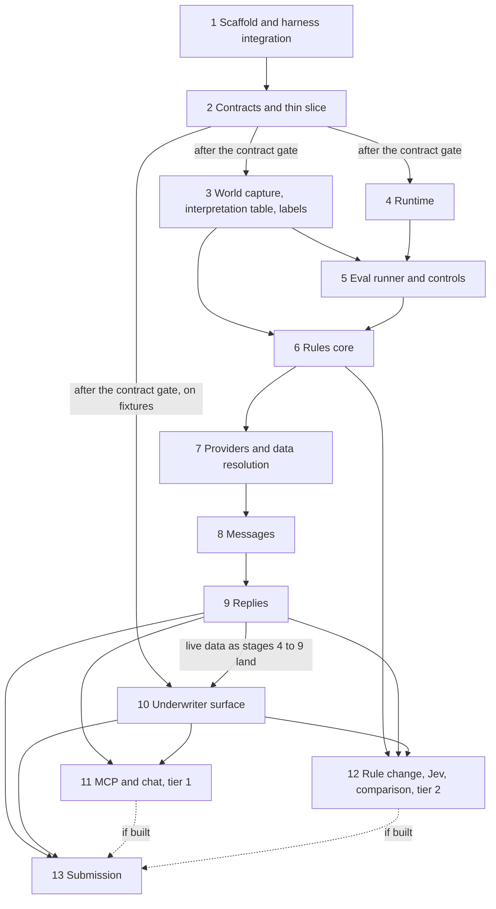

# Development plan: underwriting triage harness

This plan implements `docs/architecture.md`, cited as §n and A.n for its appendix. It adds no scope. Each stage is executable from this plan and the architecture. `AGENTS.md` holds the working rules; `.agents/skills/stage/SKILL.md` is the procedure for running one stage.

## Stage dependencies



Stage 2 ends at a human gate where Brett approves the event payloads, route responses and skill models (Appendix A, first paragraph). Stages 3, 4 and 10 start after that gate. Stages 3 and 4 do not depend on each other and may run at the same time. Stage 10 is a parallel track: it starts on fixtures and replaces each fixture-backed view with its live route as stages 4 to 9 land.

## Build tiers and cut order

§4.1 sets three tiers. A lower tier is finished and verified before a higher tier starts. The stage order stays fixed inside each tier, so the build runs in passes:

1. **Tier-0 pass.** Stages 1 to 13 in order, tier-0 tasks only. Stage 13 closes the pass, so a submittable build exists at its end.
2. **Tier-1 pass.** Stages 1 to 13 in order, tier-1 tasks only. Stage 13 updates the README for what the pass added.
3. **Tier-2 pass.** Stage 12's tier-2 tasks, built in the reverse of the cut order so the first item cut is the last item built: the model-driven triage comparison (§13.6), then the rule-change flow (§12), then the Jev adapter (§10.4). Stage 13 closes the pass.

**Cut order.** If time runs short, cut from the top of tier 2: the Jev adapter first, then the rule-change flow, then the triage comparison. Chat, MCP and replay mode are tier 1 and are cut only after all of tier 2. Whatever is cut, stage 13 writes it into the README's "Cut and hand-waved" section, and a graph that is not built returns an explicit `not_evaluated` note on the lead, never a silent pass (§4.1).

**Reading of §4.1 applied here.** An item the §4.1 table names is in that tier. An item it does not name is tier 0 when a named tier-0 item cannot work without it, and tier 1 otherwise. Examples: the event log, fact ledger, command layer, approval binding and the A.11 item actions sit under "quote packet and decline notice with approval"; recordings and record mode sit under `read_reply`, whose tests replay recordings (`AGENTS.md`); the Reply reading grader and the held-back replies sit under the improvement cycle; the runner's per-skill case results sit under the tier-0 graphs, whose per-outcome cases they score.

| Stage | Tier 0 | Tier 1 | Tier 2 |
|---|---|---|---|
| 1 | all | | |
| 2 | all, including the contract gate | | |
| 3 | capture for seeds 42, 1 and 2, rules data, review gate, tier-0 page cases with the excluded edges, seed-42 labels, reply fixtures, held-back replies, sample gate | labelling function, tier-1 page cases, packet cases | |
| 4 | event log, clock, ledger, workflow, skill registry, commands with approval binding, intent states, send and reconcile, faults on the mailbox client, recordings and record mode, run start | emergency stop and settings, settings across run start, demotion, replay mode, second-vertical test | |
| 5 | eval services and image, runner with the suite table, results log, eight tier-0 graders, controls registered | remaining graders, skill status and dispatch, release check, 50-seed sweep with Stand's key on seeds 1 to 50 | |
| 6 | parser, triage, twelve validators, loader, three-valued interpreter, plan precedence, tier-0 graphs, not-encoded list, wiring | tier-1 graphs, PC 9 & 10 acceptance case, escalation control, sweep triage column | |
| 7 | fixture reader, lookups with the seed-1 and seed-2 `not_found` cases, `resolve_data`, wiring | provider fault | |
| 8 | ask plan, rendering, recipients, packet, decline notice, item actions and `decline_lead`, dispatch, three controls | remaining controls, emergency stop on real requests, escalation headline | |
| 9 | reply endpoint, paste box, `read_reply`, code checks, lead 008 to a sent packet, fixture-reply control, reply suite, improvement cycle | fallback and skill gating, replay of the reply suite | |
| 10 | queue, detail pane with approval by payload hash and the underwriter card, waited start and fixture-reply buttons | items with batch approval, settings, skills, live updates, mode label | |
| 11 | | all | |
| 12 | | candidate export | triage comparison, rule change, Jev |
| 13 | README, images, final eval, platform rehearsal | replay recording, release check, all eight controls caught | |

## Conventions

- Paths are relative to the repository root and follow §6.1.
- Seed-42 lead ids are `LEAD-00000042-000` to `LEAD-00000042-009`. Prose uses the last three digits. Other seeds follow Stand's format `LEAD-<seed, 8 digits>-<index, 3 digits>`, for example `LEAD-00000001-000`.
- Host URLs (§14): app `http://localhost:8000`, leadgen `http://localhost:8081`, mailbox `http://localhost:8025`. Inside the compose network the app reads `LEADGEN_URL` and `MAILBOX_URL`, defaults `http://leadgen:8080` and `http://mailbox:8080`; the eval overrides both (§14). Host-side integration tests use the host URLs, set once in `tests/conftest.py`.
- In a fresh checkout, `cp .env.example .env` runs before the first compose command (§14). `.env` is ignored by git.
- The check command is `make check` (`AGENTS.md`): ruff check with the rule selection pinned in `pyproject.toml`, ruff format check, mypy over the source directories that exist, `python3 scripts/check_discipline.py`, the fast pytest selection, the web type check from stage 2 task 6, and the web unit tests from stage 2 task 9.
- The eval command is `docker compose --profile eval run --rm eval <args>` (§13.1); `make eval` wraps it. After a code, case or label change, rebuild first with `docker compose --profile eval build eval`.
- Checks against the running app assume `docker compose up -d --build --wait` after the stage's last commit, in live mode unless the command sets `RUN_MODE`.
- Database reads in acceptance commands pipe SQL into the app container: `echo "<SQL>" | docker compose exec -T app sh -c 'sqlite3 "$UWH_DB"'`. Table and column names are A.1's; event types are A.2's.
- Acceptance commands start a run with `curl -s -X POST 'http://localhost:8000/api/run/start?wait=true'`, which returns once the run has settled, meaning no lead has a runnable workflow step (A.5), and read state straight after it.
- Command bodies, payloads, responses and settings keys are A.11's. `item_id` is an open blocker's id (`blockers.id`). An `approve` of a draft carries, as `artifact_hash`, the payload hash the underwriter was shown.
- JSON keys in API responses are the snake_case names of the items A.5 and §11 list, and every lead-scoped response carries `lead_id`. The OpenAPI file approved at the stage 2 contract gate is the reference.
- Integration tests that write to the mailbox directly use lead ids starting `TEST-`. Integration tests that drive the system go through the app's REST API and start a run first.
- Model calls in tests are served from `recordings/` (`AGENTS.md`). The tasks that make a live call are stage 9 tasks 2, 4 and 8, stage 11 task 3 (to record the chat cases), stage 12 tasks 2 and 6, and stage 13 task 5. An acceptance check that makes one says "Needs `ANTHROPIC_API_KEY` in `.env`".
- `docs/acceptance.json` mirrors every acceptance check, with its tier at the start of the description. `passes` becomes true only after the command ran and the stated result was seen (`.agents/skills/verify/SKILL.md`).
- One writer at a time across all parallel work: `pyproject.toml`, `uv.lock`, `Makefile`, `compose.yaml`, `Dockerfile`, `.dockerignore`, `web/package.json`, `web/pnpm-lock.yaml`, `src/uwh/runtime/store.py`, `src/uwh/skills/__init__.py`, `src/uwh/skills/vertical.py`, `src/uwh/api/routes.py`, `evals/suites.py`. Only the eval runner and `evals/decide.py` write `evals/results.jsonl`.

### Branches

Each stage and tier pass works on the branch `stage-NN-short-name-tN` (`AGENTS.md`), for example `stage-04-runtime-t0`. The short names are: 01 `scaffold`, 02 `contracts`, 03 `labels`, 04 `runtime`, 05 `evals`, 06 `rules`, 07 `providers`, 08 `messages`, 09 `replies`, 10 `surface`, 11 `chat`, 12 `rule-change`, 13 `submission`.

The base follows `AGENTS.md`: branch from `main` when the previous stage is merged, otherwise from the previous stage's branch. Do not wait for a merge unless the stage has a human gate. Stages that run in parallel each branch from the same base and touch only the files this plan assigns them. Cross-review diffs against the branch's fork point (`.agents/skills/cross-review/SKILL.md`).

### Eval suites

`--suite <name>` runs one row of this table. `evals/suites.py` holds the table, and `tests/evals/test_suites.py` asserts it matches this one. The score key is the key under `scores` in the `run` row.

| Suite | Case set id | Graders scored (score key) | Calls a model |
|---|---|---|---|
| `seed42` | `seed-42` | Tier 0: Coverage (`coverage`), One open request (`one_open_request`), Asks (`asks`), Forbidden asks (`forbidden_asks`), Send safety (`send_safety`), Key isolation (`key_isolation`), Stand's key (`stands_key`). Tier 1 adds Rule trace (`rule_trace`), Field resolution (`field_resolution`), Escalation (`escalation`), Approval binding (`approval_binding`), Policy (`policy`). | no |
| `cases` | `skill-cases` | No §13.3 grader. Writes `skill_results` (§8) for every registered skill from its `cases/` folder against its manifest threshold. | `read_reply` cases only |
| `replies` | `replies` | Tier 0: Reply reading (`reply_reading`). Tier 1 adds Skill gating (`skill_gating`). | yes |
| `replies-held-back` | `replies-held-back` | Reply reading (`reply_reading`) | yes |
| `packets` | `packet-cases` | Tier 1: Packet fidelity (`packet_fidelity`), Rule trace (`rule_trace`) | no |
| `chat` | `chat` | Tier 1: Chat (`chat`) | yes |
| `triage-comparison` | `triage-comparison` | Tier 2: Asks (`asks`) and Forbidden asks (`forbidden_asks`) over five repeats; a measurement, not a gate (§13.6) | yes |
| `all` | `all` | Every grader of `seed42`, `cases`, `replies`, `packets` and `chat`, in one run | yes |

- A suite scores only the graders of its row that are registered. A grader is registered when its tier is built.
- `--suite` exits 0 only when every grader it scored passes and no §13.3 critical error occurred. The `cases` suite exits 0 only when every entry of `skill_results` passes. `triage-comparison` exits 0 once its row is written.
- A suite whose row holds no registered grader, or `cases` with no registered skill, reports `not_ready` and exits 3, never 0.
- Faults never run inside a reference run (§13.1). The `seed42` suite runs its reference run, then one separate fault run on lead 008 for each send-safety fault, `fail_after_acceptance` and `empty_while_in_flight`. Send safety scores those fault runs, and the row lists them under `injected_faults`. `--fault <name>` adds one more separate fault run on lead 008, for example `provider_unavailable`.
- `--control <name>` runs the suite that holds the variant's named graders: `packets` for "Drop a requirement from the packet", `seed42` for the other seven variants.
- `replies-held-back` and `triage-comparison` run only by name; `all` excludes them.

## Test tiers

| Tier | Selection | Limit | When it runs |
|---|---|---|---|
| fast | `uv run pytest -m "not slow and not integration"` and the web unit tests | under 5 seconds per test | inside `make check`, on every stop |
| slow | `uv run pytest -m "slow or integration"` (both tiers in one selection) | none | `make test-slow`, before a stage is marked done |
| integration | the same selection, containers up | none | `make test-slow`, before a stage is marked done |
| eval | `docker compose --profile eval run --rm eval <args>` | none | in acceptance checks; every run appends a `run` row to `evals/results.jsonl` |

`slow` and `integration` are registered markers, and pytest runs with `testpaths = ["tests"]`, `--strict-markers` and `--import-mode=importlib` (each skill has its own `test_skill.py`, so test basenames repeat). Every `src/uwh/**/<name>.py` has a `tests/**/test_<name>.py`; `scripts/check_discipline.py` fails otherwise. Stage 1 task 1 ships a fast test and stage 1 task 5 ships integration tests, so neither selection collects zero tests once those tasks are done.

Fast tests that need Stand's services load Stand's unmodified mailbox app in process through Starlette's `TestClient` (`MAILBOX_DB` at a temporary file) and call Stand's generator in process. The leadgen and mailbox clients are synchronous and take an `httpx.Client`; a `TestClient` is one. These are Stand's code paths, not mocks. Stand's package `mailbox` shares its name with a standard-library module, so `tests/conftest.py` puts `sim-harness/` first on `sys.path`, sets `MAILBOX_DB`, and imports Stand's package before anything imports the standard one. Model calls in tests are served from `recordings/`, never from a hand-written response.

| Stage | fast | slow | integration | eval |
|---|---|---|---|---|
| 1 | yes | | yes | |
| 2 | yes | | | |
| 3 | yes | | yes | |
| 4 | yes | yes | yes | |
| 5 | yes | yes | | yes |
| 6 | yes | | | yes |
| 7 | yes | | | yes |
| 8 | yes | | yes | yes |
| 9 | yes | | yes | yes |
| 10 | yes | | | |
| 11 | yes | | yes | yes |
| 12 | yes | | yes | yes |
| 13 | yes | | yes | yes |

## Definition of done for any stage

1. `make check` exits 0 and its output holds no warnings or errors.
2. `make test-slow` passes for the stage's tests.
3. Every acceptance check of the stage, for the tier being built, passes and is marked in `docs/acceptance.json`.
4. The `verify` skill, then the `cross-review` skill, ran and their findings are handled.
5. `docs/progress.md` has the stage entry in the format of `.agents/skills/stage/SKILL.md`, including its **Friction** line.
6. The stage's implemented and not-implemented lists match the code.

## Build discipline

`AGENTS.md` holds the full rules. In short:

- Test first. Each code task names its failing test, and the test fails for the stated reason before the implementation exists.
- No test asserts mocked behaviour. Integration and end-to-end tests run against Stand's real containers with no mocks.
- No temporal or historical language in any artifact; `scripts/check_discipline.py` enforces a word list and the rule is wider than the list.
- Every code file starts with a two-line `ABOUTME:` header.
- Make the smallest change that passes. Do not weaken a grader, threshold or test to get green.
- One task, one commit, on the stage branch `stage-NN-short-name-tN` (Conventions, Branches).

---

## Stage 1: Scaffold and harness integration

**Goal.** One command starts Stand's leadgen and mailbox, built from their unmodified code, and an app skeleton on Stand's documented ports. A bootstrap proves the app can post the seed queue, read the leads, and round-trip one mailbox message with metadata.

**Depends on.** None.

**Architecture sections.** §2.2, §6.1, §6.2, §7.7 (the mode variable), §9.4 (no debug access), §13.1 (bootstrap check), §14, §15 item 1.

**Tier.** All tasks tier 0.

**Tasks.**

1. **uv project, tool configuration and Makefile.** Build `pyproject.toml`: Python 3.12; package `uwh` under `src/` (`src/uwh/__init__.py`); runtime dependencies fastapi, uvicorn, pydantic, httpx, pyyaml, anthropic; dev dependencies pytest, hypothesis, ruff, mypy, and jinja2 for Stand's mailbox in process; `uv.lock`. Tool configuration:
   - ruff: `line-length = 100`, `extend-exclude = ["sim-harness"]`, and `lint.select = ["E4", "E7", "E9", "F"]` written out, because ruff's default rule set depends on its version (ruff 0.16.10 enables SIM102, which `scripts/check_discipline.py` fails);
   - run `uv run ruff format scripts/` once in this task: `scripts/check_discipline.py` carries magic trailing commas that fail `ruff format --check` at any line length, and the change is whitespace made by the formatter;
   - mypy: `strict = true`, with `files` listing only directories that exist: `src` in this task, and `tools` and `evals` each added in the commit that creates the directory;
   - pytest: the options in Test tiers;
   - `Makefile` with the four targets in `AGENTS.md`: `check` runs the steps listed in Conventions, and `test-slow` runs `uv run pytest -m "slow or integration"`.

   This task ships the first fast test, so the fast selection never collects zero tests: `tests/rules/test_registry_copies.py` asserts `docs/brief/field_registry.json` and `sim-harness/shared/field_registry.json` are byte-identical, guarding the copy the app image reads. It passes on first run -> `make check` exits 0 with clean output over the package skeleton, the formatted script and this test.
2. **SDK verification.** Check the `messages.parse()` structured-output call and the forced-`tool_choice` restriction against the Anthropic SDK documentation (Context7 or the vendor page), pin the SDK version in `uv.lock`, and record both findings with their source URLs in `docs/progress.md` (§14, §6.2) -> S01-A10.
3. **Environment file.** `.env.example` documents the six variables of §14, one comment line each, with `ANTHROPIC_MODEL=claude-sonnet-5-5`, `RUN_MODE=live`, `SEED=42` and `DEBUG=false`. `.gitattributes` and `.gitignore` exist; extend them only if a stage-1 file needs it -> S01-A9.
4. **Settings.** Test: `tests/test_settings.py` asserts `RUN_MODE` accepts `live`, `replay` and `record` and refuses anything else; `SEED` defaults to 42; `ANTHROPIC_MODEL` defaults to `claude-sonnet-5-5`; `LEADGEN_URL` and `MAILBOX_URL` default to `http://leadgen:8080` and `http://mailbox:8080` and an environment value overrides each (the eval sets them, §14); `UWH_DB` is read from the environment -> red. Build: `src/uwh/settings.py` -> green.
5. **Harness clients.** Test: `tests/runtime/test_leadgen_client.py` asserts the client's public methods are exactly `post_queue`, `list_leads`, `get_lead`, `healthz`, and no attribute name contains `debug` (§9.4). `tests/runtime/test_mailbox_client.py` asserts `send`, `list_for_lead`, `get`, `reset`, `healthz`, and, against Stand's mailbox in process through Starlette's `TestClient`, that a message sent with metadata reads back by lead with equal metadata. Both clients are synchronous and take an `httpx.Client`. `tests/integration/test_harness_clients.py` posts seed 42 to the leadgen container and asserts the ten ids in order with 73 fields each, and round-trips metadata on the mailbox container under a `TEST-` lead id -> red. Build: `src/uwh/runtime/leadgen_client.py`, `src/uwh/runtime/mailbox_client.py` -> green.
6. **App skeleton.** Test: `tests/api/test_app.py` asserts `GET /api/run` returns 200 with the mode and seed and no run id before a run starts -> red. Build: `src/uwh/api/app.py` -> green.
7. **Bootstrap.** Test: `tests/integration/test_bootstrap.py` asserts `uwh.runtime.bootstrap.run()` generates its own id (no run exists at stage 1), posts the queue for `SEED`, returns the ten ids in order, reads every lead envelope, sends one probe under lead id `BOOTSTRAP-<bootstrap id>` with metadata `{"probe": true, "run_id": <bootstrap id>}` and reads it back by lead; and that a mailbox URL at a closed port raises `EnvironmentInvalid`, the type the eval maps to `invalid` (§13.1) -> red. Build: `src/uwh/runtime/bootstrap.py` with a `python -m uwh.runtime.bootstrap` entry printing a JSON summary -> green.
8. **Compose and image.** Test: `tests/packaging/test_compose.py` parses `compose.yaml` and asserts the default-profile services of §14: `leadgen` and `mailbox` built from Stand's Dockerfiles with context `./sim-harness`, host ports 8081 and 8025, `DEBUG: "${DEBUG:-false}"`, `LEADGEN_DB` and `MAILBOX_DB` set, a named volume each; `app` built from the `app` target of `Dockerfile` on host port 8000 with a named volume at `/data`, `.env` passed through `env_file`, `RUN_MODE`, `SEED` and `ANTHROPIC_MODEL` interpolated so a shell value overrides the file, `LEADGEN_URL` and `MAILBOX_URL` set to the in-network URLs, `UWH_DB` set to `/data/app-${RUN_MODE:-live}.db` so replay gets its own database (§7.7), and `depends_on` both Stand services with `condition: service_healthy`; every service has a healthcheck (the app's calls `GET /api/run`). It also asserts the root `.dockerignore` lists `.env`, `.git`, `.venv`, `web/node_modules` and `web/dist` (§14) -> red. Build: `compose.yaml`; `.dockerignore`; `Dockerfile` with an `app` stage: Python 3.12 slim, `uv sync --frozen`, the `sqlite3` CLI, `WORKDIR /app`, `ENV PATH=/app/.venv/bin:$PATH` so `python` is the project interpreter, the registry, and `src/` copied from an intermediate stage that deletes every `cases/` folder, so no layer of the app image holds one (§14); never `evals/` -> green. Then run `cp .env.example .env` (§14), and S01-A1 passes.

**Acceptance checks.**

**S01-A1.** Tier 0. All three services start and report healthy. Needs `.env`, copied from `.env.example`.
```sh
docker compose up -d --build --wait && docker compose ps --format '{{.Service}} {{.Health}}'
```
Expect: exactly three lines, `app healthy`, `leadgen healthy`, `mailbox healthy`.

**S01-A2.** Tier 0. The bootstrap posts seed 42, reads ten leads and round-trips the probe.
```sh
docker compose exec -T app python -m uwh.runtime.bootstrap | jq -e '(.lead_ids | length) == 10 and .lead_ids[0] == "LEAD-00000042-000" and .lead_ids[9] == "LEAD-00000042-009" and .probe.metadata_round_trip == true'
```
Expect: exit 0.

**S01-A3.** Tier 0. The probe is in the real mailbox with its metadata, read independently of the bootstrap.
```sh
id=$(curl -s "http://localhost:8025/emails?limit=1" | jq -r '.[0].id'); curl -s "http://localhost:8025/emails/$id" | jq -e '(.lead_id | startswith("BOOTSTRAP-")) and .metadata.probe == true and (.metadata.run_id | type) == "string"'
```
Expect: exit 0.

**S01-A4.** Tier 0. The answer key is off by default and no application source names the debug path.
```sh
docker compose config --format json | jq -r '.services.leadgen.environment.DEBUG' && test -d src/uwh && ! grep -rn '/debug' src/
```
Expect: `false`, then exit 0.

**S01-A5.** Tier 0. Stand's code is unchanged since the root commit and clean in the working tree.
```sh
git diff --quiet "$(git rev-list --max-parents=0 HEAD)" HEAD -- sim-harness && test -z "$(git status --porcelain -- sim-harness)"
```
Expect: exit 0.

**S01-A6.** Tier 0. Every tracked text file has LF line endings; the tracked `.claude/skills` symlink reports an empty index field and is not counted.
```sh
git ls-files --eol | awk '$1 != "i/lf" && $1 != "i/-text" && $1 != "i/none" && $1 != "i/"' | wc -l
```
Expect: `0`.

**S01-A7.** Tier 0. The check command is clean.
```sh
make check
```
Expect: exit 0, no warnings or errors in the output.

**S01-A8.** Tier 0. The client and bootstrap integration tests pass against the containers.
```sh
uv run pytest -m integration tests/integration/test_harness_clients.py tests/integration/test_bootstrap.py
```
Expect: all pass.

**S01-A9.** Tier 0. `.env.example` documents the six variables and the default model.
```sh
grep -cE '^(ANTHROPIC_API_KEY|ANTHROPIC_MODEL|TYPESAFE_API_KEY|RUN_MODE|SEED|DEBUG)=' .env.example && grep -q '^ANTHROPIC_MODEL=claude-sonnet-5-5$' .env.example
```
Expect: `6`, then exit 0.

**S01-A10.** Tier 0. The Anthropic SDK version is pinned and the SDK check is recorded.
```sh
grep -A1 '^name = "anthropic"$' uv.lock | grep -c '^version = ' && grep -c 'messages.parse' docs/progress.md
```
Expect: `1`, then a number of at least 1.

**S01-A11.** Tier 0. The app reports its mode and seed.
```sh
curl -s http://localhost:8000/api/run | jq -e '.mode == "live" and .seed == 42'
```
Expect: exit 0.

**Implemented after this stage.** Compose with leadgen, mailbox and app on ports 8081, 8025 and 8000; the root `.dockerignore`; settings with `LEADGEN_URL` and `MAILBOX_URL`; `GET /api/run`; synchronous leadgen and mailbox clients; bootstrap; tool configuration and Makefile; the registry copy guard; SDK pin and check record.

**Not implemented after this stage.** Contracts; web; eval services; any runtime or underwriting behaviour.

**Human gate.** None.

**Parallel work.** Task 1 comes first. Tasks 4 to 7 and task 8 can then run in parallel. Single writer for `pyproject.toml`, `uv.lock`, `Makefile`, `compose.yaml`, `Dockerfile`, `.dockerignore`.

---

## Stage 2: Contracts and thin slice

**Goal.** Turn Appendix A into Pydantic models, SQL and an OpenAPI file; propose the event payload fields, route response shapes and skill input and output models that Appendix A leaves to this stage; register the underwriting vertical; render a queue page and detail pane from fixture data behind a stand-in API; and freeze the contracts at Brett's gate.

**Depends on.** 1.

**Architecture sections.** Appendix A first paragraph (the contract gate), §7 (vertical registration), §7.1, §7.4, §7.5 (intent states), §8, §9.2, §9.4 (provider result), §9.6 (node results, traces), §10.1, §10.2, §10.5, §11, A.1 to A.11, §6.2 (frontend), §14 (multi-stage image).

**Tier.** All tasks tier 0. Routes for tier-1 and tier-2 features are declared here and return 501 until their stage builds them.

**Tasks.**

1. **Vertical registration.** Test: `tests/skills/test_vertical.py` asserts `src/uwh/skills/vertical.py` registers the §7.1 statuses, the five blocker kinds in priority order (`delivery_unknown`, `underwriter_question`, `underwriter_review`, `data`, `producer_reply`), the A.3 transitions, the §7.4 command classes with default level, lock and permitted actors (including `inbound`, `resolve_fact`, `decline_lead`, `propose_rule_change`, `apply_rule_change` and `start_run`), the four §10.1 message kinds as the A.1 intent kinds, and the §2.2 reference morning -> red. Build: `src/uwh/skills/vertical.py` -> green.
2. **Tables.** Test: `tests/runtime/test_store.py` asserts the opened database has exactly the A.1 tables and columns, `runs` and `proposals` included, and that `UPDATE` and `DELETE` on `events` raise (§7.2 append-only) -> red. Build: `src/uwh/runtime/store.py` holding the A.1 DDL, including the `mode` column on `events`, and the triggers -> green.
3. **Event types.** Test: `tests/runtime/test_event_types.py` asserts the event-type enum equals the 26 names of A.2, `run_started` and `replay_miss` included, and each has a payload model named after it -> red. Build: `src/uwh/runtime/event_types.py`, with the payload fields this stage proposes -> green.
4. **Hashes and digests.** Test: `tests/runtime/test_hashing.py` asserts canonical JSON per A.4 and a Hypothesis property that the hash of a mapping does not depend on key order; plan, ruleset and payload hashes over their A.4 inputs. `tests/skills/test_digest.py` asserts the skill digest covers every file in the skill's folder except `cases/`, one shared hash of every Python file under `src/uwh/` outside `skills/`, the ruleset hash, and the model id for model skills (A.4); an edit under `cases/` leaves it unchanged, and an edit to a rules-core, provider or runtime module changes every skill's digest -> red. Build: `src/uwh/runtime/hashing.py`, `src/uwh/skills/digest.py` -> green.
5. **Domain and skill contract models.** Test: `tests/rules/test_models.py` asserts the §9.2 triage enums (`blocked` among the resolutions), the eight §9.6 effects as a discriminated union, the five `Deadline` values with no conversion, the three node results (`decided`, `undecided`, `declines_on_every_branch`), a rule trace as the concatenated `board_path` lists with `alternatives` (one trace per branch, each with its assumed value) for a decline on every branch (§9.6), the action plan with committed and possible effects and `not_evaluated` notes, and the five §10.2 ask kinds. `tests/providers/test_models.py` asserts the §9.4 provider result. `tests/skills/test_contracts.py` asserts an input and an output model for each of the seven §8 skills, each output a result or a typed abstention (§8); the A.9 `Candidate` (with `field`) and `ReplyReading`; and the §10.5 quote packet -> red. Build: `src/uwh/rules/models.py`, `src/uwh/providers/models.py`, `src/uwh/skills/contracts.py` -> green.
6. **Web package scaffold.** Not code; no test of its own. Build `web/` with `package.json` (a `packageManager` field naming the pnpm version, `engines.node` set to 22), `pnpm-lock.yaml`, Vite, React, TypeScript and shadcn/ui configuration, a `gen:types` script that runs openapi-typescript on `web/src/api/openapi.json` into `web/src/api/types.ts`, and a dev-server proxy of `/api` to `UWH_API_URL`. Node 22 and pnpm through `corepack enable` are the `AGENTS.md` prerequisites. Every scaffolded `.ts` and `.tsx` file carries the two ABOUTME lines, `vite.config.ts`, `src/vite-env.d.ts` and each shadcn/ui component included; the generated `web/src/api/types.ts` is the one exemption, already listed in `scripts/check_discipline.py`. The Makefile's web step runs `pnpm --dir web exec tsc --noEmit` from this task -> `pnpm --dir web install --frozen-lockfile` and `make check` pass.
7. **Routes, OpenAPI file and generated types.** Test: `tests/api/test_routes.py` asserts the app's OpenAPI paths equal the A.5 table (14 paths; `/mcp` is mounted outside OpenAPI). `tests/api/test_views.py` asserts the queue row carries every §11 queue column; the lead detail carries `lead_id`, facts, plan, rule trace, notes, blockers with `item_id`, drafts with `intent_id` and `payload_hash`, and open choices with `choice_id` (A.5); command bodies, payloads and responses match A.11, `approve` with `artifact_hash` included; the HTTP command schema omits the workflow-only classes; and no field anywhere is named `confidence` or carries a model confidence (§11), while `p_f` is an ordinary fact, since it is an underwriting input. `tests/tools/test_export_openapi.py` asserts `tools/export_openapi.py --check` fails when `web/src/api/openapi.json` differs from the app's document -> red. Build: `src/uwh/api/views.py`, `src/uwh/api/routes.py`, `tools/export_openapi.py`; `pnpm --dir web run gen:types` writes `web/src/api/types.ts`; both files are committed -> green.
8. **UI fixtures and stand-in API.** Test: `tests/tools/test_standin_api.py` asserts every GET route of A.5, served by `tools/standin_api.py` through FastAPI's test client, returns fixture data that validates against its response model for all ten seed-42 ids, and POST routes return 501 -> red. Build: `tests/fixtures/ui/` oriented on §5, with a README stating these are display data that no grader and no label author reads; `tools/standin_api.py --port <n>` -> green.
9. **Queue page and detail pane.** Test: `web/src/queue/QueuePage.test.tsx` asserts ten rows in the order received with the §11 group boundaries and the one-sentence summary with its six counts. `web/src/lead/DetailPane.test.tsx` asserts the next action, facts with source tags (`p_f` among them), the playbook-path checklist with its exceptions-only toggle, the draft, the notes, and no model confidence -> red. Build: the two views; the Makefile's web step adds `pnpm --dir web exec vitest run` with these first web tests -> green.
10. **Frontend in the image.** Test: `tests/api/test_app.py` gains: with `UWH_STATIC_DIR` pointing at a temporary directory holding an `index.html`, the app serves that file at `/`; `tests/test_settings.py` gains `UWH_STATIC_DIR` with the image's built-frontend path as its default -> red. Build: the frontend stage of the multi-stage `Dockerfile` (Node 22, `corepack enable`, `pnpm install --frozen-lockfile`, `pnpm build`) with `web/dist` copied to that path, and the static mount (§14) -> green.
11. **Human gate: contracts.** Brett reads the event payload models (`src/uwh/runtime/event_types.py`), the route response shapes (`src/uwh/api/views.py` and `web/src/api/openapi.json`) and the skill input and output models (`src/uwh/skills/contracts.py`), and approves them. The stage 2 progress entry records `Contracts approved by Brett at <commit>`. From that point the shapes are frozen, and a change needs Brett's approval (Appendix A) -> S02-A8.

**Acceptance checks.**

**S02-A1.** Tier 0. Contract tests pass.
```sh
uv run pytest tests/skills/test_vertical.py tests/runtime/test_store.py tests/runtime/test_event_types.py tests/runtime/test_hashing.py tests/skills/test_digest.py tests/rules/test_models.py tests/providers/test_models.py tests/skills/test_contracts.py tests/api/test_routes.py tests/api/test_views.py
```
Expect: all pass.

**S02-A2.** Tier 0. The committed OpenAPI file matches the app and holds the 14 A.5 paths.
```sh
uv run python tools/export_openapi.py --check && jq -e '(.paths | keys | length) == 14 and (.paths | has("/api/run/start")) and (.paths | has("/api/replies/fixtures"))' web/src/api/openapi.json
```
Expect: exit 0.

**S02-A3.** Tier 0. Generated TypeScript types are tracked and match the committed copy; an untracked or differing file fails.
```sh
pnpm --dir web run gen:types && git ls-files --error-unmatch web/src/api/types.ts web/src/api/openapi.json >/dev/null && test -z "$(git status --porcelain -- web/src/api)"
```
Expect: exit 0.

**S02-A4.** Tier 0. The stand-in API serves valid fixture data for every GET route and all ten leads.
```sh
uv run pytest tests/tools/test_standin_api.py
```
Expect: all pass.

**S02-A5.** Tier 0. Web unit tests pass.
```sh
pnpm --dir web exec vitest run
```
Expect: all pass.

**S02-A6.** Tier 0. The app container serves the built frontend.
```sh
docker compose up -d --build --wait app && curl -s http://localhost:8000/ | grep -c 'id="root"'
```
Expect: `1`.

**S02-A7.** Tier 0. The check command, with its web steps, is clean.
```sh
make check
```
Expect: exit 0, no warnings or errors.

**S02-A8.** Tier 0. Brett's approval of the contracts is recorded with the commit it covers.
```sh
grep -cE 'Contracts approved by Brett at [0-9a-f]{7,40}' docs/progress.md
```
Expect: a number of at least 1.

**Implemented after this stage.** Vertical registration; A.1 tables with `runs` and `proposals`; the 26 A.2 event models; A.4 hashes and skill digest; domain, provider and skill contract models for all seven skills; the web package; A.5 routes declared and the OpenAPI file; generated types; fixtures and stand-in API; queue page and detail pane on fixtures; frontend in the image; contracts approved and frozen.

**Not implemented after this stage.** Every route except `GET /api/run` returns 501; no behaviour behind the models.

**Human gate.** Task 11. Brett also opens the queue page and detail pane against the stand-in (`uv run python tools/standin_api.py --port 8765` and `UWH_API_URL=http://localhost:8765 pnpm --dir web dev`). Feedback goes into `docs/progress.md` for the stage 10 track. Stages 3, 4 and 10 start after this gate.

**Parallel work.** Tasks 1 to 5 have one writer. Task 6 can run alongside them. Task 7 follows tasks 5 and 6. Tasks 8 and 9 start once task 7 has generated types; task 10 follows task 9. Single writer for `src/uwh/api/routes.py`, `src/uwh/skills/vertical.py`, `web/package.json`, `web/pnpm-lock.yaml`.

---

## Stage 3: World capture, interpretation table, labels

**Goal.** Produce the synthetic provider data, the reviewed rules data, and the expected results the evals grade against, written without reading the rules Python.

**Depends on.** 1, 2 (after its contract gate).

**Architecture sections.** §5, §9.1, §9.2 (conditional preambles), §9.3, §9.4, §9.5 (validator ids and confirmation templates), §9.6 (rule traces, case acceptance), §9.7, §13.2, A.6 (board ids, derived inputs, `params`), A.7, §15 item 3.

**Authors.** Two agents. The **rules-data author** writes tasks 1 to 3. The **label author** writes tasks 5 to 7 and 9 to 12, after the gate in task 4. The label author reads the playbook transcriptions, the registry, the architecture, the provider fixtures and the data files under `src/uwh/rules/data/`, and never the Python under `src/uwh/rules/` (§13.2) or `tests/fixtures/ui/`.

**Tasks.**

1. **capture_world** (tier 0). Test: `tests/tools/test_capture_world.py` asserts, for seeds 42, 1 and 2, that the wrapped generator's output equals the unwrapped output field for field; that the guarantee-pass assertion raises on an in-memory copy of Stand's config whose `guarantee_hard_archetypes` is raised above the natural count, and stays silent under the supplied config; that each fixture entry holds the clean base value of every §9.4 provider field, the archetype-set values, and a fingerprint of the lead's submitted fields; and that the entry is `not_found` for `kyc_score` on `LEAD-00000001-000` (the profile archetype nulled it) and for `protection_class` on `LEAD-00000002-004` (the rural archetype nulled it). `tests/integration/test_world_matches_leadgen.py` posts each of the three seeds to the leadgen container and asserts the fixture's final leads equal its `GET /leads/{id}` fields -> red. Build: `tools/capture_world.py` (wraps `_base_lead` and each archetype call of Stand's unmodified generator, imported in process), writing `src/uwh/providers/data/world-<seed>.json`, with `--seed` and `--check`, which fails when the file is absent or differs -> green.
2. **derivations.yaml** (tier 0). Test: `tests/rules/test_rules_data.py` asserts the roof and siding maps equal `ROOF_CLASS` and `SIDING_CLASS` imported from Stand's `generator.py` and cite that file and symbol (§9.1), and that the two derived inputs of A.6 are declared with their inputs: `coverage_to_rce_ratio` (`coverage_a / replacement_cost`) and `roof_age_years` (the reference year minus `roof_replacement_year`) -> red. Build: `src/uwh/rules/data/derivations.yaml` -> green.
3. **interpretation.yaml, catalogue.yaml, wording.yaml** (tier 0). Test: `tests/rules/test_rules_data.py` asserts rows I01 to I57, each with id, source page, ruling, kind and rationale, each kind equal to §9.7; I35 carries `params: {tolerance: 0.10}` (A.6); a row applied outside the graphs carries `applied_in`, naming the validator, derivation, resolution rule or rendering step that applies it (§9.6). `catalogue.yaml` holds exactly the eleven A.7 ids with wording, answer type and row. `wording.yaml` holds a plain-language question for every producer-editable registry field; one conditional preamble for each distinct `requiredWhen` string in the registry (six, enumerated from the registry so a seventh fails the test, §9.2); and one neutral confirmation template for each of the twelve §9.5 validators, keyed by a validator id that lists the registry fields it covers (A.7) -> red. Build: the three files under `src/uwh/rules/data/` -> green.
4. **Human gate: interpretation rows** (tier 0). Brett reviews every row, the §9.7 lenient rows first, and adds `reviewed_by: Brett` to each row he accepts -> S03-A4.
5. **Cases for the tier-0 pages** (tier 0). Test: `tests/evals/test_case_coverage.py` follows §13.2 "Case coverage". It parses the Mermaid in the `flowchart.md` of `docs/playbook/02-*`, `03-*`, `04-*`, `05-*`, `06-*`, `07-*` and `12-*`, lists every edge into a terminal box, and asserts one case per edge in `src/uwh/skills/evaluate_playbook/cases/<page>/`, except the edges listed in `evals/labels/excluded_edges.yaml`. Each exclusion cites the interpretation row that removes the edge, and the rows cited are exactly the six of §13.2: I04, I05, I12, I14, I20 and I48. Each case is one YAML file whose stem is its case id, unique across pages, and names its expected trace, the concatenated `board_path` from root to outcome (§9.6; for example ending `07:LIVING`, `07:D1`), or `alternatives` for a decline on every branch. One further case covers each §9.7 boundary on those pages, listed in `evals/labels/boundaries.yaml` with its row. Cases validate against `evals/labels/schema.py` -> red. Build: the cases, including the I12 hand cases at `p_f` 0.21 and 0.54, the I07 two-month choice, the I52 case for a 2001 asphalt roof at `p_f` 0.6, and the two Post & Pier acceptance cases of §9.6: a deck above 12 feet on a home built in 2000 or later with `post_pier_supports_living_area` unknown, which declines with two alternative traces, and a deck height of 15 feet from a reply, which declines. `src/uwh/skills/triage_fields/cases/` covers the §9.2 rules and table, including the seed-42 shapes of leads 002, 005 and 006 and the blocked protection-class dependents -> green.
6. **Seed-42 labels** (tier 0). Test: `tests/evals/test_labels.py` asserts ten files `evals/labels/seed-42/LEAD-00000042-00N.yaml` that validate against the label schema. Each label holds: expected status, open blocker kinds, primary next action, message class, expected asks (kind and field, catalogue or validator id), the expected trace of each decline and requirement (§9.6), the pages left undecided, the fields resolved as `blocked`, the reason the lead needs the underwriter where it does, `underwriter_actions` (the scripted underwriter the eval plays, naming choices by `choice_id`), and `signed_by`. Whether a lead needs the underwriter (the Escalation positive class) is derived from its expected blockers and message class, and a request whose only non-field asks are confirmations has `message_class: routine` (§10.1). The test also asserts the first-pass results §5 and §9.6 state: 000 is a proposed decline with no asks; 001 asks for the address, has `p_f` blocked, and leaves Fire Simulation undecided with no card; 003 blocks the four protection-class fields (`fire_dept_response_time`, `alternative_water_source`, `interior_sprinklers`, `physical_barriers`) and asks none of them, leaves Occupancy undecided, commits the Siding requirement, and holds one card; 005 leaves Fire Simulation undecided, asks follow-ons only for the missing pool fields, and does not ask `pool_has_diving_board_or_slide`; 006 asks no pool field already on the lead, blocks the four protection-class fields, commits the Siding requirement, and holds one card; 007 blocks the four protection-class fields; and the leads needing the underwriter are exactly 000, 003 and 006 -> red. Build: the ten labels -> green.
7. **Reply fixtures** (tier 0). Test: `tests/evals/test_reply_fixtures.py` asserts four fixtures: full for lead 008; partial, contradicting and instruction-bearing on leads the author names. Each holds expected facts with `ask_id`, `field` and spans (A.9; a confirmation answer carries its validator id as `ask_id` and the covered field it gives as `field`), the classification, and the lead state, every span occurring verbatim in its body. Bodies sit in `fixtures/replies/` and expected results in `evals/labels/replies/` (§13.2) -> red. Build: the fixtures, with producer answers written by hand -> green.
8. **Human gate: labels and case sample** (tier 0). Brett reads the ten labels, the boundary list and the excluded-edge list, adds `signed_by: Brett` to each label he accepts, and checks a random sample of 20 per-outcome cases, recorded by case id in `evals/labels/case_sample.yaml`. The sample is drawn at the last stage-3 gate reached, over all cases present then -> S03-A6, S03-A7.
9. **Labelling function** (tier 1). Test: `tests/evals/test_labelling.py` asserts, on hand-built leads, every §9.2 rule (a present value needs no ask, blocked dependents of an unresolved system-owned field, the three-valued `is_gated_community` condition), the six fields of the §9.2 table, and the §9.3 defaults, including the combined knob-and-tube question below 1950 and the ask at 1950 or later (I51) -> red. Build: `evals/labelling.py`, the §13.2 function with its own condition handling; it imports no `uwh.rules` module except `uwh.rules.models` (S03-A8) -> green.
10. **Cases for the tier-1 pages** (tier 1). Test: `tests/evals/test_case_coverage.py` gains the pages `08-*`, `09-*`, `10-*`, `11-*` and `13-*` -> red. Build: their cases and boundaries, including the PC 9 & 10 acceptance case of §9.6: a rural lead with no hydrant within 1,000 feet and limited road access declines on every branch, and no catalogue question is asked -> green.
11. **Packet cases** (tier 1). Test: `tests/evals/test_packet_cases.py` asserts three constructed leads in `evals/labels/packet_cases/` whose expected plans between them hold a surcharge, a requirement with a deadline, an exclusion and a coverage adjustment (§13.2) -> red. Build: the three leads -> green.
12. **Held-back replies** (tier 0, written in the tier-0 pass with tasks 5 to 7). Three hand-written replies, bodies and expected results together in `evals/labels/replies-held-back/` and never in `fixtures/replies/`, kept from the `read_reply` implementer until the stage 9 eval run (§13.2) -> S03-A9.

**Acceptance checks.**

**S03-A1.** Tier 0. The committed world fixtures for seeds 42, 1 and 2 match a fresh capture.
```sh
uv run python tools/capture_world.py --seed 42 --check && uv run python tools/capture_world.py --seed 1 --check && uv run python tools/capture_world.py --seed 2 --check
```
Expect: exit 0.

**S03-A2.** Tier 0. The captured leads for seeds 42, 1 and 2 equal the leadgen container's leads.
```sh
uv run pytest -m integration tests/integration/test_world_matches_leadgen.py
```
Expect: all pass.

**S03-A3.** Tier 0. Capture and rules-data tests pass.
```sh
uv run pytest tests/tools/test_capture_world.py tests/rules/test_rules_data.py
```
Expect: all pass.

**S03-A4.** Tier 0. Brett has reviewed all 57 interpretation rows.
```sh
grep -c 'reviewed_by: Brett' src/uwh/rules/data/interpretation.yaml
```
Expect: `57`.

**S03-A5.** Tier 0. Case coverage for the tier-0 pages, labels and reply fixtures pass.
```sh
uv run pytest tests/evals/test_case_coverage.py tests/evals/test_labels.py tests/evals/test_reply_fixtures.py
```
Expect: all pass.

**S03-A6.** Tier 0. Brett has signed all ten seed-42 labels.
```sh
grep -l 'signed_by: Brett' evals/labels/seed-42/*.yaml | wc -l
```
Expect: `10`.

**S03-A7.** Tier 0. Brett's sample holds 20 distinct case ids, each naming a case that exists.
```sh
uv run python -c "import glob, pathlib, yaml; ids = yaml.safe_load(open('evals/labels/case_sample.yaml'))['cases']; known = {pathlib.Path(p).stem for p in glob.glob('src/uwh/skills/evaluate_playbook/cases/**/*.yaml', recursive=True)}; print(len(ids), len(set(ids)), len(set(ids) - known))"
```
Expect: `20 20 0`.

**S03-A8.** Tier 0. Code under `evals/` and `tests/evals/` imports no `uwh.rules` module other than `uwh.rules.models`, in any import form.
```sh
uv run pytest tests/evals/test_label_independence.py
```
Expect: all pass. The test parses every Python file under `evals/` and `tests/evals/` with `ast` and fails on `import uwh.rules`, `import uwh.rules as r`, `import uwh.rules.<module>`, `from uwh.rules import <name>`, `from uwh.rules.<module> import <name>` and `from uwh import rules`, unless the module is `uwh.rules.models`. It first asserts that its detector flags each of those forms in literal source strings.

**S03-A9.** Tier 0. Three held-back replies exist outside the shipped fixture folder.
```sh
test "$(ls evals/labels/replies-held-back/*.yaml | wc -l)" -eq 3
```
Expect: exit 0.

**S03-A10.** Tier 1. The labelling function, tier-1 page cases and packet cases pass.
```sh
uv run pytest tests/evals/test_labelling.py tests/evals/test_case_coverage.py tests/evals/test_packet_cases.py
```
Expect: all pass.

**Implemented after this stage.** Tier 0: `tools/capture_world.py` and `world-42.json`, `world-1.json` and `world-2.json` with fingerprints; `derivations.yaml` with the two derived inputs; `interpretation.yaml` (57 rows, reviewed, I35 `params`, `applied_in`); `catalogue.yaml`; `wording.yaml` with conditional preambles and twelve validator templates; tier-0 page cases, boundaries and the excluded-edge list; ten signed labels; four reply fixtures with bodies in `fixtures/replies/`; three held-back replies; the recorded case sample; the label-independence test. Tier 1: labelling function; tier-1 page cases; packet cases.

**Not implemented after this stage.** Graph files; any rules Python; the runner that grades against these files.

**Human gate.** Two in the tier-0 pass: interpretation rows (task 4) before any label is written, and the labels with the case sample (task 8).

**Parallel work.** The rules-data author's tasks run alongside stage 4. The label author's tasks 5, 6 and 7 touch separate folders and can run in parallel. Single writer per folder under `evals/labels/` and per cases folder.

---

## Stage 4: Runtime

**Goal.** Build the runtime with no insurance vocabulary: event log, fact ledger, lead workflow with blockers, command layer with actors, autonomy, locks and approval binding, the send primitive with intent states and reconciliation, the clock, run modes, and run start. Every write goes through a command.

**Depends on.** 1, 2 (after its contract gate).

**Architecture sections.** §7 (all), §8 rules (skill list, declared command classes), §12 first bullet, §13.1 (`FaultPlan` on the mailbox client), §14 (run start and reset), A.1 to A.5, A.10, A.11.

**Tasks.**

1. **Event log** (tier 0). Test: `tests/runtime/test_events.py` asserts an appended event carries actor, run id, ruleset hash, model id and request id where a model was called, both timestamps and the run mode in the A.1 `mode` column; events read back in id order -> red. Build: `src/uwh/runtime/events.py` -> green.
2. **Clock** (tier 0). Test: `tests/runtime/test_clock.py` asserts simulated time per §7.6 with the real clock passed in, and a Hypothesis property that adding N business days from any timestamp never lands on a weekend in UTC and spans exactly N weekdays -> red. Build: `src/uwh/runtime/clock.py` -> green.
3. **Fact ledger** (tier 0). Test: `tests/runtime/test_facts.py` asserts the ten §7.3 rules as named tests: rule 2 filling a missing field and replacing an `assumed` value; rule 3 raising a review; rule 6 (a restating reply closes the conflict and marks the fact confirmed; a changing reply follows rule 3); rule 7 (a reply differing from an accepted value that another reply supplied is `pending_review`); rule 8 (a reply value that trips a validator, registered in the test, is accepted and opens the conflict); rule 9 (a reply to a closed round is recorded and raises a review); rule 10 (`approve` makes a pending observation effective, `reject` keeps the existing value, `resolve_fact` records an underwriter observation). A Hypothesis property asserts that an underwriter ruling, when present, is the effective value for any order of observations, and that a reply never becomes effective for a system-owned field. A changed effective fact increments the lead revision and marks every dependant stale, and stale drafts and approvals return to review -> red. Build: `src/uwh/runtime/facts.py` -> green.
4. **Workflow and waits** (tier 0). Test: `tests/runtime/test_workflow.py` asserts the A.3 transitions, including a reply after a terminal status being recorded with an underwriter review and no status change; the primary next action as the highest open blocker in the registered order; one lead's steps in order; an accepted fact re-evaluates the lead; a run is settled when no lead has a runnable workflow step (A.5); and, marked `slow`, never more than four leads in flight (A.10). `tests/runtime/test_waits.py` asserts a lead holds several blockers with kind, owner and resume trigger -> red. Build: `src/uwh/runtime/workflow.py`, `src/uwh/runtime/waits.py` -> green.
5. **Skill registry contract** (tier 0). Test: `tests/skills/test_manifest.py` asserts the skill list is a plain list in `src/uwh/skills/__init__.py`, a folder missing `manifest.yaml`, `skill.py` or `cases/` (or `prompt.md` for a model skill) fails, shown with a temporary folder, and a manifest carries every §8 field -> red. Build: `src/uwh/skills/__init__.py`, `src/uwh/skills/manifest.py` -> green.
6. **Command layer and approval binding** (tier 0). Test: `tests/runtime/test_commands.py` asserts the actor comes from the transport binding and a payload key named `actor` is refused; human-only classes refuse every other actor; `assistant` and `mcp_client` may submit only `propose_command`, and an `approve` from either writes `command_refused`; `inbound` may submit only `deliver_reply`; a class absent from the issuing skill's manifest is refused; `item_id` resolves to an open blocker; and `test_stale_artifact_hash_refused`: an `approve` whose `artifact_hash` is not the item's current payload hash is refused with `command_refused` (§7.4). `tests/runtime/test_policy.py` asserts default levels per §7.4, locked classes never run at `auto`, `off` refuses, and approval binding parametrised over the five bound items (lead revision, plan hash, ruleset hash, recipient, payload hash), each change returning the item to review; every approve, edit, reject and ruling records actor, reason and artifact hash in `approvals` (§12) -> red. Build: `src/uwh/runtime/commands.py`, `src/uwh/runtime/policy.py` -> green.
7. **Send primitive, intent states and faults** (tier 0). Test: `tests/runtime/test_send.py`, against Stand's mailbox in process, asserts §7.5. An intent is created in state `draft` with the A.1 fields; `edit_draft` replaces its subject, body and payload hash and voids any approval of it. Dispatch sets `dispatching` in the same transaction that begins the post, after which the intent is immutable. Metadata carries intent id, run id, kind, round and payload hash; the mailbox id is recorded and the state becomes `sent`. An ambiguous result reconciles by intent id, and no match sets `unknown` and opens `delivery_unknown`. Named tests: `test_restart_with_pending_draft`, where at startup only `dispatching` intents are reconciled before any dispatch and a pending draft stays a draft with no blocker; `test_delivery_unknown_approve_rechecks`, where `approve` re-runs the mailbox check; and `test_delivery_unknown_reject_closes_unsent`, where `reject` sets `closed_unsent` and the workflow creates a fresh draft for the same round that waits for approval whatever its class. One sender per lead. Rounds number requests only, the first request being round 1, and a duplicate is more than one request for one (run id, lead id, round) or more than one quote packet or decline notice for one (run id, lead id) (§7.5); which message kinds are requests is read from the vertical registration. Tests key on lead id and intent id. `tests/runtime/test_faults.py` asserts the `FaultPlan` hook on the mailbox client injects fail-after-acceptance and empty-while-in-flight, records `fault_injected`, and leaves exactly one message per intent -> red. Build: `src/uwh/runtime/send.py`, `src/uwh/runtime/faults.py` -> green.
8. **Recordings and record mode** (tier 0). Test: `tests/runtime/test_recordings.py` asserts recordings keyed by skill, prompt version and input hash, written under `recordings/` at the repository root in record mode and read back by the same key. `tests/packaging/test_compose.py` gains the app's `./recordings` bind mount, read-only unless `RECORDINGS_ACCESS=rw`, which a `make record` target sets together with `RUN_MODE=record` (§7.7); `recordings/` holds a tracked `.gitkeep` so the mount has a source. `tests/runtime/test_modes.py` asserts the mode is read once at startup and stamped on events, and no code path falls back from live to replay -> red. Build: `src/uwh/runtime/recordings.py`, `src/uwh/runtime/modes.py`, the mount and the `record` target -> green.
9. **Run start** (tier 0). Test: `tests/runtime/test_runs.py` asserts `start_run {seed}` recreates every A.1 table except `settings` (`runs` and `proposals` included) rather than deleting rows, writes the one `runs` row with status `processing` and `run_started`, resets the interactive mailbox, posts the queue for the seed (default `SEED`) with count 10, sets the run start for the clock, ingests ten leads with `lead_received`, and sets status `settled` when no lead has a runnable step (§14). Named tests: `test_start_while_processing_refused`, where a start while the run is `processing` writes `command_refused`; and `test_stale_run_writes_nothing`, where a commit or dispatch carrying a run id that is not the current one writes nothing. `tests/api/test_run.py` asserts `POST /api/run/start` submits `start_run` as `underwriter` and returns at once with the run id, `?wait=true` returns once the run has settled, and `GET /api/run` reports run id, mode, seed, simulated time, summary counts and `first_pass_complete` (A.5). `tests/api/test_commands.py` asserts `POST /api/commands` binds `underwriter` from the REST transport, returns the A.11 response, and refuses the workflow-only classes -> red. Build: `src/uwh/runtime/runs.py`, `src/uwh/api/run.py`, `src/uwh/api/commands.py` -> green.
10. **Runtime vocabulary** (tier 0). Test: `tests/runtime/test_vocabulary.py` asserts no file under `src/uwh/runtime/` contains a status, blocker kind, command class, message kind or actor name registered in `src/uwh/skills/vertical.py`. Names that A.1 and A.2 define for the runtime itself are outside the check: the event types (`delivery_unknown` is both an event type and a blocker kind), the intent states and the approval item kinds -> red only if a task leaked vocabulary; fix by moving it into the registration module.
11. **Integration faults** (tier 0). Test: `tests/integration/test_send_faults.py` repeats fail-after-acceptance, empty-while-in-flight and startup reconcile against the mailbox container under `TEST-` lead ids, counting messages per intent id with `GET /leads/{id}/emails` -> green once task 7 is done.
12. **Emergency stop, settings, demotion** (tier 1). Test: `tests/runtime/test_policy.py` gains the stop refusing every dispatching class for every actor, checked immediately before the side effect; `change_setting` refusing `auto` on a locked class with `command_refused`; demotion on two mailbox messages for one intent or a failed pre-send check, with `class_demoted`; and settings, the stop and any demotion included, surviving a run start (§14). `tests/api/test_settings.py` asserts `GET /api/settings` over the A.11 keys (`autonomy.<command_class>`, `emergency_stop`, and `ruleset.active`, null until a rule change is applied) -> red. Build: the policy additions, `src/uwh/api/settings.py` -> green.
13. **Replay mode** (tier 1). Test: `tests/runtime/test_modes.py` gains replay: its own app database and the `replay` run id (§14), recordings served by key, a miss failing closed with a `replay_miss` event and a visible error, and no model client constructed -> red. Build: the replay branch of `modes.py` -> green.
14. **Second vertical** (tier 1). Test: `tests/runtime/test_second_vertical.py` registers a two-status toy vertical in the test and drives a lead through the workflow, commands and send primitive with no edit under `src/uwh/runtime/` (§7) -> red until the runtime reads every name from the registration, then green.

**Acceptance checks.**

**S04-A1.** Tier 0. Runtime, skill-registry and API tests pass.
```sh
uv run pytest tests/runtime tests/skills tests/api
```
Expect: all pass.

**S04-A2.** Tier 0. Faults and startup reconcile against the mailbox container leave exactly one message per intent.
```sh
uv run pytest -m integration tests/integration/test_send_faults.py
```
Expect: all pass.

**S04-A3.** Tier 0. A waited run start ingests ten leads and reports the first pass complete.
```sh
curl -s -X POST 'http://localhost:8000/api/run/start?wait=true' >/dev/null && curl -s http://localhost:8000/api/run | jq -e '.first_pass_complete == true' && echo "SELECT count(*) FROM leads; SELECT count(*) FROM events WHERE type = 'lead_received';" | docker compose exec -T app sh -c 'sqlite3 "$UWH_DB"'
```
Expect: `true`, then `10`, then `10`.

**S04-A4.** Tier 0. A run start resets the interactive mailbox: a fresh bootstrap probe is present before the start and absent after it.
```sh
docker compose exec -T app python -m uwh.runtime.bootstrap >/dev/null && curl -s "http://localhost:8025/emails?limit=1000" | jq -e 'map(select(.lead_id | startswith("BOOTSTRAP-"))) | length >= 1' && curl -s -X POST 'http://localhost:8000/api/run/start?wait=true' >/dev/null && curl -s "http://localhost:8025/emails?limit=1000" | jq -e 'map(select(.lead_id | startswith("BOOTSTRAP-"))) | length == 0'
```
Expect: `true`, then `true`, and exit 0.

**S04-A5.** Tier 0. Every event carries actor, run id, mode, ruleset hash and both timestamps.
```sh
echo "SELECT count(*) > 0, sum(actor IS NULL OR run_id IS NULL OR mode IS NULL OR ruleset_hash IS NULL OR real_ts IS NULL OR sim_ts IS NULL) FROM events;" | docker compose exec -T app sh -c 'sqlite3 "$UWH_DB"'
```
Expect: `1|0`.

**S04-A6.** Tier 0. The live event table is append-only.
```sh
echo "DELETE FROM events;" | docker compose exec -T app sh -c 'sqlite3 "$UWH_DB"'; echo "SELECT count(*) > 0 FROM events;" | docker compose exec -T app sh -c 'sqlite3 "$UWH_DB"'
```
Expect: the first command prints the append-only trigger's error; the second prints `1`.

**S04-A7.** Tier 0. The runtime holds no vertical vocabulary.
```sh
uv run pytest tests/runtime/test_vocabulary.py
```
Expect: passes.

**S04-A8.** Tier 1. A locked class cannot be set to `auto` on the running app.
```sh
curl -s -X POST http://localhost:8000/api/commands -H 'content-type: application/json' -d '{"type":"change_setting","payload":{"key":"autonomy.send_quote_packet","value":"auto"}}' | jq -e '.accepted == false' && echo "SELECT coalesce((SELECT value_json FROM settings WHERE key = 'autonomy.send_quote_packet'), '\"review\"');" | docker compose exec -T app sh -c 'sqlite3 "$UWH_DB"'
```
Expect: `true`, then `"review"` (an absent key reads as the §7.4 default).

**S04-A9.** Tier 1. The emergency stop engages and releases through commands on the running app.
```sh
curl -s -X POST http://localhost:8000/api/commands -H 'content-type: application/json' -d '{"type":"emergency_stop","payload":{"engaged":true}}' >/dev/null; echo "SELECT value_json FROM settings WHERE key = 'emergency_stop';" | docker compose exec -T app sh -c 'sqlite3 "$UWH_DB"'; curl -s -X POST http://localhost:8000/api/commands -H 'content-type: application/json' -d '{"type":"emergency_stop","payload":{"engaged":false}}' >/dev/null; echo "SELECT value_json FROM settings WHERE key = 'emergency_stop';" | docker compose exec -T app sh -c 'sqlite3 "$UWH_DB"'
```
Expect: `true`, then `false`.

**S04-A10.** Tier 1. Replay fails closed on a missing recording, and a second vertical runs with no runtime change.
```sh
uv run pytest tests/runtime/test_modes.py tests/runtime/test_second_vertical.py
```
Expect: all pass.

**S04-A11.** Tier 0. A run start leaves one settled `runs` row and one `run_started` event.
```sh
curl -s -X POST 'http://localhost:8000/api/run/start?wait=true' >/dev/null && echo "SELECT count(*), max(status) FROM runs; SELECT count(*) FROM events WHERE type = 'run_started';" | docker compose exec -T app sh -c 'sqlite3 "$UWH_DB"'
```
Expect: `1|settled`, then `1`.

**S04-A12.** Tier 0. The named intent, approval and run-lifecycle cases pass.
```sh
uv run pytest tests/runtime/test_send.py tests/runtime/test_commands.py tests/runtime/test_runs.py -k "restart_with_pending_draft or delivery_unknown_approve_rechecks or delivery_unknown_reject_closes_unsent or stale_artifact_hash_refused or start_while_processing_refused or stale_run_writes_nothing"
```
Expect: `6 passed`.

**S04-A13.** Tier 1. Settings survive a run start: the stop engaged before a start reads engaged after it.
```sh
curl -s -X POST http://localhost:8000/api/commands -H 'content-type: application/json' -d '{"type":"emergency_stop","payload":{"engaged":true}}' >/dev/null && curl -s -X POST 'http://localhost:8000/api/run/start?wait=true' >/dev/null && echo "SELECT value_json FROM settings WHERE key = 'emergency_stop';" | docker compose exec -T app sh -c 'sqlite3 "$UWH_DB"'; curl -s -X POST http://localhost:8000/api/commands -H 'content-type: application/json' -d '{"type":"emergency_stop","payload":{"engaged":false}}' >/dev/null
```
Expect: `true`.

**Implemented after this stage.** Tier 0: event log, clock, ledger with the ten §7.3 rules, workflow and waits with the settled condition, skill registry contract, commands, policy and approval binding with the artifact-hash check, intent states, send with startup reconcile of dispatching intents and both `delivery_unknown` resolutions, `FaultPlan` on the mailbox client, recordings and record mode, run start with the `runs` row, `run_started`, the processing refusal and the run-id check, and `GET /api/run`. Tier 1: emergency stop, settings across run start, demotion, replay mode with `replay_miss`, second-vertical test.

**Not implemented after this stage.** Skills; providers; messages; replies; lead, item, skill and stream routes; proposals (stages 11 and 12 write them).

**Human gate.** None.

**Parallel work.** Track A: tasks 1 to 4. Track B: tasks 5, 6, 9 and 12, after task 1. Track C: tasks 7, 8, 11 and 13, after task 1. `src/uwh/runtime/store.py` has one writer (track A); other tracks request schema changes from it. Stage 3 runs alongside.

---

## Stage 5: Eval runner and controls

**Goal.** A containerised eval runner that imports the app in process against dedicated leadgen and mailbox instances, runs the suites of the Conventions table, refuses to score an invalid environment, proves each grader can fail, and logs every run.

**Depends on.** 3, 4.

**Architecture sections.** §8 (skill results, status, dispatch, release check, results mount), §13.1, §13.2 (Stand's key), §13.3, §13.4, §13.5, §14 (eval profile and image).

**Tasks.**

1. **Eval services and image** (tier 0). Test: `tests/packaging/test_compose.py` gains the `eval` profile: `eval`, `leadgen-eval` and `mailbox-eval`, separate named volumes, no host ports, `DEBUG` pass-through. `eval` is built from the `eval` stage of `Dockerfile`: the app image plus `evals/`, every `src/uwh/skills/*/cases/` folder, and `sim-harness/leadgen` with `sim-harness/shared`, for regenerating Stand's key in process (§14). It receives `.env` with `LEADGEN_URL=http://leadgen-eval:8080` and `MAILBOX_URL=http://mailbox-eval:8080`, writes `evals/results.jsonl` through a bind mount, and mounts `./recordings` read-only. The `app` service mounts `evals/results.jsonl` read-only (§8) -> red. Build: the compose additions, the `eval` image stage, and an empty committed `evals/results.jsonl` so the mounts have a source -> green.
2. **Runner and suites** (tier 0). Test: `tests/evals/test_suites.py` asserts `evals/suites.py` equals the Conventions suite table. `tests/evals/test_runner.py` asserts the runner imports the app with its own database path and points it at `LEADGEN_URL` and `MAILBOX_URL`; a failed health or bootstrap check writes a `run` row with status `invalid` and no scores and exits 2; `--suite <name>` runs that row and exits per the Conventions rules, including `not_ready` with exit 3 for a row with no registered grader; the `cases` suite writes `skill_results.<name>: {cases_passed, cases_total, passed}` for every registered skill against its manifest threshold, and a skill with no cases scores `passed: false` (§8); the runner dispatches every skill whatever its stored status (§8); `--fault <name>` adds a separate fault run on lead 008 with that `FaultPlan` entry, never inside the reference run, and the `seed42` suite runs its two send-safety fault runs the same way (§13.1); the row lists the injected faults; the scripted underwriter plays `underwriter_actions` from the labels through an underwriter-bound transport, approving drafts with the payload hash it reads; a transport recorder logs every outbound request; `--control <name>` runs the suite that holds the variant's named graders and exits 0 only when those graders fail it, and 3 when it is not ready; `--controls all` runs every variant and writes one row holding `controls`; `--hypothesis <text>` sets the row's hypothesis -> red. Build: `evals/runner.py`, `evals/suites.py` -> green.
3. **Results log** (tier 0). Test: `tests/evals/test_results.py` asserts one `run` row per run with `type`, `run_id`, `commit`, `evaluator_hash`, `case_set_id`, `suite`, `skill_digests` (skill name to its A.4 digest), `skill_results`, `status` (`scored` or `invalid`), `scores` (per grader, each with `passed`), `critical_errors`, `injected_faults`, `tokens`, `cost_usd`, `per_lead` (tokens and wall time per lead, the §13.3 measurements), `hypothesis`, `control` and `controls`. `tests/evals/test_decide.py` asserts `python -m evals.decide <run_id> keep|discard --reason <text>` appends a `decision` row with `run_id`, `decision` and `reason`, and that no row is ever rewritten (§13.5) -> red. Build: `evals/results.py`, `evals/decide.py` -> green.
4. **Tier-0 graders** (tier 0). Test: `tests/evals/test_graders.py` asserts one constructed passing state and one constructed failing state (event rows, ledger rows, and mailbox records in Stand's mailbox in process) for each of: Coverage; One open request (at most one unanswered request per lead, and no duplicate as §7.5 defines it); Asks, both directions; Forbidden asks; Send safety (scored on the suite's fault runs on lead 008: each fault yields no second message); Key isolation (the static test and the transport recorder); Stand's key on seed 42; and Reply reading. Stand's key is record-directed per §13.2: it regenerates the debug history by running Stand's generator in process, applies the rule for each record kind (`missing_required` and `missing_required_conditional` when the condition is active or unknown; `archetype_null` by the field's owner; `missing_bind_only`, `missing_system_owned` and `missing_derived` never an ask; `conflict` a confirmation or an underwriter item; `archetype_set` no expectation), counts the two allowed classes, and requires a zero residual. Reply reading grades extraction and classification against the fixtures and reports `repeat_agreement`: `passed` or `failed` over three live repeats (A.10), `not_applicable` in replay. Each failure message names the lead, and each §13.3 critical error fails the run, `duplicate_send` meaning a duplicate as §7.5 defines it: more than one request for one (run id, lead id, round), or more than one quote packet or decline notice for one (run id, lead id) -> red. Build: `evals/graders/` for those eight -> green.
5. **Controls scaffold** (tier 0). Test: `tests/evals/test_controls.py` asserts all eight §13.4 variants are registered with their named graders, and each reports `state` and `caught` under `controls.<name>`. A variant reports `not_ready`, and never counts as caught, when its prerequisite is unbuilt, when the reference run holds no instance of what the variant breaks, or when the reference run fails the variant's named graders. At this stage every variant is `not_ready`, because the reference run does nothing -> red. Build: `evals/controls/` with the eight registrations and the "Do nothing" variant -> green. Stage 8 fills "Email every lead with every missing field" and "Send twice" and proves all three tier-0 controls (§4.1).
6. **Remaining graders** (tier 1). Test: `tests/evals/test_graders.py` gains passing and failing states for: Rule trace (the concatenated `board_path` trace, or the set of `alternatives` for a decline on every branch, §9.6); Packet fidelity (on the stage 3 packet cases); Field resolution (precision and recall each 1.0 on seed 42); Escalation (precision and recall each 1.0 on seed 42, reporting `count`, `total` and `reasons` keyed by lead id as the headline, target at most 4 of 10); Approval binding; Policy; and Skill gating (through the forced-status fault of `FaultPlan`, §8). Tokens and wall time are measurements on every row (task 3), not a grader (§13.3) -> red. Build: those graders -> green.
7. **Skill status and dispatch** (tier 1). Test: `tests/skills/test_status.py` asserts a skill's status is read from the latest `run` row with status `scored`, no `control`, a digest matching the skill's current digest (A.4) and a result for that skill, and control and invalid rows are ignored; a changed skill is `untested`; dispatch per §8 for all four statuses (a deterministic skill at `failing` stops the lead with a `data` blocker; a model skill uses its fallback with `skill_fallback_used`; `untested` runs and the lead shows "unevaluated skill"); `unavailable` applies in live mode with no key, and replay needs no key and runs model skills from recordings; the forced-status fault sets a status; the app appends no row at startup; the release check fails while any skill is `untested` or `failing`, and with no Jev key `read_reply` is evaluated on its Claude path (§8); and a temporary skill folder with manifest, cases and threshold is dispatched, permission-checked and gated with no edit under `src/uwh/runtime/` (§8) -> red. Build: `src/uwh/skills/status.py` with `python -m uwh.skills.status --release-check` -> green.
8. **50-seed sweep** (tier 1). Test: `tests/evals/test_sweep.py` (slow) asserts the sweep runs seeds 1 to 50 in process through capture, triage, resolution, evaluation and the ask plan with no dispatch and no model call; applies Stand's key per §13.2 with the two allowed disagreement classes counted by class; and reports the residual -> red. Build: `evals/sweep.py` (`python -m evals.sweep`) -> green.

**Acceptance checks.**

**S05-A1.** Tier 0. One eval run appends one complete `run` row.
```sh
before=$(wc -l < evals/results.jsonl); docker compose --profile eval run --rm eval --suite seed42; test $(( $(wc -l < evals/results.jsonl) - before )) -eq 1 && tail -1 evals/results.jsonl | jq -e '.type == "run" and ((["run_id","commit","evaluator_hash","case_set_id","suite","skill_digests","skill_results","status","scores","critical_errors","injected_faults","tokens","cost_usd","per_lead","hypothesis"] - keys) == [])'
```
Expect: exit 0.

**S05-A2.** Tier 0. A broken environment yields `invalid`, exit code 2 and no scores.
```sh
docker compose --profile eval run --rm -e MAILBOX_URL=http://mailbox-eval:9 eval --suite seed42; test $? -eq 2 && tail -1 evals/results.jsonl | jq -e '.status == "invalid" and .scores == null'
```
Expect: exit 0.

**S05-A3.** Tier 0. The `seed42` suite scores exactly its seven tier-0 graders.
```sh
docker compose --profile eval run --rm eval --suite seed42; tail -1 evals/results.jsonl | jq -e '.suite == "seed42" and .case_set_id == "seed-42" and (.scores | keys) == ["asks","coverage","forbidden_asks","key_isolation","one_open_request","send_safety","stands_key"]'
```
Expect: exit 0.

**S05-A4.** Tier 0. All eight controls are registered, and each reports `not_ready` while the reference run does nothing.
```sh
docker compose --profile eval run --rm eval --controls all; tail -1 evals/results.jsonl | jq -e '(.controls | length) == 8 and all(.controls[]; .state == "not_ready" and .caught != true)'
```
Expect: exit 0.

**S05-A5.** Tier 0. Suite, runner, results, decision, grader and control tests pass.
```sh
uv run pytest tests/evals tests/packaging/test_compose.py
```
Expect: all pass.

**S05-A6.** Tier 0. The app container holds no labels and reads the results log through a read-only mount.
```sh
docker compose up -d --wait app && docker compose exec -T app sh -c 'test ! -e /app/evals/labels && test -r /app/evals/results.jsonl && ! touch /app/evals/results.jsonl 2>/dev/null'
```
Expect: exit 0.

**S05-A7.** Tier 0. On seed 42 Key isolation passes: no debug path in `src/` and no debug request seen by the transport recorder.
```sh
docker compose --profile eval run --rm eval --suite seed42; tail -1 evals/results.jsonl | jq -e '.scores.key_isolation.passed == true'
```
Expect: exit 0.

**S05-A8.** Tier 1. Stand's key leaves a zero residual across seeds 1 to 50.
```sh
uv run python -m evals.sweep --seeds 1-50 --grader stands_key
```
Expect: exit 0; counts for each of the two allowed disagreement classes; residual `0`.

**S05-A9.** Tier 1. Skill status, dispatch, release check and the harness claim pass.
```sh
uv run pytest tests/skills/test_status.py
```
Expect: all pass.

**S05-A10.** Tier 0. The eval container holds the eval code and Stand's generator and shared code, and mounts the recordings read-only.
```sh
docker compose --profile eval build eval && docker compose --profile eval run --rm --entrypoint sh eval -c 'test -f /app/evals/runner.py && test -f /app/sim-harness/leadgen/generator.py && test -f /app/sim-harness/shared/field_registry.json && test -d /app/recordings && ! touch /app/recordings/.probe 2>/dev/null'
```
Expect: exit 0.

**Implemented after this stage.** Tier 0: eval profile and image, runner with the suite table and per-skill case results, results log with `run` and `decision` rows and per-lead measurements, eight graders (Coverage, One open request, Asks, Forbidden asks, Send safety, Key isolation, Stand's key on seed 42, Reply reading), eight controls registered with "Do nothing" built. Tier 1: remaining graders except Chat, skill status and dispatch, release check, 50-seed sweep with Stand's key.

**Not implemented after this stage.** A passing reference run; any control proven caught (stage 8); the Chat grader (stage 11); two of the tier-0 control variants and the five tier-1 variants.

**Human gate.** None.

**Parallel work.** Tasks 2 and 3 form one track; tasks 4 and 6 a second; tasks 7 and 8 a third. Single writer for `compose.yaml`, `Dockerfile`, `evals/runner.py`, `evals/suites.py`.

---

## Stage 6: Rules core

**Goal.** The deterministic rules core wired into the workflow as `triage_fields` and `evaluate_playbook`, with the seven tier-0 graphs encoded first and the five tier-1 graphs after, graded against the stage 3 cases.

**Depends on.** 3, 5.

**Architecture sections.** §9.1, §9.2, §9.5, §9.6, §8 (`triage_fields`, `evaluate_playbook`), §4.1 (`not_evaluated` for unbuilt graphs; Plumbing and Electrical on every lead), §13.2 (case coverage, board ids), A.6.

**Graph author's read scope.** The playbook transcriptions, the registry, and the data files under `src/uwh/rules/data/`. Failing case output from the runner may be read; every fix cites a playbook box or an interpretation row, never a case.

**Tasks.**

1. **Registry and condition parser** (tier 0). Test: `tests/rules/test_registry.py` asserts the loader reads the 73 fields with owner, requirement and section. `tests/rules/test_conditions.py` enumerates the distinct `requiredWhen` strings in the registry and asserts each parses (a seventh form fails the test), the three results, `pool_type != None` against the option string, and protection-class strings against numeric condition text; a Hypothesis property that a missing referenced field gives unknown and a present one never does -> red. Build: `src/uwh/rules/registry.py`, `src/uwh/rules/conditions.py` -> green.
2. **Field triage** (tier 0). Test: `tests/rules/test_triage.py` asserts every §9.2 rule as a named test: JSON null is missing and `"None"`, `false`, `0` and `"Unknown"` are present; a present, non-conflicting value needs no ask whatever its condition; `conditional_unknown` on a missing producer-editable field whose controlling field is producer-editable yields `ask_follow_on` with the form's conditional preamble; a dependent of a system-owned controlling field that is unresolved resolves to `blocked`; a missing system-owned field never yields `ask`; `bind_only` yields `defer`; and the six fields of the §9.2 table, `is_gated_community` as the three-valued condition. Named cases on the seed-42 leads from `world-42.json`: `test_lead_002_gated_community_inactive` (`pool_type` "None" with `pool_security` missing), `test_lead_005_present_pool_values_not_asked` (`pool_type` missing, `pool_has_diving_board_or_slide` present), `test_lead_006_present_pool_values_not_asked` (`pool_type` missing, `pool_security` and `pool_has_diving_board_or_slide` present), and `test_lead_003_006_007_protection_class_dependents_blocked`. Hypothesis properties: a missing system-owned field never resolves to `ask`, and `bind_only` always resolves to `defer`. `tests/skills/triage_fields/test_skill.py` runs the stage 3 triage cases -> red. Build: `src/uwh/rules/triage.py`, skill `src/uwh/skills/triage_fields/` -> green.
3. **Conflict validators** (tier 0). Test: `tests/rules/test_validators.py` asserts each of the twelve §9.5 validators fires on its condition and stays silent past its boundary, uses its validator id and covered fields from `wording.yaml`, and returns the fields involved and the neutral template. Hand cases cover the conflicts the generator never injects: effective date before the reference date, a tankless heater with an age, Tenant or Mixed with `is_rental` "No" (I53), and zero residents with both `dwelling_use_type` and `dwelling_type` missing. Roof replaced before the home was built fires, and the same function runs on reply-extracted values -> red. Build: `src/uwh/rules/validators.py` -> green.
4. **Loader** (tier 0). Test: `tests/rules/test_loader.py` asserts the A.6 format: every node carries `board_path`; a `test` may name a derived input from `derivations.yaml` (`coverage_to_rce_ratio`, `roof_age_years`) in place of a field, unknown when any input is unknown or the divisor is zero; a bound may be a literal or `{param: <row>.<name>}`, read from that interpretation row's `params`. Each §9.6 load-time check rejects a constructed bad graph with its named error: bands incomplete or overlapping, an unreachable outcome, a field in neither the registry, the catalogue nor the derived inputs, a fan-out with no semantics, and a §9.7 row that no node references, that is not `not_evaluated`, that carries no `applied_in`, and whose page is not listed in `graphs/_not_encoded.yaml` -> red. Build: `src/uwh/rules/loader.py` -> green.
5. **Interpreter** (tier 0). Test: `tests/rules/test_interpreter.py` asserts `one_of`, `all_of` and `ladder` semantics and the §9.6 node-result table: a `test` on a usable field takes the selected child; on an unknown field it is `declines_on_every_branch` when every child is a decline and otherwise `undecided` naming the field; an unanswered `producer_question` follows the same rule; an unanswered `underwriter_choice` is `undecided`, its effects possible and not committed, and choices beneath it are not shown; `all_of` is a decline when any child is, otherwise `undecided` when any child is, keeping decided children's effects. Usable facts follow §9.6: a fact in an open conflict is unknown, and a derived fact is usable when its inputs are. `applies_when` per the §9.6 table; when it rests on an unknown fact, the graph is undecided and contributes nothing. Catalogue questions are collected when the branch selections leading to them are settled, whatever unfinished siblings remain. Effects are deduplicated by rule id, keeping traces. The rule trace is the concatenation of `board_path` from root to outcome, and a `declines_on_every_branch` decline carries `alternatives`. A lead that a page listed in `graphs/_not_encoded.yaml` applies to carries a `not_evaluated` note naming the page. Named cases: `test_post_and_pier_deck_over_12_declines_on_every_branch` (a home built in 2000 or later, deck above 12 feet, `post_pier_supports_living_area` unknown: a decline with two alternative traces) and `test_post_and_pier_reply_deck_15_declines` (a deck height of 15 feet from a `reply` observation: a decline) -> red. Build: `src/uwh/rules/interpreter.py` -> green.
6. **Tier-0 graphs** (tier 0). Test: the runner's `cases` suite over the tier-0 pages -> red. Build: under `src/uwh/rules/data/graphs/`: `profile.yaml`, `occupancy.yaml`, `fire_simulation.yaml`, `roof_class.yaml` (I52 through `roof_age_years`), `siding.yaml`, `post_and_pier.yaml` (A.6), and `replacement_cost.yaml` (bands of `coverage_to_rce_ratio` at `1 - I35.tolerance`, `1 + I35.tolerance` and 1.5, the tolerance read as `{param: I35.tolerance}`), each with the §9.6 `applies_when`; and `_not_encoded.yaml`, a `pages` list naming Plumbing, Electrical, Pools, Trusts and PC 9 & 10, each with its §9.6 `applies_when`, so a note lands only on leads the page applies to. Plumbing and Electrical apply always, so every lead carries those two notes in a tier-0 build (§4.1). Every board box on a page's decided paths appears in some node's `board_path`. Where a box cannot be placed without inventing a branch, the graph author stops and asks (`AGENTS.md`); case paths are not edited to fit -> every tier-0 case passes.
7. **Plan precedence** (tier 0). Test: `tests/skills/evaluate_playbook/test_skill.py` asserts the six §9.6 precedence rules: when any applicable graph's root is a decline, the plan is a proposed decline with no request and a decline notice draft for the underwriter; registry asks go out while a choice is open; catalogue questions and document requests under an unanswered choice are held; and all open choices on a lead form one card. A rejected proposed decline records a ruling that suppresses that rule id for the lead. Named cases: `test_lead_003_occupancy_undecided_under_open_conflict` (on lead 003 from `world-42.json`: Occupancy undecided while the conflict is open, the Siding requirement committed, one card, the confirmation asked); `test_fire_simulation_undecided_when_p_f_unknown` (no card, as on leads 001 and 005); and `test_not_encoded_notes_on_seed_42_leads` (every seed-42 lead carries a `not_evaluated` note for each page in `_not_encoded.yaml` whose `applies_when` holds, read from that file) -> red. Build: skill `src/uwh/skills/evaluate_playbook/` -> green.
8. **Workflow wiring** (tier 0). Test: `tests/skills/test_vertical.py` gains the step order: on `lead_received` or a fact change, `triage_fields` then `evaluate_playbook`, writing `triage_completed` and `plan_built` -> red. Build: the registration in `src/uwh/skills/vertical.py` -> green.
9. **Tier-1 graphs** (tier 1). Test: the `cases` suite over the tier-1 pages, and `tests/rules/test_interpreter.py` gains `test_pc_9_10_rural_declines_on_every_branch` (no hydrant within 1,000 feet and limited road access: a decline on every branch, no catalogue question, §9.6) -> red. Build: `plumbing.yaml`, `electrical.yaml`, `pools.yaml`, `trusts.yaml`, `pc_9_10.yaml`, removing each page from `_not_encoded.yaml` as its graph lands -> every case passes.
10. **Escalation control and sweep column** (tier 1). Fill "Send everything to the underwriter"; add the triage-versus-labelling column to the sweep with `--fail-on-disagreement` -> S06-A7, S06-A8.

**Acceptance checks.**

**S06-A1.** Tier 0. Rules and skill tests pass.
```sh
uv run pytest tests/rules tests/skills
```
Expect: all pass.

**S06-A2.** Tier 0. The tier-0 acceptance cases of §9.6 pass: the two Post & Pier cases and lead 003's undecided Occupancy page.
```sh
uv run pytest tests/rules/test_interpreter.py tests/skills/evaluate_playbook/test_skill.py -k "post_and_pier_deck_over_12_declines_on_every_branch or post_and_pier_reply_deck_15_declines or lead_003_occupancy_undecided_under_open_conflict"
```
Expect: `3 passed`.

**S06-A3.** Tier 0. Every per-outcome, boundary and triage case present passes, and both skills ran a non-empty case set.
```sh
docker compose --profile eval run --rm eval --suite cases && tail -1 evals/results.jsonl | jq -e '.skill_results.triage_fields.cases_total > 0 and .skill_results.evaluate_playbook.cases_total > 0 and all(.skill_results[]; .passed == true)'
```
Expect: exit 0.

**S06-A4.** Tier 0. After a run, every seed-42 lead has a built plan.
```sh
curl -s -X POST 'http://localhost:8000/api/run/start?wait=true' >/dev/null && echo "SELECT count(DISTINCT lead_id) FROM events WHERE type = 'plan_built';" | docker compose exec -T app sh -c 'sqlite3 "$UWH_DB"'
```
Expect: `10`.

**S06-A5.** Tier 0. No lead holds more than one open underwriter card.
```sh
echo "SELECT coalesce(max(c), 0) <= 1 FROM (SELECT count(*) AS c FROM blockers WHERE kind = 'underwriter_question' AND closed_event_id IS NULL GROUP BY lead_id);" | docker compose exec -T app sh -c 'sqlite3 "$UWH_DB"'
```
Expect: `1`.

**S06-A6.** Tier 1. All twelve graphs load, no page is listed as not encoded, and every case passes.
```sh
test "$(ls src/uwh/rules/data/graphs/*.yaml | grep -vc _not_encoded)" -eq 12 && uv run python -c "import yaml; d = yaml.safe_load(open('src/uwh/rules/data/graphs/_not_encoded.yaml')) or {}; raise SystemExit(len(d.get('pages') or []))" && docker compose --profile eval run --rm eval --suite cases && tail -1 evals/results.jsonl | jq -e '.skill_results.evaluate_playbook.cases_total > 0 and all(.skill_results[]; .passed == true)'
```
Expect: exit 0.

**S06-A7.** Tier 1. The send-everything-to-the-underwriter variant is caught by Escalation precision.
```sh
docker compose --profile eval run --rm eval --control send_everything_to_underwriter && tail -1 evals/results.jsonl | jq -e '.scores.escalation.passed == false'
```
Expect: exit 0.

**S06-A8.** Tier 1. With the rules Python in place, label code imports no rules module, and triage agrees with the labelling function on seeds 1 to 50.
```sh
uv run pytest tests/evals/test_label_independence.py && uv run python -m evals.sweep --seeds 1-50 --fail-on-disagreement
```
Expect: exit 0; zero triage-versus-labelling disagreements.

**S06-A9.** Tier 1. The PC 9 & 10 acceptance case of §9.6 passes.
```sh
uv run pytest tests/rules/test_interpreter.py -k pc_9_10_rural_declines_on_every_branch
```
Expect: `1 passed`.

**S06-A10.** Tier 0. Every seed-42 lead carries a `not_evaluated` note for each not-encoded page that applies to it.
```sh
uv run pytest tests/skills/evaluate_playbook/test_skill.py -k not_encoded_notes_on_seed_42_leads
```
Expect: `1 passed`.

**S06-A11.** Tier 0. The app container holds no skill `cases/` folder, and the eval container holds both skills' cases.
```sh
docker compose up -d --build --wait app && docker compose exec -T app sh -c 'test -z "$(find /app -path "*/uwh/skills/*/cases" 2>/dev/null)"' && docker compose --profile eval build eval && docker compose --profile eval run --rm --entrypoint sh eval -c 'test -d /app/src/uwh/skills/triage_fields/cases && test -d /app/src/uwh/skills/evaluate_playbook/cases'
```
Expect: exit 0.

**S06-A12.** Tier 0. The named triage cases on leads 002, 005 and 006, and the blocked protection-class dependents, pass.
```sh
uv run pytest tests/rules/test_triage.py -k "lead_002_gated_community_inactive or lead_005_present_pool_values_not_asked or lead_006_present_pool_values_not_asked or protection_class_dependents_blocked"
```
Expect: `4 passed`.

**Implemented after this stage.** Tier 0: registry loader, condition parser, triage with blocked dependents and the three-valued gated-community condition, twelve validators, loader with `board_path`, derived inputs and `{param: ...}` bounds, three-valued interpreter with `alternatives`, seven graphs, `_not_encoded.yaml` with the five tier-1 pages, plan precedence, both skills in the workflow. Tier 1: five graphs with the not-encoded list emptied, the PC 9 & 10 acceptance case, escalation control, sweep triage column.

**Not implemented after this stage.** Data resolution; asks and messages; replies.

**Human gate.** None.

**Parallel work.** Tasks 1 to 3 and tasks 4 and 5 are separate tracks. Graph encoding splits by page, one writer per graph file. Single writer for `src/uwh/skills/__init__.py` and `src/uwh/skills/vertical.py`.

---

## Stage 7: Providers and data resolution

**Goal.** Stand-in providers read the world fixture under the §9.4 policy, with a fingerprinted synthetic fallback, and `resolve_data` resolves missing values by derivation, lookup or stated default, or reports them blocked.

**Depends on.** 6.

**Architecture sections.** §9.3, §9.4, §8 (`resolve_data`), §13.1 (`FaultPlan` on the provider client), §9.7 I51.

**Tasks.**

1. **Fixture reader** (tier 0). Test: `tests/providers/test_world.py` asserts the fixture for `SEED` is read (`world-42.json`, `world-1.json`, `world-2.json`); a lead whose submitted fields match its fingerprint gets the captured value; a missing entry or a fingerprint mismatch gets a deterministic synthetic value seeded by lead id with `is_stub` true; the reader opens no network connection -> red. Build: `src/uwh/providers/world.py` -> green.
2. **Lookups** (tier 0). Test: `tests/providers/test_lookups.py` asserts each row of the §9.4 table: inputs; `blocked` naming the missing inputs (full address is `street_address`, `city`, `state`, `zip`); archetype-set values never replaced; no provider for roof and siding class; each call writes `provider_called`. Named cases: `test_kyc_not_found_on_seed_1` (`LEAD-00000001-000`, whose `kyc_score` the profile archetype nulled) and `test_protection_class_not_found_on_seed_2` (`LEAD-00000002-004`, whose `protection_class` the rural archetype nulled) -> red. Build: `src/uwh/providers/lookups.py` -> green.
3. **resolve_data** (tier 0). Test: `tests/skills/resolve_data/test_skill.py` asserts the §9.3 order; the combined knob-and-tube question when `year_built` is below 1950, the ask at 1950 or later (I51), and both asks when it is missing; `blocked` adds the input to the ask plan and reruns after the reply without a `data` blocker; each observation carries its evidence. Named cases: `test_kyc_not_found_on_seed_1_raises_underwriter_question` (with name-search links, §9.4) and `test_protection_class_not_found_on_seed_2_assumes_9` (`assumed`, §9.3) -> red. Build: skill `src/uwh/skills/resolve_data/` -> green.
4. **Wiring** (tier 0). Test: `tests/skills/test_vertical.py` gains `resolve_data` between triage and evaluation, and re-evaluation on a fact it produced -> red. Build: the registration -> green.
5. **Provider fault** (tier 1). Test: `tests/providers/test_lookups.py` gains the `FaultPlan` hook on the provider client: `unavailable` raises a `data` blocker and records `fault_injected` -> red. Build: the hook and the eval fault `provider_unavailable`, run as a separate fault run on lead 008 (§13.1) -> green.

**Acceptance checks.**

**S07-A1.** Tier 0. Provider and resolution tests pass.
```sh
uv run pytest tests/providers tests/skills/resolve_data tests/skills/test_vertical.py
```
Expect: all pass.

**S07-A2.** Tier 0. A fingerprint mismatch falls back to a marked synthetic value.
```sh
uv run pytest tests/providers/test_world.py -k fingerprint
```
Expect: at least one test selected; all pass.

**S07-A3.** Tier 0. On the live app, lead 001's address-dependent lookups are called and none returns a fetched value.
```sh
curl -s -X POST 'http://localhost:8000/api/run/start?wait=true' >/dev/null && echo "SELECT (SELECT count(*) FROM events WHERE lead_id = 'LEAD-00000042-001' AND type = 'provider_called') > 0, (SELECT count(*) FROM observations WHERE lead_id = 'LEAD-00000042-001' AND source = 'fetched' AND key IN ('replacement_cost', 'p_f', 'slope_angle_deg', 'vegetation_clearance', 'min_distance_to_neighbor_ft'));" | docker compose exec -T app sh -c 'sqlite3 "$UWH_DB"'
```
Expect: `1|0`.

**S07-A4.** Tier 1. Provider unavailability, injected in a separate fault run on lead 008, is scored with the fault recorded, not marked invalid.
```sh
docker compose --profile eval run --rm eval --suite seed42 --fault provider_unavailable; tail -1 evals/results.jsonl | jq -e '.status == "scored" and (.injected_faults | index("provider_unavailable")) != null'
```
Expect: exit 0.

**S07-A5.** Tier 1. Field resolution on seed 42 agrees fully with the labelling function.
```sh
docker compose --profile eval run --rm eval --suite seed42; tail -1 evals/results.jsonl | jq -e '.scores.field_resolution.precision == 1 and .scores.field_resolution.recall == 1'
```
Expect: exit 0.

**S07-A6.** Tier 0. The two `not_found` cases seed 42 lacks pass on the seed-1 and seed-2 fixtures, through the lookup and through `resolve_data`.
```sh
uv run pytest tests/providers/test_lookups.py tests/skills/resolve_data/test_skill.py -k "kyc_not_found_on_seed_1 or protection_class_not_found_on_seed_2"
```
Expect: `4 passed`.

**Implemented after this stage.** Tier 0: fixture reader with fingerprint and fallback, lookups with the seed-1 and seed-2 `not_found` cases, `resolve_data` in the workflow. Tier 1: provider fault.

**Not implemented after this stage.** Asks, messages, dispatch, replies.

**Human gate.** None.

**Parallel work.** Tasks 1 and 2 are one track; task 3 follows. Single writer for `src/uwh/skills/__init__.py` and `src/uwh/skills/vertical.py`.

---

## Stage 8: Messages

**Goal.** Build the ask plan, render messages in code, route recipients, build quote packets and decline notices, give each review item its A.11 approve and reject effect, and send lead 008's request end to end to the real mailbox.

**Depends on.** 7.

**Architecture sections.** §10.1, §10.2, §10.3, §10.5, §7.4, §7.5, §9.6 (packet precondition, rejected decline), §8 (`plan_asks`, `render_message`, `build_quote_packet`), §13.3, §13.4, A.7, A.8, A.10, A.11.

**Confirmation class.** The message class of a request whose only non-field asks are confirmations is one value in the vertical registration, `confirmation_only_class` in `src/uwh/skills/vertical.py`, set to `routine` per §10.1. It is not a settings key, because A.11 fixes those. The labels hold the matching `message_class` field (stage 3).

**Tasks.**

1. **plan_asks** (tier 0). Test: `tests/skills/plan_asks/test_skill.py` asserts the mapping from triage, resolution and plan to the five ask kinds; follow-on questions worded with the form's conditional preamble; `blocked` dependents not asked; present values not asked; a confirmation's ask id is its validator id (A.9); a Hypothesis property that no ask targets a system-owned, bind-only or inactive conditional field; the §10.1 class, confirmation-only requests taking it from `confirmation_only_class`; a proposed decline yields no asks; one open request per lead, and a second request only after a reply; rounds number requests only, the first request being round 1; a quote packet or decline notice may follow an open request, closes it, carries the round of the last request, and does not count toward the two-round limit; after two rounds an underwriter blocker (A.10); and no duplicate as §7.5 defines it -> red. Build: skill `src/uwh/skills/plan_asks/` -> green.
2. **render_message** (tier 0). Test: `tests/skills/render_message/test_skill.py` asserts the A.8 sender, subjects and fixed opening; asks grouped by the registry's `section` in registry order, then a final numbered group "Additional questions" holding catalogue questions and confirmations (§10.2); each ask's wording from `wording.yaml` or `catalogue.yaml` appears exactly once; applicant wording for `direct_web`; ask ids recorded in the intent; the pre-send check rejects an edited draft holding a decline reason, a price or an internal note -> red. Build: skill `src/uwh/skills/render_message/` -> green.
3. **Recipients** (tier 0). Test: `tests/providers/test_contacts.py` asserts `agent_portal` and `broker_email` route to the directory address for that source, `direct_web` to `owner_email` with applicant wording, no address to the "no contact route" underwriter blocker, which the underwriter resolves with `resolve_fact` on the internal fact key `q:contact_email`, whose value is then the recipient (§10.3), and no bind-only field requested to repair routing -> red. Build: `src/uwh/providers/contacts.py`, `src/uwh/providers/data/contacts.yaml` keyed by source and headed as a labelled mock directory -> green.
4. **build_quote_packet and decline notice** (tier 0). Test: `tests/skills/build_quote_packet/test_skill.py` asserts every §10.5 element, no price, and the internal copy (assumptions, rule trace, approver); firing only when the plan holds no decline, no graph is undecided, no blocker is open and no ask remains (§9.6); the packet listing each `not_evaluated` note, so lead 008's packet in a tier-0 build names Plumbing and Electrical (§4.1); packets and decline notices carrying the round of the lead's last request (§7.5); and packets and decline notices always waiting for approval. The decline notice uses its fixed template with no reason -> red. Build: skill `src/uwh/skills/build_quote_packet/` -> green.
5. **Item actions and decline_lead** (tier 0). Test: `tests/skills/test_vertical.py` gains the A.11 `approve` and `reject` effect of each draft item: a draft request dispatches, or returns to draft with the reason; a draft quote packet dispatches, or returns to draft; a draft decline notice dispatches and the lead becomes `declined`, or a ruling suppresses the declining rule for the lead and re-evaluation runs (§9.6). `decline_lead` makes the plan a proposed decline with the reason as its trace and drafts the decline notice. `tests/integration/test_item_actions.py` (through the REST API, ids read from `GET /api/leads/{id}`) starts a run; approves lead 000's decline notice with its displayed payload hash and asserts `declined` with the notice in the mailbox; starts a second run, rejects that notice, and asserts the ruling and that the rejected rule is absent from lead 000's plan; submits `decline_lead` on lead 008 and asserts a decline notice draft; and asserts an `approve` with a payload hash that is not current is refused -> red. Build: the item effects in the vertical registration and `decline_lead` -> green.
6. **Dispatch** (tier 0). Test: `tests/integration/test_lead_008_request.py` (through the app's REST API) starts a run and asserts lead 008's request in the mailbox with the A.8 sender and subject, kind `routine_request`, round 1, intent id and payload hash in metadata, and the intent's ask ids equal to the label's expected asks in both directions -> red. Build: the registration from `plan_asks` through `render_message` to the send primitive under the §7.4 classes -> green.
7. **Tier-0 controls** (tier 0). Fill "Email every lead with every missing field" and "Send twice". With a passing reference run, the three tier-0 controls (§4.1) are proven: run the seed-42 suite with its send-safety fault runs, and each control -> S08-A6 to S08-A8, S08-A15, S08-A17.
8. **Remaining controls** (tier 1). Fill "Ignore conflicts", "Drop a requirement from the packet" (on the stage 3 packet cases), "Dispatch after a stale approval" and "Ask for a bind-only field" -> S08-A9 to S08-A12.
9. **Emergency stop on real requests** (tier 1). Test: `tests/integration/test_stop.py` (through the REST API) asserts that with the stop engaged a run start leaves every seed-42 lead without a mailbox message and approving a draft sends nothing; released, the same approval sends one message -> green once stage 4 task 12 and this stage are done.

**Acceptance checks.**

**S08-A1.** Tier 0. Message, recipient, packet and item-action tests pass.
```sh
uv run pytest tests/skills tests/providers
```
Expect: all pass.

**S08-A2.** Tier 0. Lead 008's request reaches the real mailbox with the expected asks.
```sh
uv run pytest -m integration tests/integration/test_lead_008_request.py
```
Expect: all pass.

**S08-A3.** Tier 0. After a run, the mailbox holds exactly one routine request for lead 008 with the A.8 sender, subject and §7.5 metadata.
```sh
curl -s -X POST 'http://localhost:8000/api/run/start?wait=true' >/dev/null && curl -s http://localhost:8025/leads/LEAD-00000042-008/emails | jq -e 'length == 1 and .[0].from == "uw@stand.com" and (.[0].subject | startswith("Information needed for your quote: ")) and .[0].metadata.kind == "routine_request" and .[0].metadata.round == 1 and (.[0].metadata.intent_id | type) == "string" and (.[0].metadata.payload_hash | type) == "string"'
```
Expect: exit 0.

**S08-A4.** Tier 0. Run directly after S08-A3: lead 000, a proposed decline, has no message and an open underwriter blocker.
```sh
curl -s http://localhost:8025/leads/LEAD-00000042-000/emails | jq -e 'length == 0' && echo "SELECT count(*) > 0 FROM blockers WHERE lead_id = 'LEAD-00000042-000' AND kind = 'underwriter_review' AND closed_event_id IS NULL;" | docker compose exec -T app sh -c 'sqlite3 "$UWH_DB"'
```
Expect: exit 0 from `jq`, then `1`.

**S08-A5.** Tier 0. Run directly after S08-A3: the mailbox count across the ten leads equals the sent intents.
```sh
n=0; for i in 0 1 2 3 4 5 6 7 8 9; do c=$(curl -s "http://localhost:8025/leads/LEAD-00000042-00$i/emails" | jq length); n=$((n + c)); done; echo "$n"; echo "SELECT count(*) FROM intents WHERE state = 'sent';" | docker compose exec -T app sh -c 'sqlite3 "$UWH_DB"'
```
Expect: two equal numbers.

**S08-A6.** Tier 0. The seed-42 suite passes every grader it scores with no critical error.
```sh
docker compose --profile eval run --rm eval --suite seed42
```
Expect: exit 0.

**S08-A7.** Tier 0. The email-every-missing-field variant is caught by Forbidden asks and Asks.
```sh
docker compose --profile eval run --rm eval --control email_every_missing_field && tail -1 evals/results.jsonl | jq -e '.scores.forbidden_asks.passed == false and .scores.asks.passed == false'
```
Expect: exit 0.

**S08-A8.** Tier 0. The send-twice variant is caught by Send safety with a duplicate-send critical error.
```sh
docker compose --profile eval run --rm eval --control send_twice && tail -1 evals/results.jsonl | jq -e '.scores.send_safety.passed == false and (.critical_errors | index("duplicate_send")) != null'
```
Expect: exit 0.

**S08-A9.** Tier 1. The ignore-conflicts variant is caught by Asks.
```sh
docker compose --profile eval run --rm eval --control ignore_conflicts && tail -1 evals/results.jsonl | jq -e '.scores.asks.passed == false'
```
Expect: exit 0.

**S08-A10.** Tier 1. The drop-a-requirement variant is caught by Packet fidelity on the packet cases.
```sh
docker compose --profile eval run --rm eval --control drop_requirement && tail -1 evals/results.jsonl | jq -e '.scores.packet_fidelity.passed == false'
```
Expect: exit 0.

**S08-A11.** Tier 1. The stale-approval variant is caught by Approval binding.
```sh
docker compose --profile eval run --rm eval --control stale_approval && tail -1 evals/results.jsonl | jq -e '.scores.approval_binding.passed == false'
```
Expect: exit 0.

**S08-A12.** Tier 1. The bind-only-ask variant is caught by Stand's key and Forbidden asks.
```sh
docker compose --profile eval run --rm eval --control bind_only_ask && tail -1 evals/results.jsonl | jq -e '.scores.stands_key.passed == false and .scores.forbidden_asks.passed == false'
```
Expect: exit 0.

**S08-A13.** Tier 1. The emergency stop blocks dispatch on the workflow and REST paths, read from the mailbox.
```sh
uv run pytest -m integration tests/integration/test_stop.py
```
Expect: all pass.

**S08-A14.** Tier 1. The seed-42 run row reports the escalation headline: 3 of 10 leads, exactly 000, 003 and 006, each with a reason.
```sh
docker compose --profile eval run --rm eval --suite seed42; tail -1 evals/results.jsonl | jq -e '.scores.escalation.count == 3 and .scores.escalation.total == 10 and (.scores.escalation.reasons | keys) == ["LEAD-00000042-000","LEAD-00000042-003","LEAD-00000042-006"] and all(.scores.escalation.reasons[]; (type == "string") and length > 0)'
```
Expect: exit 0. The count is within the target of at most 4.

**S08-A15.** Tier 0. With a passing reference run, the do-nothing variant is caught by Coverage.
```sh
docker compose --profile eval run --rm eval --control do_nothing && tail -1 evals/results.jsonl | jq -e '.control == "do_nothing" and .scores.coverage.passed == false'
```
Expect: exit 0.

**S08-A16.** Tier 0. Approving and rejecting draft items, `decline_lead`, and the stale payload-hash refusal work through the REST API, read from the mailbox and the event log.
```sh
uv run pytest -m integration tests/integration/test_item_actions.py
```
Expect: all pass.

**S08-A17.** Tier 0. The seed-42 row records the two send-safety fault runs on lead 008, and Send safety passes on them.
```sh
docker compose --profile eval run --rm eval --suite seed42; tail -1 evals/results.jsonl | jq -e '.scores.send_safety.passed == true and (.injected_faults | index("fail_after_acceptance")) != null and (.injected_faults | index("empty_while_in_flight")) != null'
```
Expect: exit 0.

**Implemented after this stage.** Tier 0: `plan_asks`, `render_message`, recipients by source, `build_quote_packet` with its precondition and notes, decline notice, the A.11 draft item actions and `decline_lead`, dispatch, `confirmation_only_class`, the three tier-0 controls proven, Send safety on its fault runs. Tier 1: four controls, stop on real requests, escalation headline.

**Not implemented after this stage.** Replies; packets reaching the mailbox on seed 42.

**Human gate.** Brett reads the seed-42 messages in the mailbox viewer (`http://localhost:8025/`) and the decline template. Wording changes go into `wording.yaml`, `catalogue.yaml` or the templates before stage 9.

**Parallel work.** Tasks 1, 3 and 4 are separate tracks; task 2 follows task 1; task 5 follows task 4. Single writer for `src/uwh/skills/__init__.py`, `src/uwh/skills/vertical.py` and `evals/controls/`.

---

## Stage 9: Replies

**Goal.** Close the loop: deliver replies through the endpoint or the paste box, read them with a model under code checks, close rounds, carry lead 008 to a sent quote packet, and record one improvement cycle.

**Depends on.** 8.

**Architecture sections.** §10.4 (without the cascade, which is stage 12), §7.3 (rules 2 to 10), §7.4 (`inbound`), §7.7, §8 (`read_reply`, fallback), §11 (fixture-reply control), §13.2 (held-back cases), §13.3, §13.5, A.5, A.9, A.10.

**Tasks.**

1. **Reply endpoint and paste box** (tier 0). Test: `tests/api/test_replies.py` asserts `POST /api/replies` submits `deliver_reply` as `inbound` and returns after the reply has been read and the lead re-evaluated (A.5); it is accepted only for an intent in state `sent`; a second identical body for one intent delivers nothing (§10.4); a body over 8,000 characters is refused (A.9); an unknown intent is refused. `web/src/lead/PasteReplyBox.test.tsx` asserts the box posts lead id, intent id and body -> red. Build: `src/uwh/api/replies.py`, `web/src/lead/PasteReplyBox.tsx` -> green.
2. **read_reply** (tier 0). Test: `tests/skills/read_reply/test_skill.py`, served from recordings, asserts the A.9 output model, `Candidate.field` included; the model id from `ANTHROPIC_MODEL`; the prompt version as the content hash of `prompt.md`; the reply passed as data; and `model_called` with model id and request id -> red. Build: skill `src/uwh/skills/read_reply/` calling `messages.parse()` with the A.9 model and no forced `tool_choice`, and its `cases/`. Recordings come from a record-mode run (`make record`) into `recordings/` and are committed -> green.
3. **Code checks after the model** (tier 0). Test: `tests/skills/read_reply/test_apply.py` asserts the five §10.4 steps as named tests. Candidates for a confirmation carry the validator id as `ask_id` and one of the fields it covers as `field` (A.9). Source authority follows §7.3: a restating reply closes its conflict (rule 6); a value differing from an accepted value that another reply supplied is `pending_review` (rule 7); a value that trips a validator is accepted, opens the conflict and puts its confirmation in the next request (rule 8); a reply to a closed round is recorded and raises an underwriter review (rule 9). The round closes on `answers_all` or `answers_some`; `off_topic` and `declines_to_answer` leave it open and raise an underwriter review. The contradicting fixture's `pending_review` observation is settled by `approve` (it becomes the effective fact) or `reject` (the existing value stays) on its review item (rule 10). Facts, round closure and re-evaluation commit in one transaction (a fault injected mid-transaction commits nothing), and reply text cannot approve or change a setting -> red. Build: `src/uwh/skills/read_reply/apply.py` -> green.
4. **Lead 008 end to end** (tier 0). Test: `tests/integration/test_lead_008_quote.py` (stack in record mode, so the model call is real and recorded; through the REST API) starts a run, delivers the full-reply fixture for lead 008, asserts accepted facts with source `reply` and spans, no remaining ask, and a packet awaiting approval whose notes name Plumbing and Electrical in a tier-0 build; approves it as underwriter with its displayed payload hash; and asserts status `quote_sent` with the request and the packet in the mailbox -> red. Build: the remaining wiring -> green.
5. **Reply safety** (tier 0). Test: `tests/integration/test_reply_safety.py` delivers the instruction-bearing fixture and asserts no `approvals` row, no settings change and no command other than `deliver_reply` from `inbound` -> red until tasks 1 to 3 are done, then green.
6. **Fixture-reply control** (tier 0). Test: `tests/providers/test_fixture_replies.py` asserts the reader lists every body in `fixtures/replies/` keyed by lead id and never a held-back reply; `tests/api/test_replies.py` gains `POST /api/replies/fixtures`, delivering each fixture body to its lead's open request intent for the run and returning after all are processed (A.5, §13.2) -> red. Build: `src/uwh/providers/fixture_replies.py`, the route, and the copy of `fixtures/replies/` into the app image -> green.
7. **Fallback** (tier 1). Test: `tests/skills/read_reply/test_skill.py` gains: with status `failing` the reply goes to the underwriter unread and the lead shows the fallback (`skill_fallback_used`) -> red. Build: the fallback through stage 5's dispatch -> green.
8. **Reply suite and improvement cycle** (tier 0). Run `--suite replies` live (three repeats, A.10). Then run `--suite replies-held-back` once. If a case fails: write the diagnosis in `docs/progress.md`, make one change to `prompt.md`, commit it, rerun `--suite replies-held-back --hypothesis "<the change>"`, and have Brett write the `decision` row naming that rerun's run id. If none fails, the first held-back row records it and no cycle is staged (§13.2) -> S09-A8.

**Acceptance checks.**

**S09-A1.** Tier 0. Reply endpoint, reading, apply and fixture-reader tests pass.
```sh
uv run pytest tests/api/test_replies.py tests/skills/read_reply tests/providers/test_fixture_replies.py && pnpm --dir web exec vitest run src/lead/PasteReplyBox.test.tsx
```
Expect: all pass.

**S09-A2.** Tier 0. Lead 008 reaches a sent quote packet through the running app in record mode. Needs `ANTHROPIC_API_KEY` in `.env`.
```sh
RUN_MODE=record RECORDINGS_ACCESS=rw docker compose up -d --wait --force-recreate app && uv run pytest -m integration tests/integration/test_lead_008_quote.py
```
Expect: all pass.

**S09-A3.** Tier 0. Run directly after S09-A2: the mailbox holds lead 008's request and packet, both in round 1, and the lead's status is `quote_sent`.
```sh
curl -s http://localhost:8025/leads/LEAD-00000042-008/emails | jq -e 'length == 2 and ([.[].metadata.kind] | sort) == ["quote_packet","routine_request"] and ([.[].metadata.round] | unique) == [1]' && echo "SELECT status FROM leads WHERE lead_id = 'LEAD-00000042-008';" | docker compose exec -T app sh -c 'sqlite3 "$UWH_DB"'
```
Expect: exit 0 from `jq`, then `quote_sent`.

**S09-A4.** Tier 0. `read_reply` recordings are committed.
```sh
git ls-files recordings/read_reply | wc -l
```
Expect: a number of at least 1.

**S09-A5.** Tier 0. An instruction-bearing reply changes nothing.
```sh
uv run pytest -m integration tests/integration/test_reply_safety.py
```
Expect: all pass.

**S09-A6.** Tier 0. The fixture-reply control exercises `read_reply` on several leads. Needs `ANTHROPIC_API_KEY` in `.env`.
```sh
curl -s -X POST 'http://localhost:8000/api/run/start?wait=true' >/dev/null && curl -s -X POST http://localhost:8000/api/replies/fixtures >/dev/null && echo "SELECT count(DISTINCT lead_id) >= 2 FROM events WHERE type = 'reply_read';" | docker compose exec -T app sh -c 'sqlite3 "$UWH_DB"'
```
Expect: `1`.

**S09-A7.** Tier 0. The reply suite passes Reply reading, with three agreeing live repeats and no critical error. Needs `ANTHROPIC_API_KEY` in `.env`.
```sh
docker compose --profile eval run --rm eval --suite replies && tail -1 evals/results.jsonl | jq -e '.scores.reply_reading.passed == true and .scores.reply_reading.repeat_agreement == "passed" and .critical_errors == []'
```
Expect: exit 0.

**S09-A8.** Tier 0. The held-back run is logged, and either its first run passed, or a held-back rerun with a changed `read_reply` digest and a stated hypothesis is the run a `keep` decision row names.
```sh
jq -s -e '[.[] | select(.type == "run" and .case_set_id == "replies-held-back")] as $h | [.[] | select(.type == "decision" and .decision == "keep") | .run_id] as $k | ($h | length) >= 1 and ($h[0].scores.reply_reading.passed == true or any($h[1:][]; .run_id as $r | any($k[]; . == $r) and .skill_digests.read_reply != $h[0].skill_digests.read_reply and ((.hypothesis // "") | length) > 0))' evals/results.jsonl
```
Expect: exit 0.

**S09-A9.** Tier 1. A `read_reply` forced to `failing` hands the reply to the underwriter and the Skill gating grader passes.
```sh
docker compose --profile eval run --rm eval --suite replies && tail -1 evals/results.jsonl | jq -e '.scores.skill_gating.passed == true'
```
Expect: exit 0.

**S09-A10.** Tier 1. The reply suite replays from recordings with zero tokens, and the repeat check reports not applicable.
```sh
docker compose --profile eval run --build --rm -e RUN_MODE=replay eval --suite replies && tail -1 evals/results.jsonl | jq -e '.tokens == 0 and .scores.reply_reading.repeat_agreement == "not_applicable"'
```
Expect: exit 0.

**Implemented after this stage.** Tier 0: reply endpoint returning after processing, paste box, `read_reply` with committed recordings, code checks with §7.3 rules 6 to 10 and one transaction, lead 008 to a sent packet, reply safety, fixture-reply control, reply suite, held-back run and improvement cycle. Tier 1: fallback and skill gating, replay of the reply suite.

**Not implemented after this stage.** MCP and chat; Jev; rule change. Which UI views read live data depends on the stage 10 track.

**Human gate.** Brett writes the `decision` row of the improvement cycle (§13.5).

**Parallel work.** Task 1 and tasks 2 and 3 are separate tracks. `web/src/lead/PasteReplyBox.tsx` has this stage as its single writer; the stage 10 track mounts it. Single writer for `src/uwh/skills/read_reply/prompt.md`.

---

## Stage 10: Underwriter surface on live data

**Goal.** The underwriter's working surface on the real API: queue, detail pane with approval and the underwriter card, then items with batch approval, settings, skills, live updates and the mode label.

**Depends on.** 2 (after its contract gate) to start. Each view switches to its live route when the stage it reads from lands: queue and detail after 6 to 8, approval after 8, paste box after 9, settings after stage 4's tier-1 tasks, skills after stage 5's tier-1 tasks.

**Architecture sections.** §11 except Chat and MCP, §7.1, §7.4 (approval by payload hash), §14 ("Start morning run"), A.5, A.11.

**Tasks.**

1. **Queue** (tier 0). Test: `tests/api/test_leads.py` asserts `GET /api/leads` in the §11 order as a Hypothesis property over any set of rows; age in business days on the simulated clock against the two-business-day service level, labelled as assumed with its source; and `GET /api/run` summary counts from stored state -> red. Build: `src/uwh/api/leads.py`; the queue page switches to it; views refetch after every command they submit -> green.
2. **Detail pane** (tier 0). Test: `tests/api/test_leads.py` gains `GET /api/leads/{id}` and `GET /api/leads/{id}/events`: `lead_id`; next action templated from the plan; facts with source tags, `p_f` among them; the playbook path as a checklist with its exceptions-only flag; blockers with `item_id`, drafts with `intent_id` and `payload_hash`, and open choices with `choice_id` (A.5); the non-blocking notes for N rows and for `not_evaluated` pages; search and map links where I47 applies; and no model confidence. `web/src/lead/DetailPane.test.tsx` gains approve, edit and reject on the draft, with `approve` sending the displayed `payload_hash` as `artifact_hash` and the `item_id` read from the lead detail (A.11). `web/src/lead/UnderwriterCard.test.tsx` asserts one card per lead with all open choices, equal buttons, no default, a required reason, and `record_ruling` carrying the `choice_id` from the lead detail -> red. Build: the routes, the pane and the card; the pane mounts `PasteReplyBox` -> green.
3. **Start and fixture-reply buttons** (tier 0). Test: `web/src/layout/Layout.test.tsx` asserts the start button calls `POST /api/run/start?wait=true` and refetches when it returns, and the fixture-reply button calls `POST /api/replies/fixtures` and refetches (§11, A.5) -> red. Build: layout -> green.
4. **Items and batch approval** (tier 1). Test: `tests/api/test_items.py` asserts `GET /api/items`, batch approval as one approve per item, each with its own payload hash and each rechecked by the dispatcher, and a batch holding question items from more than one lead refused (§11) -> red. Build: `src/uwh/api/items.py` and the panel -> green.
5. **Settings view** (tier 1). Test: `web/src/settings/SettingsPage.test.tsx` asserts levels per class with locked classes marked and disabled, the emergency stop, and the pending rule proposals from `GET /api/proposals` -> red. Build: the page -> green.
6. **Skills view** (tier 1). Test: `tests/api/test_skills.py` asserts `GET /api/skills` returns status, last result, threshold and fallback per skill from stage 5's status function -> red. Build: `src/uwh/api/skills.py` and the page -> green.
7. **Live updates** (tier 1). Test: `tests/api/test_stream.py` asserts `GET /api/events/stream` emits `id:` lines equal to event ids in order, sends the current run's events from the start to a client with no `Last-Event-ID`, and resumes after `Last-Event-ID` (A.5); `web/src/api/stream.test.ts` asserts the client marks its state stale on reconnect and refetches the snapshot -> red. Build: `src/uwh/api/stream.py` and the client -> green.
8. **Mode label** (tier 1). Test: `web/src/layout/Layout.test.tsx` gains the mode label, `live`, `record` or `replay`, with the run id on every page (§11) -> red. Build: layout -> green.

**Acceptance checks.**

**S10-A1.** Tier 0. API tests pass.
```sh
uv run pytest tests/api
```
Expect: all pass.

**S10-A2.** Tier 0. Web unit tests pass.
```sh
pnpm --dir web exec vitest run
```
Expect: all pass.

**S10-A3.** Tier 0. After a run, the live queue holds ten rows.
```sh
curl -s -X POST 'http://localhost:8000/api/run/start?wait=true' >/dev/null && curl -s http://localhost:8000/api/leads | jq -e 'length == 10'
```
Expect: exit 0.

**S10-A4.** Tier 0. Every lead detail answers HTTP 200 with the requested lead id, and none carries a confidence field.
```sh
for i in 0 1 2 3 4 5 6 7 8 9; do curl -s -w '\n{"http_status": %{http_code}}\n' "http://localhost:8000/api/leads/LEAD-00000042-00$i"; done | jq -s -e 'length == 20 and [.[range(1; 20; 2)].http_status] == [range(10) | 200] and [.[range(0; 20; 2)].lead_id] == [range(10) | "LEAD-00000042-00\(.)"] and ([.[range(0; 20; 2)] | .. | objects | keys[] | select(test("confidence"; "i"))] | length) == 0'
```
Expect: exit 0.

**S10-A5.** Tier 1. After a run start, the event stream emits event ids to a client with no `Last-Event-ID`.
```sh
curl -s -X POST 'http://localhost:8000/api/run/start?wait=true' >/dev/null && curl -sN --max-time 3 http://localhost:8000/api/events/stream | grep -c '^id: '
```
Expect: a number of at least 1.

**S10-A6.** Tier 1. The skills route reports a status for every skill.
```sh
curl -s http://localhost:8000/api/skills | jq -e 'length >= 7 and all(.[]; has("status") and has("threshold") and has("fallback"))'
```
Expect: exit 0.

**Implemented after this stage.** Tier 0: queue with ordering, summary and age; detail pane with approval by displayed payload hash, the one-card underwriter choice and the paste box; waited start and fixture-reply buttons. Tier 1: items with batch approval, settings and stop, skills, live updates, mode label.

**Not implemented after this stage.** Chat panel; MCP; rule-proposal form.

**Human gate.** Brett runs the seed-42 morning in the UI: starts the run, reads the queue, answers lead 003's card, approves the drafts waiting on him, pastes lead 008's full reply, approves the packet. Friction goes into `docs/progress.md`.

**Parallel work.** This track runs alongside stages 3 to 9 in each pass. It is the single writer of `web/` except `web/src/lead/PasteReplyBox.tsx` (stage 9), `web/src/chat/` (stage 11) and `web/src/settings/RuleProposalForm.tsx` (stage 12), and of `src/uwh/api/leads.py`, `items.py`, `skills.py` and `stream.py`. It reads stage 4 to 9 modules and requests changes from their owners.

---

## Stage 11: MCP transport and chat panel

**Goal.** Add the MCP transport and the chat panel as further clients of the command layer: they read, and they propose commands that only the underwriter applies.

**Depends on.** 9, 10.

**Architecture sections.** §11 (Chat, MCP), §7.4, §8 (chat manifest), §13.3 (Chat, Policy), §4, A.1 (`proposals`), A.5, A.11 (`propose_command`).

**Tier.** All tasks tier 1.

**Tasks.**

1. **Tool functions.** Test: `tests/api/test_tools.py` asserts `list_leads`, `get_lead`, `explain_decision` (answers from the event log and cites event ids), `list_skills` and `propose_command`, which stores a `proposals` row with kind `command` and state `open` and executes nothing; the underwriter applies it by submitting the proposed command (A.11). `tests/api/test_proposals.py` asserts `GET /api/proposals` lists the open command proposals -> red. Build: `src/uwh/api/tools.py`, `src/uwh/api/proposals.py` (the read view) -> green.
2. **MCP transport.** Test: `tests/integration/test_mcp.py` (an MCP client over streamable HTTP at `http://localhost:8000/mcp`) asserts exactly the five tools, actor `mcp_client` bound by the transport, a proposal applied only by the underwriter, an `approve` submitted directly refused with `command_refused`, and an applied MCP proposal blocked by the emergency stop -> red. Build: `src/uwh/api/mcp.py` mounting the MCP Python SDK's streamable HTTP app -> green.
3. **Chat loop.** Test: `tests/chat/test_loop.py`, served from recordings, asserts read questions answered with cited event ids, directives turned into `propose_command` cards, actor `assistant`, model id from `ANTHROPIC_MODEL`. `tests/api/test_chat.py` asserts `POST /api/chat` runs one turn -> red. Build: `src/uwh/chat/` (`manifest.yaml`, `prompt.md`, `cases/`, `loop.py`), `src/uwh/api/chat.py`; the chat recordings come from a record-mode run -> green.
4. **Chat grader.** Test: `tests/evals/test_graders.py` gains Chat: a question causes zero commands; a refused directive stays refused when reworded -> red. Build: `evals/graders/chat.py` -> green.
5. **Chat panel.** Test: `web/src/chat/ChatPanel.test.tsx` asserts a card shows a preview and an apply action for the underwriter only -> red. Build: the panel -> green.

**Acceptance checks.**

**S11-A1.** Tier 1. Tool, chat and grader tests pass.
```sh
uv run pytest tests/api/test_tools.py tests/api/test_chat.py tests/chat tests/evals/test_graders.py
```
Expect: all pass.

**S11-A2.** Tier 1. The MCP transport exposes five tools, binds its actor, refuses approval and respects the stop.
```sh
uv run pytest -m integration tests/integration/test_mcp.py
```
Expect: all pass.

**S11-A3.** Tier 1. Run directly after S11-A2: the event log holds the refused MCP approval.
```sh
echo "SELECT count(*) > 0 FROM events WHERE type = 'command_refused' AND actor = 'mcp_client';" | docker compose exec -T app sh -c 'sqlite3 "$UWH_DB"'
```
Expect: `1`.

**S11-A4.** Tier 1. The chat suite passes. Needs `ANTHROPIC_API_KEY` in `.env`.
```sh
docker compose --profile eval run --rm eval --suite chat
```
Expect: exit 0.

**S11-A5.** Tier 1. The chat panel tests pass.
```sh
pnpm --dir web exec vitest run src/chat
```
Expect: all pass.

**Implemented after this stage.** Five tool functions, command proposals in the `proposals` table with `GET /api/proposals`, MCP at `/mcp`, chat loop and route, Chat grader, chat panel.

**Not implemented after this stage.** Rule change; Jev; triage comparison.

**Human gate.** None.

**Parallel work.** Tasks 1 and 3 are separate tracks; task 2 follows task 1. The stage 10 track hands `web/src/chat/` to this stage.

---

## Stage 12: Rule change and Jev adapter

**Goal.** Export underwriter inputs as candidate eval cases (tier 1), then the three tier-2 items in reverse cut order: the model-driven triage comparison, the I35 rule change end to end, and the optional Jev classification adapter.

**Depends on.** 6, 9, 10.

**Architecture sections.** §12, §13.6, §10.4 (cascade), §4.1, §15 items 2 and 3, A.1 (`proposals`), A.5, A.6 (`params`), A.10, A.11 (`propose_rule_change`, `apply_rule_change`, the settings key `ruleset.active`).

**Tasks.**

1. **Candidate eval cases** (tier 1). Test: `tests/runtime/test_export_candidates.py` asserts every event submitted by a human actor exports as one candidate document with actor, reason, artifact hash and lead revision, and no other event exports -> red. Build: `src/uwh/runtime/export_candidates.py` (`python -m uwh.runtime.export_candidates` writes YAML documents to stdout) and `evals/candidates/README.md`, which says a candidate joins a suite only after Brett places it in a cases folder -> green.
2. **Triage comparison** (tier 2, built first). Test: `tests/evals/test_comparison.py` asserts the comparison runs the ten seed-42 leads through a tool-calling Claude loop given the registry, scores its ask lists with Asks and Forbidden asks over five repeats, and writes one `run` row with case-set id `triage-comparison` beside the rules core's row (§13.6); model calls in the test come from recordings -> red. Build: `evals/comparison.py` and the suite row -> green.
3. **Rule proposals** (tier 2). Test: `tests/rules/test_proposals.py` asserts `propose_rule_change {row_id, param, value, reason}` on `I35.tolerance` stores a `proposals` row with kind `rule_change` and state `open`, after running, in order: the §9.6 load-time checks on the candidate ruleset; a dry run against stored lead snapshots as they were at decision time, rebuilt from `fact_selected` events; and a diff of changed plans with its diff hash. `apply_rule_change {proposal_id, diff_hash}` applies only the exact diff hash shown, writes the approved ruleset to the app volume under `rulesets/<hash>/`, sets the settings key `ruleset.active` to that hash, sets the proposal to `applied`, and writes `rule_change_applied`. In-flight leads re-evaluate under the next ruleset version and their open drafts return to review; a dry run sends no mail; both commands are human-only, and no model drafts a proposal (§12). Every evaluation, the next run start included, loads the active ruleset, or the image's `src/uwh/rules/data/` when `ruleset.active` is null, and events carry that ruleset's hash; `tests/rules/test_loader.py` gains the named test `test_run_start_loads_active_ruleset`. `tests/api/test_proposals.py` gains rule proposals in `GET /api/proposals` -> red. Build: `src/uwh/rules/proposals.py` and the active-ruleset lookup in `src/uwh/rules/loader.py` -> green.
4. **Proposal form** (tier 2). Test: `web/src/settings/RuleProposalForm.test.tsx` asserts the form targets one interpretation-row parameter, shows the diff, and applies only the exact diff shown -> red. Build: the form -> green.
5. **Rule change end to end** (tier 2). Test: `tests/integration/test_rule_change.py` (through the REST API) starts a run, proposes an I35 tolerance Brett chooses at the gate, asserts each lead in the diff has a changed Replacement Cost outcome and no other lead changed, asserts the mailbox count is equal before and after the dry run, applies the diff, and asserts that events after the applied change carry a different ruleset hash -> red. Build: the wiring -> green.
6. **Jev adapter** (tier 2, built last). Only with `TYPESAFE_API_KEY`. Jev is part of `read_reply`: with no Jev key it is inactive and `read_reply` runs its Claude path (§8). `jev.py` sits in the `read_reply` folder, so it changes `read_reply`'s digest, and `read_reply` is `untested` until the `cases` suite runs again (A.4). First read the `jev-1.13.0` TypeSafe SDK documentation and record the live response shape in `docs/progress.md` (§15 item 2). Test: `tests/skills/read_reply/test_jev.py` asserts, on recorded Jev responses, confidence from the returned probabilities, Claude answering below the manifest threshold of 0.7 (A.10), and Claude answering every time without a key -> red. Build: `src/uwh/skills/read_reply/jev.py`; run the reply suite with Jev and a hypothesis naming it -> green, with Jev rows in the results log.

**Acceptance checks.**

**S12-A1.** Tier 1. A human approval exports as a candidate eval case. Run directly after a run in which the underwriter approved at least one item.
```sh
docker compose exec -T app python -m uwh.runtime.export_candidates > evals/candidates/demo-run.yaml && grep -c '^actor: underwriter' evals/candidates/demo-run.yaml
```
Expect: a number of at least 1.

**S12-A2.** Tier 2. The triage comparison writes its row to the results log.
```sh
docker compose --profile eval run --rm eval --suite triage-comparison; jq -s -e '[.[] | select(.type == "run" and .case_set_id == "triage-comparison")] | length >= 1' evals/results.jsonl
```
Expect: exit 0.

**S12-A3.** Tier 2. Proposal, form and comparison tests pass.
```sh
uv run pytest tests/rules/test_proposals.py tests/api/test_proposals.py tests/evals/test_comparison.py && pnpm --dir web exec vitest run src/settings
```
Expect: all pass.

**S12-A4.** Tier 2. The I35 change runs end to end through the running app with no mail sent by the dry run.
```sh
uv run pytest -m integration tests/integration/test_rule_change.py
```
Expect: all pass.

**S12-A5.** Tier 2. Run directly after S12-A4: the event log shows two ruleset versions and the applied change.
```sh
echo "SELECT count(DISTINCT ruleset_hash) >= 2, sum(type = 'rule_change_applied') >= 1 FROM events;" | docker compose exec -T app sh -c 'sqlite3 "$UWH_DB"'
```
Expect: `1|1`.

**S12-A6.** Tier 2. Jev classification rows are in the results log. Run only with a `TYPESAFE_API_KEY`; without one, report the check as not run and state it in the README's cut section.
```sh
uv run pytest tests/skills/read_reply/test_jev.py && jq -s -e '[.[] | select(.type == "run" and ((.hypothesis // "") | test("jev"; "i")))] | length >= 1' evals/results.jsonl
```
Expect: exit 0.

**S12-A7.** Tier 2. Run after S12-A4 and before any further run start: the `proposals` table holds the applied rule change, and `ruleset.active` names a ruleset directory on the app volume.
```sh
echo "SELECT count(*) >= 1 FROM proposals WHERE kind = 'rule_change' AND state = 'applied';" | docker compose exec -T app sh -c 'sqlite3 "$UWH_DB"' && h=$(echo "SELECT json_extract(value_json, '\$') FROM settings WHERE key = 'ruleset.active';" | docker compose exec -T app sh -c 'sqlite3 "$UWH_DB"') && test -n "$h" && docker compose exec -T app test -d "/data/rulesets/$h" && echo "$h"
```
Expect: `1`, then the active ruleset hash.

**S12-A8.** Tier 2. Run after S12-A7: the next run start loads the active ruleset, so its `run_started` event carries the `ruleset.active` hash.
```sh
curl -s -X POST 'http://localhost:8000/api/run/start?wait=true' >/dev/null && echo "SELECT (SELECT ruleset_hash FROM events WHERE type = 'run_started') = (SELECT json_extract(value_json, '\$') FROM settings WHERE key = 'ruleset.active');" | docker compose exec -T app sh -c 'sqlite3 "$UWH_DB"'
```
Expect: `1`.

**Implemented after this stage.** Tier 1: candidate export. Tier 2, as far as built: triage comparison, I35 rule change with stored proposal, dry run, diff and bound approval, the approved ruleset on the app volume named by `ruleset.active` and loaded by every evaluation, proposal form, Jev adapter.

**Not implemented after this stage.** A general rule editor and autonomy promotion (§4).

**Human gate.** Brett chooses the I35 tolerance and, as underwriter, applies the exact diff in task 5. He also decides whether `ruleset.active` stays set for the submission; `change_setting` with the value null returns evaluation to the image's data (A.11).

**Parallel work.** Task 1, task 2 and tasks 3 to 5 touch separate files, but tier-2 tasks start only in reverse cut order (task 2, then 3 to 5, then 6). `src/uwh/rules/data/interpretation.yaml` changes only through a reviewed commit (§12); the proposal flow writes rulesets to the app volume.

---

## Stage 13: Submission

**Goal.** Package the brief's four deliverables at the end of each tier pass, so a submittable build always exists, and prove the one command on the three platforms of §14.

**Depends on.** 9, 10, and 11 and 12 as built.

**Architecture sections.** §1, §2.3, §4.1, §6, §9.4 (real-source column, fixture statement), §12 (permanence of an applied ruleset), §13.3 (escalation headline), §13.5, §14, §17; the brief's four deliverables and five product decisions.

**Tasks.**

1. **README** (tier 0, refreshed each pass). Test: `tests/docs/test_readme.py` asserts the headings checked in S13-A4 and that the README's skills table names exactly the skills in `uwh.skills`, plus chat if built -> red. Build: `README.md` with the one command (`cp .env.example .env`, set the key, `docker compose up --build`) and Docker Compose 2.20 or later; the architecture overview with the five product decisions one by one, each pointing at its section; data and control flow (§6); trade-offs (§17); the integrations table from the §9.4 real-source column plus the contacts directory, the mailbox and reply classification; the plain statement that the provider fixture replays the generator's pre-perturbation state (§9.4); skills with what each does, when it fires and its status; the prioritised hit list with rationale; evals and the iteration plan (§13.5 loop, the autonomy-promotion mechanism named in §4, U rows turning into A rows per §15 item 3, the escalation headline); the statement that an applied ruleset lives on the app volume, named by `ruleset.active`, and that making it permanent is a reviewed commit to `src/uwh/rules/data/` (§12), if the rule change is built; "Cut and hand-waved" naming every tier or item not built, including the `not_evaluated` pages of a tier-0 build; the platform table -> green.
2. **Images** (tier 0). Build the `app` and `eval` stages for linux/amd64 and linux/arm64 (§14). Multi-platform builds need a `docker-container` builder and, on a Linux host, QEMU emulation; S13-A5 creates the builder `uwh-multi` when it is absent -> S13-A5.
3. **Final eval** (tier 0, each pass). Run `--suite all` and `--controls all` for the tiers built; Brett writes the `decision` row -> S13-A1, S13-A2, and S13-A10 in the tier-1 pass.
4. **Platform rehearsal** (tier 0). From a clean clone, run the one command and the demo on macOS (arm64), an amd64 Linux host and Windows with WSL2, and record each result, or "not run", in the README's platform table (§14) -> S13-A6, S13-A7.
5. **Replay recording for seed 42** (tier 1). Run the demo script in record mode (start run, scripted underwriter actions, the full reply for lead 008, packet approval) and write the mailbox bodies per lead and message kind to `tests/fixtures/replay/seed-42-mailbox.json`. Test: `tests/integration/test_replay_seed42.py` (through the REST API, stack in replay mode) runs the same script and asserts `GET /api/run` reports `replay`, the mailbox bodies equal the transcript, and no `replay_miss` event exists -> red until recordings exist, then green.
6. **Release check** (tier 1). `python -m uwh.skills.status --release-check` passes at the tagged commit (§8) -> S13-A9.

**Acceptance checks.**

**S13-A1.** Tier 0. The reference run passes every grader it scores with no critical error.
```sh
docker compose --profile eval run --rm eval --suite all
```
Expect: exit 0.

**S13-A2.** Tier 0. The three tier-0 controls are caught by name, and every other control is caught or `not_ready`; an empty controls object fails.
```sh
docker compose --profile eval run --rm eval --controls all; tail -1 evals/results.jsonl | jq -e '.controls.do_nothing.caught == true and .controls.email_every_missing_field.caught == true and .controls.send_twice.caught == true and all(.controls[]; .state == "not_ready" or .caught == true)'
```
Expect: exit 0.

**S13-A3.** Tier 0. After a full demo on containers created with `--force-recreate`, the leadgen log shows the run and no debug request.
```sh
docker compose logs leadgen | grep -q 'POST /queue' && ! docker compose logs leadgen | grep -q '/debug'
```
Expect: exit 0.

**S13-A4.** Tier 0. The README carries every required section and its skills table matches the code.
```sh
uv run pytest tests/docs/test_readme.py && grep -cE '^## (Run it|Architecture overview|Human-in-the-loop|Queue orchestration|Outbound comms|Visualization|Integrations|Evals and iteration plan|Skills|Hit list|Cut and hand-waved|Platforms)$' README.md
```
Expect: tests pass; `12`.

**S13-A5.** Tier 0. App and eval images build for both architectures.
```sh
docker buildx inspect uwh-multi >/dev/null 2>&1 || docker buildx create --name uwh-multi --driver docker-container >/dev/null; docker buildx build --builder uwh-multi --platform linux/amd64,linux/arm64 --target app . && docker buildx build --builder uwh-multi --platform linux/amd64,linux/arm64 --target eval .
```
Expect: exit 0.

**S13-A6.** Tier 0. A clean clone starts with the one command. Stop the main project first; it holds the same host ports.
```sh
d=$(mktemp -d) && git clone -q . "$d" && cd "$d" && cp .env.example .env && docker compose -p uwh-rehearsal up -d --build --wait && docker compose -p uwh-rehearsal ps --format '{{.Service}} {{.Health}}'
```
Expect: three lines, `app healthy`, `leadgen healthy`, `mailbox healthy`.

**S13-A7.** Tier 0. The README records a result for each of the three platforms.
```sh
grep -cE '^\| (macOS \(arm64\)|Linux \(amd64\)|Windows \(WSL2\)) \|' README.md
```
Expect: `3`.

**S13-A8.** Tier 1. Replay of seed 42 reproduces the recorded mailbox content with no replay miss.
```sh
RUN_MODE=replay docker compose up -d --wait --force-recreate app && uv run pytest -m integration tests/integration/test_replay_seed42.py
```
Expect: all pass.

**S13-A9.** Tier 1. No skill is `untested` or `failing` at the release commit.
```sh
uv run python -m uwh.skills.status --release-check
```
Expect: exit 0.

**S13-A10.** Tier 1. In the tier-1 pass, all eight controls are caught.
```sh
docker compose --profile eval run --rm eval --controls all; tail -1 evals/results.jsonl | jq -e '(.controls | length) == 8 and all(.controls[]; .caught == true)'
```
Expect: exit 0.

**Implemented after this stage.** Tier 0: README with every deliverable and the cut section, multi-architecture images, final eval rows, platform results. Tier 1: seed-42 replay recording, release check, all eight controls caught.

**Not implemented after this stage.** Everything §4 lists as a non-goal, and every tier or item the cut section names.

**Human gate.** Brett runs the platform rehearsal, writes the final `decision` row, and signs off the README.

**Parallel work.** Tasks 1, 2 and 4 are separate tracks; tasks 3, 5 and 6 run in that order. Only the runner and `evals/decide.py` write `evals/results.jsonl`.

---

## Questions for the architecture

None open.
