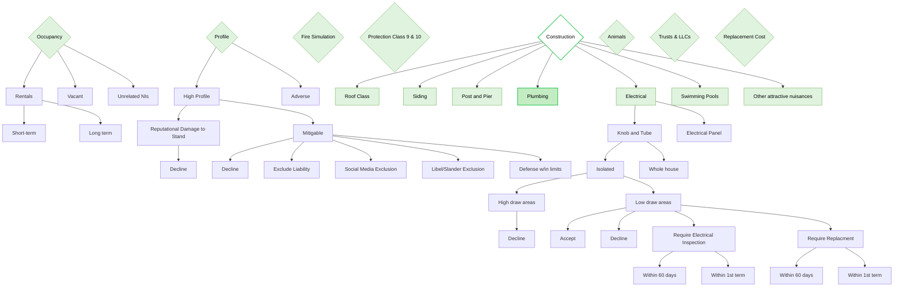

# Decision Points (overview)

FigJam page: **Decision Points**. This page is the overview: it lists the top-level underwriting criteria and partially expands some of them. Most criteria have a more detailed page of their own (see *Drill-down pages* below).

Fire Simulation, Protection Class 9 & 10, Animals, Trusts & LLCs and Replacement Cost have no children on this page.

## Notes on the page

- Sticky note: "Be Sure to check other Pages for deeper drill downs"
- Colour on this page marks the top-level criteria and Construction sub-criteria (green), not outcomes. Decline boxes on this page are uncoloured.
- Two criteria are styled differently on the board: the Construction diamond has a white fill with a bright green outline, and the Plumbing box has a darker green fill with a bright green outline. The chart mirrors both; the board gives no meaning for the difference.

## Reading notes

- The board draws no arrow from "Mitigable" to the leftmost "Decline" box in its row (only four arrows, to the exclusion boxes). The board owner confirmed the fifth arrow to Decline is intended, so it is drawn here.
- "Require Replacment" is spelled that way on the board.

## Drill-down pages

| Criterion on this page | Detail page folder |
|---|---|
| Occupancy | `03-occupancy` |
| Profile | `02-profile` |
| Fire Simulation | `04-fire-simulation` |
| Protection Class 9 & 10 | `13-protection-class-9-and-10` |
| Construction → Roof Class | `05-roof-class` |
| Construction → Siding | `06-siding` |
| Construction → Post and Pier | `07-post-and-pier-foundations` |
| Construction → Plumbing | `08-plumbing` |
| Construction → Electrical | `09-electrical-systems` |
| Construction → Swimming Pools | `10-swimming-pools` |
| Trusts & LLCs | `11-trusts-and-llcs` |
| Replacement Cost | `12-replacement-cost` |
| Animals | none on the board |
| Construction → Other attractive nuisances | none on the board |

## Differences from the detail pages

- **Occupancy:** this page shows Rentals / Vacant / Unrelated NIs; the Occupancy page shows Rentals / Vacant / Unoccupied / For Sale.
- **Electrical:** this page offers Accept and Require Electrical Inspection with "within 60 days / within 1st term" deadlines; the Electrical Systems page offers replacement only, with "within First Term / within UWing Period" deadlines, and routes through a "Tier one broker or rounded account?" question.
- **Profile:** this page shows High Profile / Adverse; the Profile page branches on KYC score bands.
