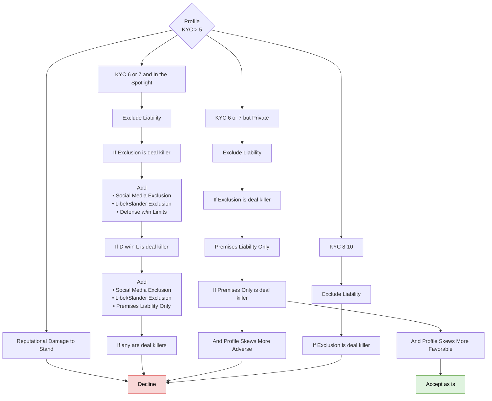

# Profile

FigJam page: **Profile**. Drill-down for the *Profile* criterion on the Decision Points page.

## Notes on the page

- Text box beside the root: "If KYC is missing Look up name on Facebook and google. Explicitly look for their involvement in lawsuits"
- Every decline path on this page ends in the same single Decline box on the board.

## Reading notes

- Each branch is a ladder of fallbacks: apply the first remedy; only if the broker/insured treats it as a deal killer, move to the next box.
- The root reads "KYC > 5", but "Reputational Damage to Stand" sits beside the KYC bands as a fourth branch rather than a KYC band. The KYC scale itself is not defined on the board.
