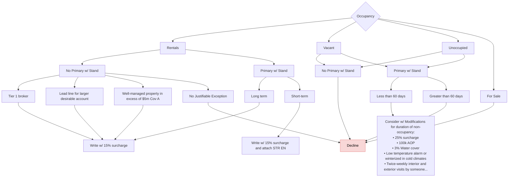

# Occupancy

FigJam page: **Occupancy**. Drill-down for the *Occupancy* criterion on the Decision Points page.

## Notes on the page

- Text box beside the root: "You can provide the quote without this information but you must follow up after"

## Reading notes

- Vacant and Unoccupied share the same pair of child boxes ("No Primary w/ Stand" and "Primary w/ Stand"); their connectors overlap on the board.
- Only Decline is colour-coded on this page; the surcharge and modification outcomes are plain white.
- "w/ Stand" refers to whether the property is the insured's primary residence insured with Stand (interpretation; not defined on the board).
- "STR EN" is not defined on the board (plausibly a short-term-rental endorsement).
- The overview page lists "Unrelated NIs" under Occupancy, which does not appear on this page.
