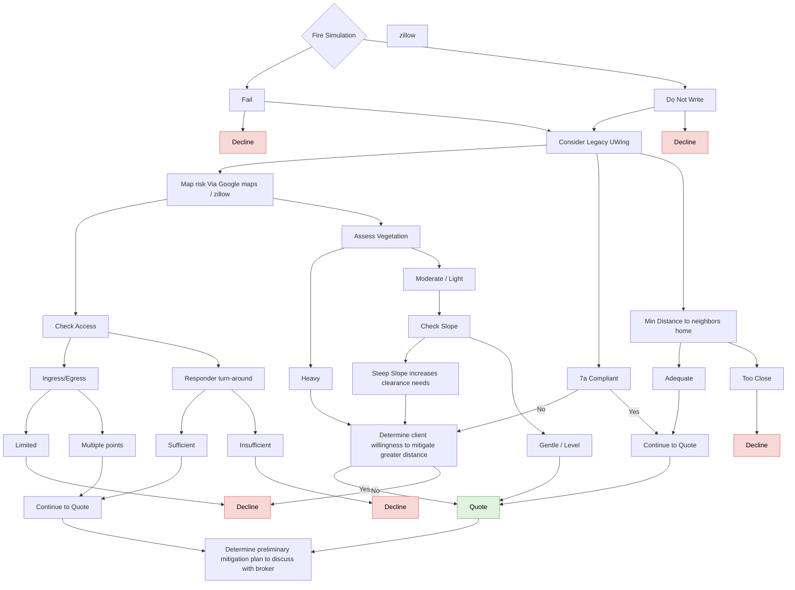

# Fire Simulation

FigJam page: **Fire Simulation**. Drill-down for the *Fire Simulation* criterion on the Decision Points page.

## Reading notes

- "Fail" and "Do Not Write" each branch to both Decline and Consider Legacy UWing. The board gives no criterion for choosing between them.
- "Determine client willingness…" = No leads to the Decline box under "Limited" (on the board: willingness → "No" box → that Decline box). "Yes"/"No" boxes are folded into edge labels here.
- The "Continue to Quote" box in the Check Access branch connects straight to "Determine preliminary mitigation plan…", bypassing the green "Quote" box.
- A standalone box labelled "zillow" sits beside "Map risk Via Google maps / zillow" with no connectors.
- Undefined on the board: "Legacy UWing", "7a Compliant", and what the simulation's Fail / Do Not Write results are based on.
