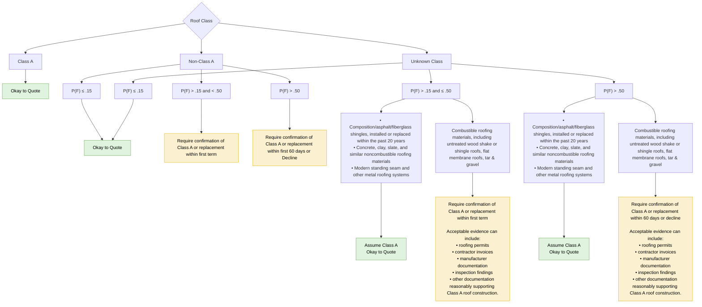

# Roof Class

FigJam page: **Roof Class**. Drill-down for *Construction → Roof Class* on the Decision Points page.

## Reading notes

- The material-list boxes under Unknown Class have no heading on the board; they start directly with their bullets.
- Band labels on the board are written "P(F) < = .15", "P(F) > .15 < .50" (Non-Class A) and "P(F) > .15 < = .50" (Unknown Class); they are rewritten here with ≤ and "and".
- **Threshold gap:** for Non-Class A, P(F) = .50 falls in neither band (`< .50` and `> .50`). Unknown Class uses `≤ .50`.
- P(F) is not defined on the board (presumably a probability of failure from the fire simulation; unverified).
- Unknown Class with P(F) ≤ .15 connects to the same "Okay to Quote" box as Non-Class A with P(F) ≤ .15.
