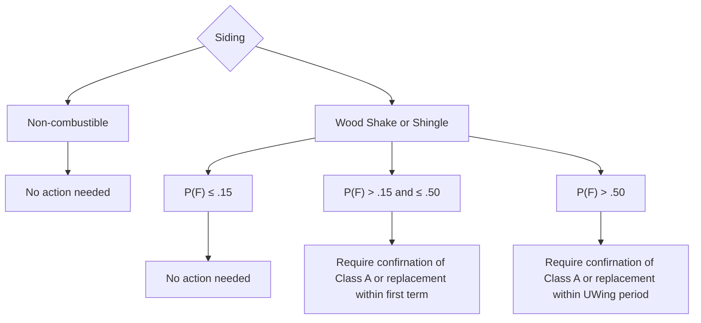

# Siding

FigJam page: **Siding**. Drill-down for *Construction → Siding* on the Decision Points page.

## Reading notes

- No boxes on this page are colour-coded; all are plain white.
- The board draws no arrow between "P(F) > .50" and the box directly beneath it; the connection is shown here as intended.
- "confirnation" is spelled that way on the board.
- Band labels on the board are "P(F) < = .15", "P(F) > .15 < =.50", "P(F) > .50".
