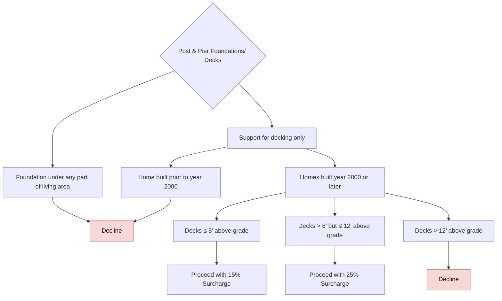

# Post & Pier Foundations / Decks

FigJam page: **Post & Pier Foundations**. Drill-down for *Construction → Post and Pier* on the Decision Points page.

## Notes on the page

- Text box beside the root: "If this field is missing you can try to check zillow to look at the deck construction. Otherwise we will have to follow up with the broker"

## Reading notes

- The two surcharge outcomes are uncoloured (white) on the board.
