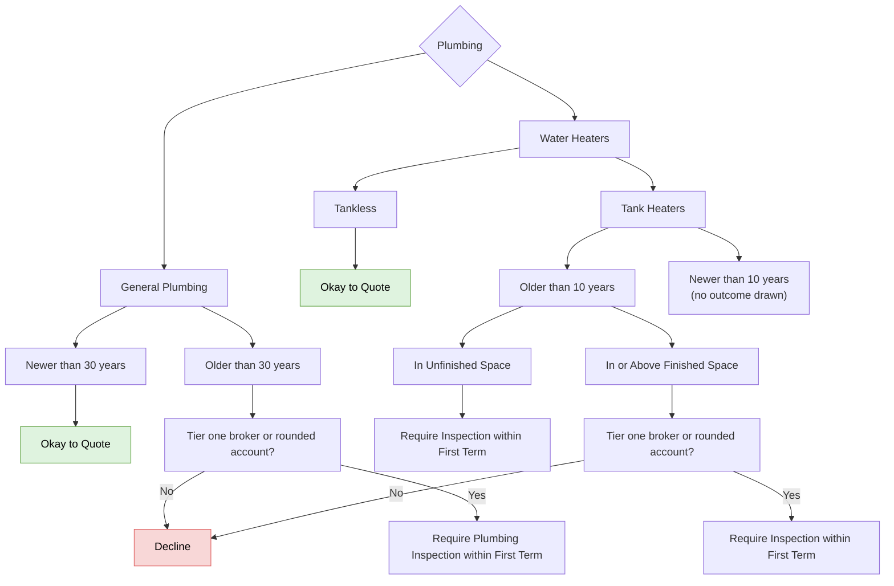

# Plumbing

FigJam page: **Plumbing**. Drill-down for *Construction → Plumbing* on the Decision Points page.

## Reading notes

- "Yes"/"No" boxes on the board are folded into edge labels here.
- "Newer than 10 years" (tank heaters) has no outgoing arrow on the board.
- The inspection requirements are uncoloured (white) on the board.
- "Tier one broker or rounded account" is not defined on the board.
