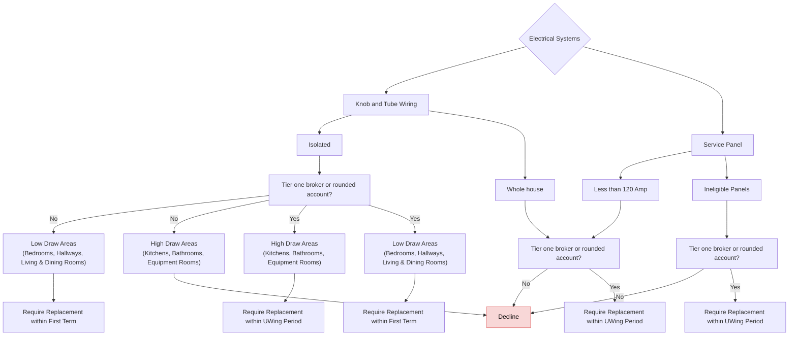

# Electrical Systems

FigJam page: **Electrical Systems**. Drill-down for *Construction → Electrical* on the Decision Points page.

## Notes on the page

- Text box beside the root: "If knob and question is missing assume it based on year built (1950)" (read as: if the knob-and-tube answer is missing, infer it from year built, with 1950 as the cut-off).

## Reading notes

- "Yes"/"No" boxes on the board are folded into edge labels here.
- The replacement requirements are uncoloured (white) on the board.
- The overview page shows a different Electrical subtree (Accept / Require Electrical Inspection, 60-day deadlines). This page has no inspection option.
- "UWing Period" vs "First Term" and "Tier one broker or rounded account" are not defined on the board.
