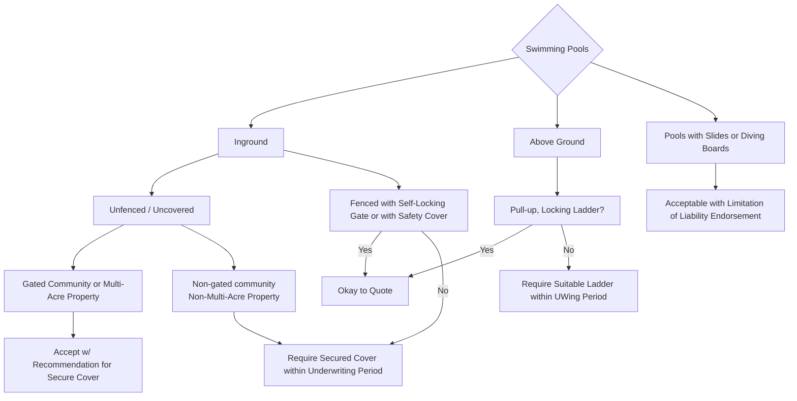

# Swimming Pools

FigJam page: **Swimming Pools**. Drill-down for *Construction → Swimming Pools* on the Decision Points page.

## Notes on the page

- Text box beside the root: "If Missing Check google maps and zillow if you dont see anything assume no"

## Reading notes

- "Yes"/"No" boxes on the board are folded into edge labels here. On the board the "Fenced…" box and the "Pull-up, Locking Ladder?" box share one "Yes" box leading to "Okay to Quote".
- No boxes on this page are colour-coded; all are plain white.
