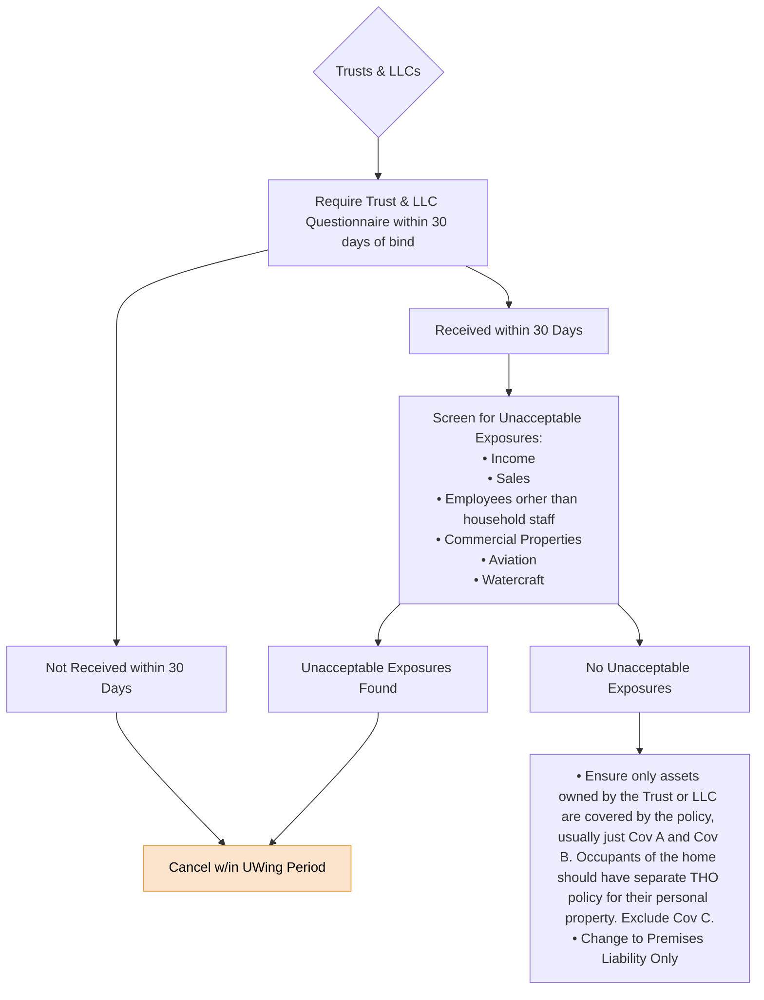

# Trusts & LLCs

FigJam page: **Trusts & LLCs**. Drill-down for the *Trusts & LLCs* criterion on the Decision Points page.

## Reading notes

- "Cancel w/in UWing Period" is orange on the board.
- The vertical line between "Unacceptable Exposures Found" and "Cancel w/in UWing Period" looks like one two-headed arrow, but appears to be two connectors sharing a segment: the arrow from "Screen for Unacceptable Exposures" curves in and ends with the downward arrowhead into "Found", and a separate arrow runs from "Found" up into "Cancel". Read as Screen → Found → Cancel.
- "orher" is spelled that way on the board.
- "THO" is not defined on the board (plausibly a tenant homeowners policy).
