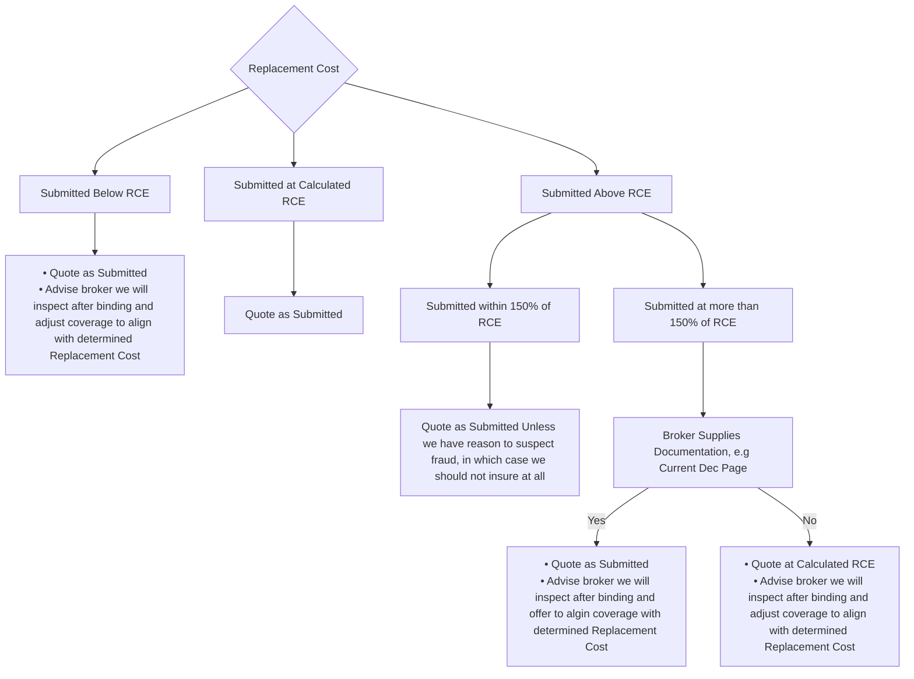

# Replacement Cost

FigJam page: **Replacement Cost**. Drill-down for the *Replacement Cost* criterion on the Decision Points page. RCE = replacement cost estimate.

## Reading notes

- "Yes"/"No" boxes on the board are folded into edge labels here.
- No boxes on this page are colour-coded; all are plain white.
- "algin" is spelled that way on the board.
- The Yes outcome's first bullet ends with a stray character on the board ("Quote as Submitted l"). The board owner confirmed it is a typo, so it is omitted here.
