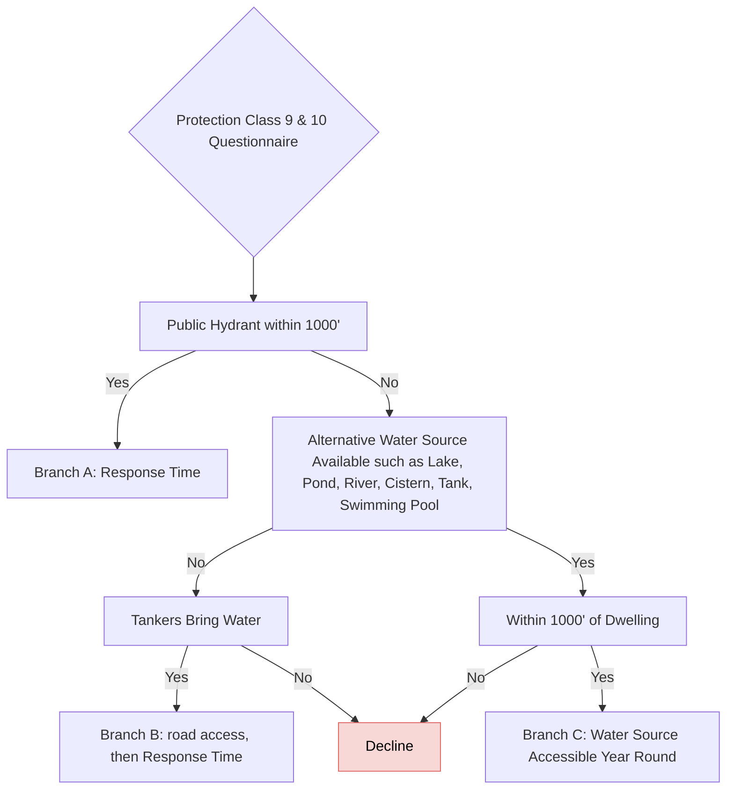
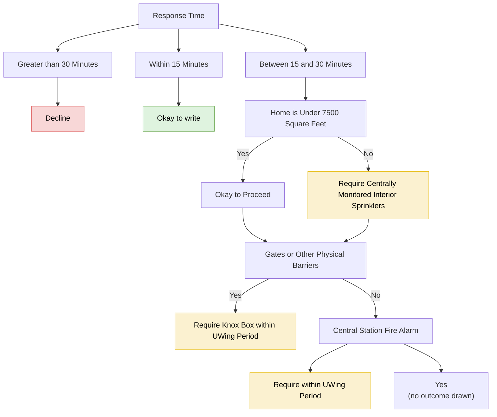
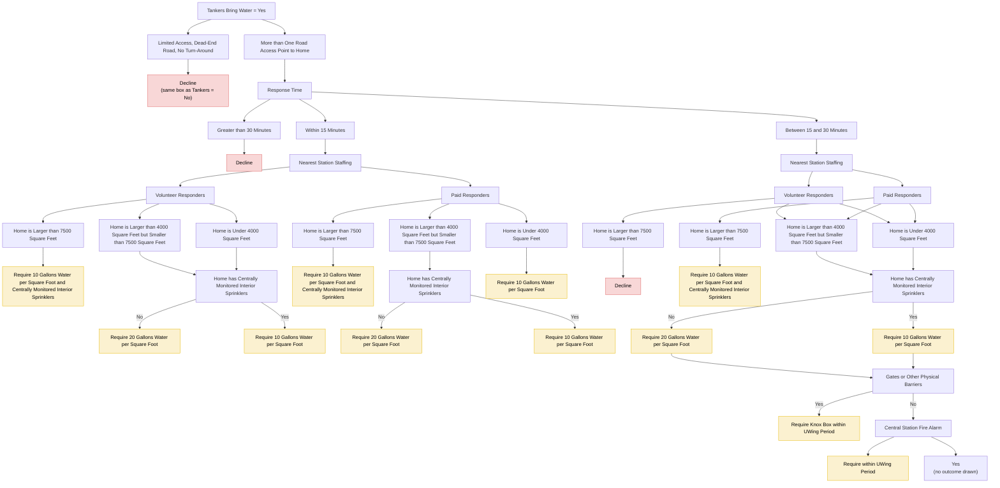
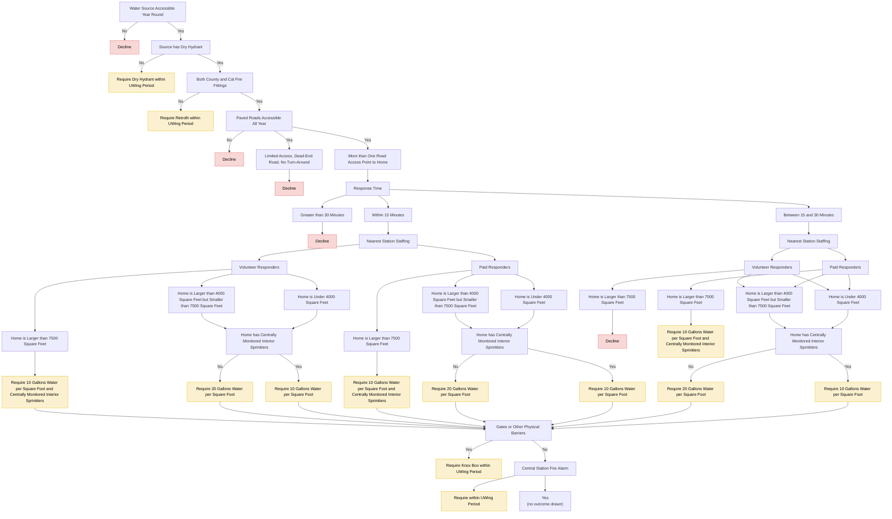

# Protection Class 9 & 10

FigJam page: **PC 9 & 10**. Drill-down for the *Protection Class 9 & 10* criterion on the Decision Points page. This is the largest page on the board.

## Structure at a glance

The tree has three main branches. Several sub-blocks repeat across them:

- **Response Time** → Greater than 30 min (Decline) / Between 15 and 30 min / Within 15 min
- **Nearest Station Staffing** → Volunteer / Paid responders → home-size bands (> 7500, 4000–7500, < 4000 sq ft) → water and sprinkler requirements
- **Gates or Other Physical Barriers** → Knox Box requirement, or Central Station Fire Alarm check

| Branch | Path to it |
|---|---|
| A. Hydrant | Public hydrant within 1000' = Yes |
| B. Tankers | No hydrant → no alternative water source → tankers bring water |
| C. Alternative water source | No hydrant → alternative source (lake, pond, cistern, …) within 1000' and accessible year round |

The full chart is split into one Mermaid block per branch so each stays readable. Node IDs are prefixed by branch (`A_`, `B_`, `C_`).

## Screenshots

The page is too large to read in one image, so it is captured as an overview plus zoomed tiles:

| File | Shows |
|---|---|
| `screenshot-0-overview.png` | Whole page (layout only; text not legible) |
| `screenshot-1-root-and-hydrant-branch.png` | Root, hydrant question, Branch A down to Gates, top of Branches B and C |
| `screenshot-2-water-source-checks.png` | Branch C water-source checks (dry hydrant, fittings, paved roads); Branch A Gates/Alarm; part of Branch B within-15 staffing |
| `screenshot-3-tankers-branch.png` | All of Branch B; Branch C checks down to its Response Time |
| `screenshot-4-water-source-response-time.png` | Branch C Response Time and both staffing blocks |
| `screenshot-5-water-source-gates.png` | Branch C shared Gates / Central Station Fire Alarm step |

## Root

## Branch A: public hydrant within 1000'

## Branch B: tankers bring water

## Branch C: alternative water source within 1000'

## Notes on the page

- Text box beside the root: "If Missing Assume protection Class 9 and run through the diagram."
- The word "Questionnaire" under the root is underlined on the board (it may be a link that does not survive in a view-only session).

## Reading notes

- "Yes"/"No" boxes on the board are folded into edge labels, except where a "Yes" box has no outgoing arrow; those are kept as nodes marked "(no outcome drawn)".
- Under "Central Station Fire Alarm", one arrow goes to "Require within UWing Period" with no Yes/No box (read as: no alarm → require one), and one goes to a "Yes" box that leads nowhere.
- In both "Between 15 and 30 Minutes" staffing blocks (Branches B and C), the Volunteer and Paid connectors overlap on the board. Volunteer > 7500 → Decline; Paid > 7500 → 10 gallons + sprinklers; both Volunteer and Paid → 4000–7500 and < 4000 → sprinkler question.
- In Branch B, the "Volunteer > 7500 → Decline" connector has arrowheads at both ends on the board. The board owner confirmed this is an error (a Decline has no outgoing path, and the identical block in Branch C is one-way), so it is drawn one-way here.
- **Inconsistencies on the board:**
  - Branch B's "Within 15 Minutes" outcomes have no Gates step, while the sprinkler outcomes of Branch B's "Between 15 and 30" block, and every Branch C outcome except Paid > 7500 in its "Between 15 and 30" block, do.
  - In both "Between 15 and 30" blocks, the "Paid > 7500" outcome does not continue to the Gates step, while the sprinkler outcomes do.
  - Paid responders with a home under 4000 sq ft: Branch B goes straight to "Require 10 Gallons Water per Square Foot", while Branch C goes through the sprinkler question.
  - In Branch C, "Require Dry Hydrant…" and "Require Retrofit…" are terminal; the board does not show whether evaluation continues after them.
- Branch A's "Within 15 Minutes" goes straight to "Okay to write" with no Gates step.
